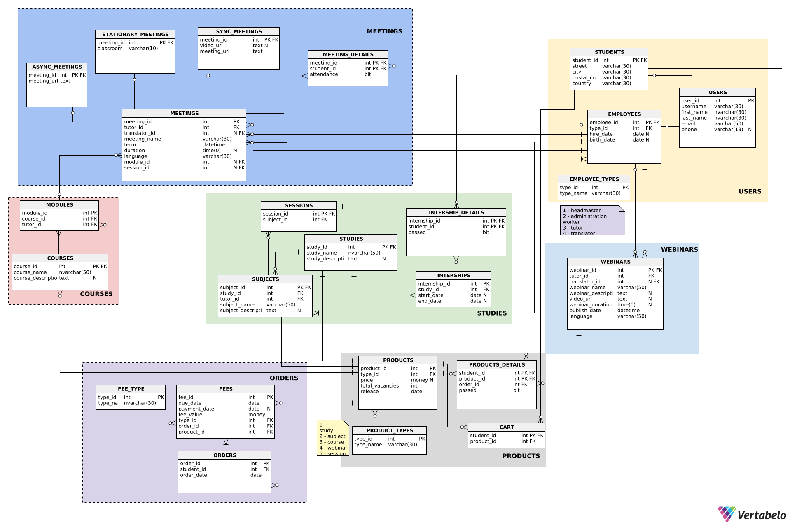

---

# Podstawy baz danych

**Dzień i godzina zajęć**: Środa 15:00

**Nr zespołu**: 2

**Autorzy:** Dariusz Marecik, Filip Węgrzyn, Paweł Fornagiel

**Link do repozytorium GitHub**: https://github.com/pFornagiel/bazy-danych-2025

---

### Wkład w projekt
- **Dariusz Marecik** - Widoki, funkcje, wyzwalacze, procedury losowe, warunki integralności, współtworzenie struktury bazy danych i funckji systemu
- **Filip Węgrzyn** - Widoki, funkcje, role i uprawnienia, indeksy, demo funkcjonalności, współtworzenie struktury bazy danych i funckji systemu
- **Paweł Fornagiel** - procedury, wyzwalacze, genereratory danych, utworzenie i zarządzanie bazą danych na zdalnym serwerze, dokumentacja, współtworzenie struktury bazy danych i funckji systemu

---

<!-- TOC -->

- [Opis Funkcjonalności Systemu](#opis-funkcjonalności-systemu)
  - [Funkcje Systemu](#funkcje-systemu)
  - [Użytkownicy](#użytkownicy)
  - [Funkcje poszczególnych użytkowników](#funkcje-poszczególnych-użytkowników)
    - [Studenci (użytkownicy zalogowani, rozszerzenie możliwości gości)](#studenci-użytkownicy-zalogowani-rozszerzenie-możliwości-gości)
    - [Goście (użytkownicy niezalogowani)](#goście-użytkownicy-niezalogowani)
    - [Prowadzący zajęcia](#prowadzący-zajęcia)
    - [Administrator zasobów](#administrator-zasobów)
    - [Dyrektor](#dyrektor)
    - [Dziekanat](#dziekanat)
    - [Tłumacz](#tłumacz)
- [Schemat bazy danych](#schemat-bazy-danych)
- [Opis tabel](#opis-tabel)
  - [Kategoria USERS](#kategoria-users)
    - [Tabela USERS](#tabela-users)
    - [Tabela STUDENTS](#tabela-students)
    - [Tabela EMPLOYEES](#tabela-employees)
    - [Tabela EMPLOYEES_TYPES](#tabela-employees_types)
    - [Tabela COUNTRIES](#tabela-countries)
  - [Kategoria Products](#kategoria-products)
    - [Tabela Products](#tabela-products)
    - [Tabela PRODUCT_DETAILS](#tabela-product_details)
    - [Tabela PRODUCT_TYPES](#tabela-product_types)
    - [Tabela SHOPPING_CART](#tabela-shopping_cart)
  - [Kategoria Orders](#kategoria-orders)
    - [Tabela ORDERS](#tabela-orders)
    - [Tabela FEES](#tabela-fees)
    - [Tabela FEE_TYPES](#tabela-fee_types)
  - [Kategoria Webinars](#kategoria-webinars)
    - [Tabela Webinars](#tabela-webinars)
  - [Kategoria COURSES](#kategoria-courses)
    - [Tabela COURSES](#tabela-courses)
    - [Tabela MODULES](#tabela-modules)
  - [Kategoria STUDIES](#kategoria-studies)
    - [Tabela STUDIES](#tabela-studies)
    - [Tabela SUBJECTS](#tabela-subjects)
  - [Tabela SESSIONS](#tabela-sessions)
    - [Tabela InternshipS](#tabela-internships)
    - [Tabela Internship_DETAILS](#tabela-internship_details)
  - [Kategoria MEETINGS](#kategoria-meetings)
    - [Tabela MEETINGS](#tabela-meetings)
    - [Tabela MEETING_DETAILS](#tabela-meeting_details)
    - [Tabela ASYNC_MEETINGS](#tabela-async_meetings)
    - [Tabela SYNC_MEETINGS](#tabela-sync_meetings)
    - [Tabela STATIONARY_MEETINGS](#tabela-stationary_meetings)
  - [Kategoria LANGUAGES](#kategoria-languages)
    - [Tabela LANGUAGES](#tabela-languages)
- [Dokumentacja kluczy obcych](#dokumentacja-kluczy-obcych)
- [Widoki](#widoki)
  - [Users](#users)
    - [Student_address](#student_address)
    - [Emploee_list](#emploee_list)
    - [User_information](#user_information)
    - [Regular_customers](#regular_customers)
  - [Webinars](#webinars)
    - [Webinar_information](#webinar_information)
    - [Webinar_free_entry](#webinar_free_entry)
    - [Webinar_available](#webinar_available)
  - [Courses](#courses)
    - [Course_information](#course_information)
    - [Course_module_meeting_types](#course_module_meeting_types)
    - [Course_module_information](#course_module_information)
    - [Course passes](#course-passes)
    - [Course_syllabus](#course_syllabus)
  - [Kategoria zamówienia i produkty](#kategoria-zamówienia-i-produkty)
    - [Product_vacancies](#product_vacancies)
    - [Users_in_debt](#users-in-debt)
    - [Financial_record](#financial-report)
    - [Bilocation_record](#bilocation-report)
    - [Product_owners](#product-owners)
    - [Product_payment_information](#product_payment_information)
    - [Unpaid special permissions](#unpaid-special-permissions)
    - [Product_information](#product_information)
  - [Meetings](#meetings)
    - [Attendance_meeting](#attendance_meeting)
    - [Future_meeting_attendee_count](#future_meeting_attendee_count)
    - [Meeting_type](#meeting_type)
    - [Only_course_meeting](#only_course_meeting)
    - [Only_studies_meeting](#only_studies_meeting)
    - [Room_schedule](#room_schedule)
  - [Studies](#studies)
    - [Study_information](#study_information)
    - [Study_internship_information](#study_internship_information)
    - [Study_meeting_information](#study_meeting_information)
    - [Study_offers](#study_offers)
    - [Study_passed](#study_passed)
    - [Study_session_schedule](#study_session_schedule)
    - [Study_syllabus](#study_syllabus)
- [Procedury](#procedury)
  - [Sprawdzanie poprawności danych przed operacją](#sprawdzanie-poprawności-danych-przed-operacją)
    - [CheckWebinarExists](#checkwebinarexists)
    - [CheckOrderExists](#checkorderexists)
    - [CheckStudyExists](#checkstudyexists)
    - [CheckProductExists](#checkproductexists)
    - [CheckEmployeeExists](#checkemployeeexists)
    - [CheckLanguageExists](#checklanguageexists)
    - [CheckModuleExists](#checkmoduleexists)
    - [CheckMeetingExists](#checkmeetingexists)
    - [CheckSessionExists](#checksessionexists)
    - [CheckStudyExists](#checkstudyexists-1)
    - [CheckCountryExists](#checkcountryexists)
    - [CheckFeeExists](#checkfeeexists)
  - [Użytkownicy](#użytkownicy-1)
    - [CreateBasicUser](#createbasicuser)
    - [CreateStudent](#createstudent)
    - [CreateEmployee](#createemployee)
    - [LinkTranslatorToWebinar](#linktranslatortowebinar)
    - [LinkTranslatorToMeeting](#linktranslatortomeeting)
  - [Kursy](#kursy)
    - [CreateCourse](#createcourse)
    - [CreateModule](#createmodule)
    - [CreateModuleStationaryMeeting](#createmodulestationarymeeting)
    - [CreateModuleSyncMeeting](#createmodulesyncmeeting)
    - [CreateModuleAsyncMeeting](#createmoduleasyncmeeting)
  - [Webinary](#webinary)
    - [CreateWebinar](#createwebinar)
  - [Studia](#studia)
    - [CreateStudy](#createstudy)
    - [CreateSubject](#createsubject)
    - [CreateSession](#createsession)
    - [CreateSessionStationaryMeeting](#createsessionstationarymeeting)
    - [CreateSessionSyncMeeting](#createsessionsyncmeeting)
    - [CreateSessionAsyncMeeting](#createsessionasyncmeeting)
    - [CreateInternship](#createinternship)
    - [CreateInternshipDetails](#createinternshipdetails)
  - [Orders](#orders)
    - [Typ productIdList](#typ-productidlist)
    - [CreateOrder](#createorder)
    - [CreateFee](#createfee)
    - [createFeeForSession](#createfeeforsession)
    - [createFeesForSubject](#createfeesforsubject)
    - [createFeesForStudySession](#createfeesforstudysession)
    - [createEntryFeeForStudy](#createentryfeeforstudy)
    - [createFeesForCourse](#createfeesforcourse)
    - [createFeeForWebinar](#createfeeforwebinar)
    - [CreateOrderFromCart](#createorderfromcart)
    - [addProductToCart](#addproducttocart)
    - [removeProductFromCart](#removeproductfromcart)
    - [UpdateFeePaymentDate](#updatefeepaymentdate)
  - [Products](#products)
    - [FillProductDetails](#fillproductdetails)
    - [MarkProductAsPassed](#markproductaspassed)
    - [UpdateProductDetails](#updateproductdetails)
    - [UpdateProductDetailsPassed](#updateproductdetailspassed)
  - [MEETINGS](#meetings-1)
    - [FillMeetingDetails](#fillmeetingdetails)
- [Funkcje](#funkcje)
  - [Kategoria zamówienia i produkty](#kategoria-zamówienia-i-produkty-1)
    - [GetCartValue](#getcartvalue)
    - [GetOrderValue](#getordervalue)
    - [IsSingleProduct](#issingleproduct)
    - [GetParentId](#getparentid)
    - [GetVacanciesForProduct](#getvacanciesforproduct)
    - [CheckStudentOwnsProduct](#checkstudentownsproduct)
    - [CanAddToCart](#canaddtocart)
    - [CanStudentBuyProduct](#canstudentbuyproduct)
  - [Kursy, studia i webinary](#kursy-studia-i-webinary)
    - [GetAttendanceForStudy](#getattendanceforstudy)
    - [GetAttendanceForCourse](#getattendanceforcourse)
    - [GetAttendanceForSubject](#getattendanceforsubject)
    - [CheckInternshipsPass](#checkinternshipspass)
    - [DoesStudentPassStudy](#doesstudentpassstudy)
    - [DoesStudentPassCourse](#doesstudentpasscourse)
    - [DoesStudentPassSubject](#doesstudentpasssubject)
    - [GetStudySchedule](#getstudyschedule)
    - [GetCourseSchedule](#getcourseschedule)
    - [GetStudentTimetable](#getstudenttimetable)
    - [GetTutorTimetable](#gettutortimetable)
    - [GetTranslatorTimetable](#gettranslatortimetable)
    - [CheckMeetingConflict](#checkmeetingconflict)
- [Indeksy](#indeksy)
  - [Indeksy na kluczach obcych](#indeksy-na-kluczach-obcych)
    - [Tabela EMPLOYEES](#tabela-employees-1)
    - [Tabela WEBINARS](#tabela-webinars-1)
    - [Tabela FEES](#tabela-fees-1)
    - [Tabela INTERNSHIPS](#tabela-internships-1)
    - [Tabela MEETINGS](#tabela-meetings-1)
    - [Tabela MODULES](#tabela-modules-1)
    - [Tabela PRODUCT_DETAILS](#tabela-product_details-1)
    - [Tabela PRODUCTS](#tabela-products-1)
    - [Tabela SUBJECTS](#tabela-subjects-1)
    - [Tabela SESSIONS](#tabela-sessions-1)
    - [Tabela STUDENTS](#tabela-students-1)
    - [Tabela ORDERS](#tabela-orders-1)
  - [Pozostałe indeksy](#pozostałe-indeksy)
    - [Tabela USERS](#tabela-users-1)
    - [Tabela WEBINARS](#tabela-webinars-2)
    - [Tabela INTERNSHIPS](#tabela-internships-2)
    - [Tabela MEETINGS](#tabela-meetings-2)
    - [Tabela PRODUCTS](#tabela-products-2)
    - [Tabela ORDERS](#tabela-orders-2)
    - [Tabela STATIONARY_MEETINGS](#tabela-stationary_meetings-1)
- [Role i uprawnienia użytkowników](#role-i-uprawnienia-użytkowników)
  - [Gość](#gość)
  - [Student](#student)
  - [Prowadzący zajęcia](#prowadzący-zajęcia-1)
  - [Dyrektor](#dyrektor-1)
  - [Dziekanat](#dziekanat-1)
  - [Tłumacz](#tłumacz-1)
- [Wyzwalacze (Triggers)](#wyzwalacze-triggers)
  - [Weryfikacja integralności bazy danych](#weryfikacja-integralności-bazy-danych)
    - [trg_LimitVacanciesOnInsert](#trg_limitvacanciesoninsert)
    - [trg_UniqueTranslatorPerMeeting](#trg_uniquetranslatorpermeeting)
    - [trg_PreventPastMeetingAttendance](#trg_preventpastmeetingattendance)
    - [trg_CheckRoomAvailability](#trg_checkroomavailability)
    - [trg_ModuleMeetingsNoIntersection](#trg_modulemeetingsnointersection)

<!-- /TOC -->

### Opis struktury systemu

System bazodanowy składa się z tabel, których głównym celem jest przechowywanie danych dotyczących użytkowników, produktów, zamówień, płatności, webinarów, kursów, studiów oraz powiązanych spotkań.

Dane wszystkich użytkowników znajdują się w tabeli `USERS`, podział na pracowników i studentów realizowany jest poprzez tabele połączenia z tabelami `STUDENTS` oraz `EMPLOYEES`. Dla każdego studenta przechowywane są informacje o jakie adresie zamieszkania i kraju pochodzenia, będącego jednym z państw zdefiniowanych w słownikowej tabeli `COUNTRIES`. Każdy pracownik ma przypisany jeden z typów pracownika zdefiniowanych w tabeli `EMPLOYEE_TYPES`. Obsługiwane są następujące typy pracowników: _headmaster_, _administration worker_, _tutor_, _translator_.

Dane dotyczące produktów edukacyjnych, które może zakupić użytkownik będący studentem, znajdują się w tabeli `PRODUCTS`. Tabela zawiera dane dotyczące danego produktu (data wydania, cena, maksymalna ilość miejsc) oraz typ produktu, będący jednym z wpisów w tabeli słownikowej `PRODUCT_TYPES`. Obsługiwane są następujące typy produktów: _study_, _subject_, _course_, _session_, _webinar_.
System umożliwia dodawanie produktów edukacyjnych do koszyka - tabela `SHOPPING_CART` - co później umożliwia zakup wszystkich produktów będących w koszyku za pośrednictwem zewnętrznego systemu płatności. Informacje o powiązaniu produktu z danym studentem (informacja o dostępie do produktu przez danego studenta) przechowywane są w tabeli `PRODUCT_DETAILS`. System automatycznie dodaje dane do tabeli `PRODUCT_DETAILS` po utworzeniu zamówienia na dany produkt przez studenta.

Dane dotyczące zamówień przechowywane są w tabeli `ORDERS`, przechowującej informacje o dacie, numerze studenta oraz zamówienia.
Informacje dotyczące należności studenta za dane zamówienia znajdują się w tabeli `FEES` i dotyczą wartości należnej, terminu zapłaty, daty zapłaty oraz typu zamówienia, będącego jednym z typów zdefiniowanych w słownikowej tabeli `FEE_TYPES`. Obsługiwane są następujące typy należności: _session_, _subject session_, _study session_, _study entry fee_, _course_, _course advance_, _webinar_. Dane dotyczące tabeli `ORDERS` oraz powiązane należności w tabeli `FEES` tworzone są automatycznie na podstawie zawartości koszyka studenta, po wywołaniu procedury `CreateOrderFromCart`, po czym następuje opróżnienie koszyka. Dla każdego z dodawanych produktów, tworzona jest należnośc powiązana z zamówieniem, wyróżniając następujące przypadki dodawania należności

- W przypadku sesji i webinarów tworzona jest pojedyńcza należność dotycząca produktu (odpowiednio typ należności _session_ lub _webinar_)
- W przypadku kursu, tworzone są dwie należności: typu _course advance_ będąca zaliczką stanowiącą zdefiniowaną w tabeli `COURSES` część nalażności za całość kursu oraz typu _course_ staniowąca resztę należności
- W przypadku przedmiotu, tworzone są pojedyńcze należności typu _subject session_, powiązane z każdą z sesji wchodzącej w zakres przedmiotu, aby umożliwić osobne opłacenie każdej z sesji
- W przypadku studiów, tworzona jest należność _study entry fee_ będąca wpisowym za określona studia oraz dodatkowo towrzone są pojedyńcze należności typu _study session_, powiązane z każdą z sesji wchodzącej w zakres każdego przedmiotu realizowanego w danym studium, aby umożliwić osobne opłacenie każdej z sesji

W systemie studia dzielą się na przedmioty i sesje. Dane dotyczące studiów, przedmiotów i sesji znajdują się w tabelach, odpowiednio, `STUDIES`, `SUBJECTS`, `SESSIONS`. Każde studium jest powiązane z określonymi przedmiotami, każdy przemdiot jest powiązany z określonymi sesjami. Sesja jest zbiorem następujących po sobie spotkań realizowanych w ramach jednego przedmiotu. Zarówno studia, przedmioty jak i sesje są produktami. Studium jest także powiązane z praktykami, których dane znajdują się w tabeli `INTERNSHIPS`. Powiązanie prakty z danym studentem realizowane jest przez tabelę `INTERNSHIP_DETAILS`.

Dane dotyczące kursów przechowywane sa w tabeli `COURSES`, przechowującej nazwę i opis kursu oraz część należności, która stanowi zaliczkę za kurs. Każdy kurs jest produktem. Z każdym kursem powiązane są moduły, których dane przechowywane są w tabeli `MODULES`, przechowującej informacje o powiązanym prowadzącym moduł, nazwie oraz opisie modułu.

Spotkania w systemie są powiązane zarówno z sesjami wchodzącymi w zakres przedmiotów na studiach oraz modułami realizowanymi w ramach kursów. Dane o spotkaniach przechowywane są w tabeli `MEETINGS`, która przechowuje informacje o przypisanym prowadzącym, tłumaczu (jeżeli istnieje tłumaczenie z innego języka na język polski), nazwie, opisie oraz długości spotkania. Podział na spotkania stacjonarne, synchroniczne i asynchroniczne realizowane są przez powiązanie tabeli `MEETINGS` kolejno z tabelami `STATIONARY_MEETINGS`, `SYNC_MEETINGS` oraz `ASYNC_MEETINGS`, przechowującymi szczegóły odpowiednich spotkań. Powiązanie dostępu studenta do danego spotkania realizowane jest poprzez tabelę `MEETING_DETAILS` przechowującą także informacje o obecności na danym spotkaniu.

Dane dotyczące webinarów przechowywane są w tabeli `WEBINARS`, zawierającej informacje o powiązanym prowadzącym, powiązanym tłumaczy (jeżeli istnieje tłumaczenie z języka, w którym prowadzony jest webinar, na język polski), nazwie, opisie, czasie trwania, dacie wydania linków dostępu online oraz nagrania wideo. Każdy z webinarów jest produktem.

Nazwy obsługiwanych języków w systemie przechowywane są w słownikowej tabeli `LANGUAGES`.

---

# Opis Funkcjonalności Systemu

## Funkcje Systemu

- Weryfikacja limitu zapisanych osób i blokowanie jego przekroczenia
- Blokowanie zapisu / dostępu do treści po upływie terminu ważności
- Blokowanie możliwości zapisania się na te same zajęcia wiele razy

## Użytkownicy

- Studenci (użytkownicy zalogowani)
- Goście (użytkownicy niezalogowani)
- Prowadzący zajęcia
- Dyrektor Szkoły
- Administrator zasobów
- Dziekanat
- Tłumacz

## Funkcje poszczególnych użytkowników

### Studenci (użytkownicy zalogowani, rozszerzenie możliwości gości)

- możliwość zapisania się na kurs
- zapis na praktyki
- usunięcie konta
- dodanie i usunięcie adresu korespondencyjnego
- wyświetlenie wykazu zajęć w których brał udział / obecności
- wyświetlenie frekwencji / stopnia zaliczenia dla poszczególnych zajęć
- wyświetlenie dostępnych kursów / webinarów / studiów
- wyświetlanie linków dostępu do udostępnionych zasobów
- dodanie, usunięcie i przegląd elementów w koszyku
- stworzenie zamówienia
- opłacenie zamówienia

### Goście (użytkownicy niezalogowani)

- dostęp do wybranych webinarów
- przegląd dostępnych webinarów / studiów / kursów
- założenie konta

### Prowadzący zajęcia

- modyfikacja terminu zajęć
- modyfikacja udostępnionych zasobów
- sprawdzanie obecności dla każdych zajęć
- wyświetlenie wykazu prowadzonych zajęć

### Administrator zasobów

- dodawanie / usuwanie webinarów, kursów i studiów
- dodawanie / usuwanie materiałów

### Dyrektor

- dodawanie / usuwanie pracowników
- modyfikacja dostępu do kursu
- modyfikacja opłat za kurs
- modyfikacja czasu na dokonanie płatności dla danej osoby
- przegląd wszelkich danych dotyczących realizowanych zajęć

### Dziekanat

- tworzenie dyplomów potwierdzających ukończenie kursu / studium
- dodawanie / modyfikacja praktyk
- modyfikacja webinarów / kursów / studiów / przedmiotów
- dodawanie webinarów / kursów / studiów / przedmiotów
- dodawanie / usuwanie tłumacza do wybranych przedmiotów
- tworzenie sylabusu
- generowanie harmonogramu
- generowanie danych dotyczących realizowanych zajęć
- wyświetlenie zatrudnionych pracowników
- wyświetlenie studentów przypisanych do danego zasobu wraz z limitami zasobu
- wyświetlenie danych dotyczących wybranych form zajęć
- wykrywanie i wyświetlanie kolizji czasowych studentów
- Raportowanie:
  - Tworzenie raportu liczby zapisanych osób na przyszłe wydarzenia wraz z informacjami o wydarzeniach
  - Tworzenie raportu dotyczącego frekwencji na zakończonych wydarzeniach
  - Tworzenie raportu dotyczącego osób, które skorzystały z usług, ale nie uiściły opłat
  - Tworzenie raportów finansowych
  - Tworzenie list obecności dla poszczególnych form zajęć
  - Tworzenie list kolizji czasowych wśród użytkowników

### Tłumacz

- Dostęp do zasobów poszczególnych kursów / studiów i webinarów
- Dodawanie przetłumaczonych zasobów do kursów /studiów / webinarów

# Schemat bazy danych



# Opis tabel

## Kategoria USERS

### Tabela USERS

| Column Name | Data Type    | Properties  |
| ----------- | ------------ | ----------- |
| user_id     | int          | Primary Key |
| username    | varchar(30)  |             |
| first_name  | nvarchar(30) |             |
| last_name   | nvarchar(30) |             |
| email       | varchar(50)  |             |
| phone       | varchar(9)   |             |

Zawiera podstawowe informacje o każdym użytkowniku bazy.

- user_id int - klucz główny, identifikuje użytkownika

- username varchar(30) - nazwa użytkownika w bazie danych

- first_name nvarchar(30) - imię użytkownika

- last_name nvarchar(30) - nazwisko użytkownika

- email varchar(50) - email użytkownika

  - warunek: (mail LIKE '%\_@%.%')

- phone varchar(9) nullable - numer telefonu użytkownika
  - warunek: LEN(Phone) = 9 AND ISNUMERIC(Phone) = 1

```sql
-- Table: USERS
CREATE TABLE USERS (
    user_id int  NOT NULL IDENTITY,
    username varchar(30)  NOT NULL,
    first_name nvarchar(30)  NOT NULL,
    last_name nvarchar(30)  NOT NULL,
    email varchar(50)  NOT NULL CHECK (mail LIKE '%_@%.%'),
    phone varchar(9)  NULL CHECK (LEN(Phone) = 9 AND ISNUMERIC(Phone) = 1),
    CONSTRAINT unique_email UNIQUE (email),
    CONSTRAINT unique_phone UNIQUE (phone),
    CONSTRAINT USERS_pk PRIMARY KEY  (user_id)
);
```

### Tabela STUDENTS

| Column Name | Data Type   | Properties                 |
| ----------- | ----------- | -------------------------- |
| student_id  | int         | Primary Key<br>Foreign Key |
| country_id  | int         | Foreign Key                |
| street      | varchar(30) |                            |
| city        | varchar(30) |                            |
| postal_code | varchar(30) |                            |

Zawiera infromacje specyficzne dla studenta

- _student_id_ int - klucz główny, klucz obcy, identyfikuje studenta

- street varchar(30) - ulica, na której mieszka studenta

- city varchar(30) - miasto, w którym mieszka studenta

- postal_code varchar(30) - kod pocztowy studenta

- country_id int - klucz obcy, identyfikator pochodzenia studenta

```sql
-- Table: STUDENTS
CREATE TABLE STUDENTS (
   student_id int  NOT NULL,
   street varchar(30)  NOT NULL,
   city varchar(30)  NOT NULL,
   postal_code varchar(30)  NOT NULL,
   country varchar(30)  NOT NULL,
   CONSTRAINT STUDENTS_pk PRIMARY KEY  (student_id)
);
```

### Tabela EMPLOYEES

| Column Name | Data Type | Properties                 |
| ----------- | --------- | -------------------------- |
| employee_id | int       | Primary Key<br>Foreign Key |
| type_id     | int       | Foreign Key                |
| hire_date   | date      |                            |
| birth_date  | date      |                            |

Zawiera szczególne informacje dla pracowników (dyrektora, pracownika dziekanatu, nauczyciela, tłumacza)

- _employee_id_ int - klucz główny, klucz obcy, identyfikator pracownika

- type_id int - sklucz obcy, typ pracownika (opisany poniżej)

- hire_date date nullable - data zatrudnienia

- birth_date date nullable - data urodzin pracownika

```sql
-- Table: EMPLOYEES
CREATE TABLE EMPLOYEES (
    employee_id int  NOT NULL,
    type_id int  NOT NULL,
    hire_date date  NULL ,
    birth_date date  NULL,
    CONSTRAINT EMPLOYEES_pk PRIMARY KEY  (employee_id)
);
```

### Tabela EMPLOYEES_TYPES

| Column Name | Data Type   | Properties  |
| ----------- | ----------- | ----------- |
| type_id     | int         | Primary Key |
| type_name   | varchar(30) |             |

Zawiera opis typów pracowników

- _type_id_ int - klucz główny, typ pracownika <br>
- type_name varchar(30) - nazwa pełnionej funkcji

Zdefiniowany typy:

- 1 - headmaster <br>
- 2 - administration worker <br>
- 3 - tutor <br>
- 4 - translator <br>

```sql
-- Table: EMPLOYEE_TYPES
CREATE TABLE EMPLOYEE_TYPES (
    type_id int  NOT NULL IDENTITY,
    type_name varchar(30)  NOT NULL,
    CONSTRAINT EMPLOYEE_TYPES_pk PRIMARY KEY  (type_id)
);
```

### Tabela COUNTRIES

| Column Name  | Data Type     | Properties  |
| ------------ | ------------- | ----------- |
| country_id   | int           | Primary Key |
| country_name | nvarchar(300) |             |

Tabela słownikowa, przechowująca nazwy znanych państw, z których pocodzą studenci

- country_id int - klucz główny, identyfikator państwa
- country_name nvarchar(300) - nazwa państwa

```sql
-- Table: COUNTRIES
CREATE TABLE COUNTRIES (
    country_id int  NOT NULL,
    country_name nvarchar(30)  NOT NULL,
    CONSTRAINT COUNTRIES_pk PRIMARY KEY  (country_id)
);
```

## Kategoria Products

### Tabela Products

| Column Name     | Data Type | Properties                 |
| --------------- | --------- | -------------------------- |
| product_id      | int       | Primary Key<br>Foreign Key |
| type_id         | int       | Foreign Key                |
| price           | money     |                            |
| total_vacancies | int       |                            |
| release         | date      |                            |

Zawiera informacje o każdym produkcie w ofercie. Produkt jest rozumiany
jako każda z form przeprowadzania zajęć.

- product_id int - klucz główny, identyfikuje produkt

- type_id int - klucz obcy, numer kategorii produktu

- price money - cena za produkt

  - warunek: price >= 0
  - DEFAULT 1000

- total_vacancies int - ilość wolnych miejsc możliwych do zakupu na dane zajęcia

  - warunek: vacancies >= 0

- release date - data udostępnienia produktu do zakupu

```sql
-- Table: PRODUCTS
CREATE TABLE PRODUCTS (
    product_id int  NOT NULL,
    type_id int  NOT NULL,
    price money  NULL DEFAULT 1000 CHECK (price>=0),
    total_vacancies int  NOT NULL DEFAULT 30 CHECK (total_amount>0),
    release date NOT NULL,
    CONSTRAINT product_id PRIMARY KEY  (product_id)
);
```

### Tabela PRODUCT_DETAILS

| Column Name | Data Type | Properties                 |
| ----------- | --------- | -------------------------- |
| student_id  | int       | Primary Key<br>Foreign Key |
| product_id  | int       | Primary Key<br>Foreign Key |
| order_id    | int       | Foreign Key                |
| passed      | bit       |                            |

Zawiera informacje o studentach zapisanych na dane zajęcia oraz o numerze zamówienia z jakiego został kupiony dostęp do zajęć

- student_id int - wchodzi w skład klucza głównego, klucz obcy, identyfikuje studenta
- product_id int - wchodzi w skład klucza głównego, klucz obcy, identifukuje produkt
- order_id int - klucz obcy, identifikuje zamówienie z jakiego został kupiony dostęp do zajęć
- passed bit nullable - indykator zaliczenia produktu edukacyjnego (1 - produkt zaliczony, 0 - produkt niezaliczony, NULL - brak ukończenia przedmiotu)

```sql
-- Table: PRODUCTS_DETAILS
CREATE TABLE PRODUCTS_DETAILS (
    student_id int  NOT NULL,
    product_id int  NOT NULL,
    order_id int  NOT NULL,
    CONSTRAINT PRODUCTS_DETAILS_pk PRIMARY KEY  (student_id,product_id)
);
```

### Tabela PRODUCT_TYPES

| Column Name | Data Type   | Properties  |
| ----------- | ----------- | ----------- |
| type_id     | int         | Primary Key |
| type_name   | varchar(30) |             |

Zawiera informacje o typach produktów

- type_id int - klucz główny, identyfikator typu
- type_name varchar(30) - nazwa typu

Zdefiniowane typy:

- 1 - study <br>
- 2 - subject<br>
- 3 - course<br>
- 4 - webinar <br>
- 5 - session

```sql
-- Table: PRODUCT_TYPES
CREATE TABLE PRODUCT_TYPES (
    type_id int  NOT NULL IDENTITY,
    type_name varchar(30)  NOT NULL,
    CONSTRAINT PRODUCT_TYPES_pk PRIMARY KEY  (type_id)
);
```

### Tabela SHOPPING_CART

| Column Name | Data Type | Properties                 |
| ----------- | --------- | -------------------------- |
| student_id  | int       | Primary Key<br>Foreign Key |
| product_id  | int       | Primary Key<br>Foreign Key |

Zawiera informacje o koszyku użytkownika

- student_id int - klucz główny, klucz obcy, identyfikator użytkownika

- product_id int - klucz główny, klucz obcy, identyfikator produktu

```sql
-- Table: SHOPPING_CART
CREATE TABLE SHOPPING_CART (
    student_id int  NOT NULL,
    product_id int  NOT NULL,
    CONSTRAINT SHOPPING_CART_pk PRIMARY KEY  (student_id, product_id)
);
```

## Kategoria Orders

### Tabela ORDERS

| Column Name | Data Type | Properties  |
| ----------- | --------- | ----------- |
| order_id    | int       | Primary Key |
| student_id  | int       | Foreign Key |
| order_date  | date      |             |

Zawiera informacje na temat zamówienia pod danym identyfikatorem

- order_id int - klucz główny, identyfikator zamówienia

- student_id int - kluczo obcy, identyfikator studenta

- order_date datetime - data złożenia zamówienia

```sql
-- Table: ORDERS
CREATE TABLE ORDERS (
    order_id int  NOT NULL IDENTITY,
    student_id int  NOT NULL,
    order_date date  NOT NULL DEFAULT GETDATE(),
    CONSTRAINT ORDERS_pk PRIMARY KEY  (order_id)
);
```

### Tabela FEES

| Column Name  | Data Type | Properties  |
| ------------ | --------- | ----------- |
| fee_id       | int       | Primary Key |
| type_id      | int       | Foreign Key |
| order_id     | int       | Foreign Key |
| product_id   | int       | Foreign Key |
| due_date     | date      |             |
| payment_date | date      |             |
| fee_value    | money     |             |

Zawiera informacje o płatności za dany produkt dołączonej do danego zamówienia

- fee_id int - klucz główny, identyfikator płatności

- due_date date - data wymagania płatności, nieuregulowanie do podanego teminu skutkuje wpisem na liste dłużników

- payment_date date nullable - data dokonania płatności

- fee_value money - cena płatności

  - warunek: fee_value >= 0

- type_id int - klucz obcy, identyfikator typu płatności

- order_id int - klucz obcy, identifikator zamówienia

- product_id int, klucz obcy, identyfikator produktu

```sql
-- Table: PAYMENTS
CREATE TABLE FEES (
    fee_id int  NOT NULL IDENTITY,
    due_date date  NOT NULL DEFAULT GETDATE(),
    payment_date date  NULL,
    fee_value money  NOT NULL CHECK (payment_value>=0),
    type_id int  NOT NULL,
    order_id int  NOT NULL,
    product_id int  NOT NULL,
    CONSTRAINT FEES_pk PRIMARY KEY  (fee_id)
);
```

### Tabela FEE_TYPES

| Column Name | Data Type    | Properties  |
| ----------- | ------------ | ----------- |
| type_id     | int          | Primary Key |
| type_name   | nvarchar(30) |             |

Zawiera informacje o możliwych typach płatności

- type_id int - klucz główny, identyfikator typu płatności

- type_name nvarachar(30) - nazwa typu płatności

Zdefiniowane typy:

- 1 - session
- 2 - subject session
- 3 - study session
- 4 - study entry fee
- 5 - course
- 6 - course advance
- 7 - webinar

```sql
CREATE TABLE FEE_TYPES (
    type_id int  NOT NULL,
    type_name nvarchar(30)  NOT NULL,
    CONSTRAINT FEE_TYPE_pk PRIMARY KEY  (type_id)
);
```

## Kategoria Webinars

### Tabela Webinars

| Column Name         | Data Type    | Properties                 |
| ------------------- | ------------ | -------------------------- |
| webinar_id          | int          | Primary Key<br>Foreign Key |
| tutor_id            | int          | Foreign Key                |
| translator_id       | int          | Foreign Key                |
| language_id         | int          | Foreign Key                |
| webinar_name        | varchar(300) |                            |
| webinar_description | text         |                            |
| meeting_url         | text         |                            |
| video_url           | text         |                            |
| webinar_duration    | time(0)      |                            |
| publish_date        | datetime     |                            |

Zawiera informacje specyfinczne dla każdego produktu będącego webinarem

- webinar_id int - klucz główny, klucz obcy, identifikator webinaru

- tutor_id int - klucz obcy, identifikator nauczyciela

- translator_id int nullable - klucz obcy, identifikator tłumacza

- webinar_name varchar(300) - nazwa webinaru

- webinar_description text nullable - opis webinaru

- meeting_url text nullable - link do webinaru na żywo

- video_url text nullable - link do zapisu webinaru

- webinar_duration time(0) - czas trwania webinaru

  - warunek: DurationTime > '00:00:00'

  - DEFAULT 01:30:00

- publish_date datetime - data przeprowadzenia i udostępnięnia materiałów video

- language_id int - klucz obcy, identyfikator języka, w jakim jest prowadzony Webinar
  - DEFAULT 0

```sql
-- Table: WEBINARS
CREATE TABLE WEBINARS (
   webinar_id int  NOT NULL,
   tutor_id int  NOT NULL,
   translator_id int  NULL,
   webinar_name varchar(50)  NOT NULL,
   webinar_description text  NULL,
   video_url text  NULL,
   webinar_duration time(0)  NULL DEFAULT '01:30:00' CHECK (DurationTime > '00:00:00'),
   publish_date datetime  NOT NULL,
   language_id int  NOT NULL DEFAULT 0,
   CONSTRAINT WEBINARS_pk PRIMARY KEY  (webinar_id)
);
```

## Kategoria COURSES

### Tabela COURSES

| Column Name        | Data Type     | Properties                 |
| ------------------ | ------------- | -------------------------- |
| course_id          | int           | Primary Key<br>Foreign Key |
| course_name        | nvarchar(300) |                            |
| course_description | text          |                            |
| advance_share      | decimal(5,4)  |                            |

Zawiera informacje o produktach, które są kursami

- course_id int - klucz główny, klucz obcy, identifikator kursu

- course_name nvarchar(50) - nazwa kursu

- course_description text nullable - opis kursu

- advance_share - reprezentacja procentowej części ceny kursu, która jest uznawana za zaliczkę:
  - warunek: advance_share >= 0 and advance_share <= 1
  - default: 0.3000

```sql
-- Table: COURSES
CREATE TABLE COURSES (
    course_id int  NOT NULL,
    course_name nvarchar(50)  NOT NULL,
    course_description text  NULL,
    advance_share decimal(5,4) NOT NULL
      DEFAULT 0.3000
      CHECK (advance_share >= 0 and advance_share <= 1),
    CONSTRAINT COURSES_pk PRIMARY KEY  (course_id)
);
```

### Tabela MODULES

| Column Name        | Data Type     | Properties  |
| ------------------ | ------------- | ----------- |
| module_id          | int           | Primary Key |
| course_id          | int           | Foreign Key |
| tutor_id           | int           | Foreign Key |
| module_name        | nvarchar(300) |             |
| module_description | text          |             |

Zawiera szczegółowe informacje dla każdego modułu kursu

- module_id int - klucz główny, identifikator modułu

- course_id int - klucz obcy, identifikator kursu, z którego pochodzi

- tutor_id int - klucz obcy, identifikator nauczyciela, który prowadzi dany moduł

- module_name nvarchar(300) - nazwa modułu

- module_description text - opis modułu

```SQL
-- Table: MODULES
CREATE TABLE MODULES (
    module_id int  NOT NULL IDENTITY,
    course_id int  NOT NULL,
    tutor_id int  NOT NULL,
    module_name nvarchar(50)  NOT NULL,
    module_description text  NOT NULL,
    CONSTRAINT MODULES_pk PRIMARY KEY  (module_id)
);
```

## Kategoria STUDIES

### Tabela STUDIES

| Column Name       | Data Type     | Properties                 |
| ----------------- | ------------- | -------------------------- |
| study_id          | int           | Primary Key<br>Foreign Key |
| study_name        | nvarchar(300) |                            |
| study_description | text          |                            |

Zawiera ogólne informacje o danych studiach

- study_id int - klucz główny, klucz obcy, identifikator studium

- study_name nvarchar(300) - nazwa studium

- study_description text nullable - opis studium

```sql
-- Table: STUDIES
CREATE TABLE STUDIES (
    study_id int  NOT NULL,
    study_name nvarchar(50)  NOT NULL,
    study_description text  NULL,
    CONSTRAINT STUDIES_pk PRIMARY KEY  (study_id)
);
```

### Tabela SUBJECTS

| Column Name         | Data Type    | Properties                 |
| ------------------- | ------------ | -------------------------- |
| subject_id          | int          | Primary Key<br>Foreign Key |
| study_id            | int          | Foreign Key                |
| tutor_id            | int          | Foreign Key                |
| subject_name        | varchar(300) |                            |
| subject_description | text         |                            |

Zawiera informacje szczegółowe inforamcje dotyczące przedmiotow

- subject_id int - klucz główny, klucz obcy, identifikator przedmiotu

- subject_name varchar(300) - nazwa przedmiotu

- subject_description text nullable - opis przedmiotu

- study_id int - klucz obcy, identifikator studiów, z których pochodzi przedmiot

- tutor_id int - klucz obcy, identifikator nauczyciela, który uczy dany przedmiot

```sql
-- Table: SUBJECTS
CREATE TABLE SUBJECTS (
   subject_id int  NOT NULL,
   study_id int  NOT NULL,
   tutor_id int  NOT NULL,
   subject_name varchar(50)  NOT NULL,
   subject_description text  NULL,
   CONSTRAINT SUBJECTS_pk PRIMARY KEY  (subject_id)
);
```

## Tabela SESSIONS

| Column Name | Data Type | Properties                 |
| ----------- | --------- | -------------------------- |
| session_id  | int       | Primary Key<br>Foreign Key |
| subject_id  | int       | Foreign Key                |

Zawiera informacje o poszczególnych sesjach (grupach spotkań zjazdowych)

- sessions_id int - klucz główny, klucz obcy, identyfikator sesji
- subject_id int - klucz główny, klucz obcy, identifikator przedmiotu związanego z sesją

```sql
CREATE TABLE SESSIONS (
    session_id int  NOT NULL,
    subject_id int  NOT NULL,
    CONSTRAINT SESSIONS_pk PRIMARY KEY  (session_id)
);
```

### Tabela INTERNSHIPS

| Column Name   | Data Type | Properties                 |
| ------------- | --------- | -------------------------- |
| internship_id | int       | Primary Key<br>Foreign Key |
| study_id      | int       | Foreign Key                |
| start_date    | date      |                            |
| end_date      | date      |                            |

Zawiera informacje o praktykach prowadzonych na danych studiach

- internship_id - klucz główny, identifikator praktyk

- study_id int - klucz obcy, identifikator studiów

- start_date date - data rozpoczęcia praktyk

- end_date date - data zakończenia praktyk

```sql
-- Table: InternshipS
CREATE TABLE INTERNSHIPS (
    internship_id int  NOT NULL IDENTITY,
    study_id int  NOT NULL,
    start_date date NOT NULL,
    end_date date NOT NULL,
    CONSTRAINT INTERNSHIPS_pk PRIMARY KEY  (internship_id)
);
```

### Tabela INTERNSHIP_DETAILS

| Column Name   | Data Type | Properties                 |
| ------------- | --------- | -------------------------- |
| internship_id | int       | Primary Key<br>Foreign Key |
| student_id    | int       | Primary Key<br>Foreign Key |
| passed        | bit       |                            |

Zawiera szczegółowe informacje na temat danych praktyk

- internship_id int - klucz główny, klucz obcy, identifikator praktyk

- student_id int - klucz główny, klucz obcy, identifikator studenta biorącego udział w praktykach

- passed bit - zaliczenie danych praktyk, <br>
  1 - student zaliczył praktyki (100% obecności), <br>
  0 - student nie zaliczył praktyk (brak 100% obecności)

```sql
-- Table: Internship_DETAILS
CREATE TABLE INTERNSHIP_DETAILS (
    internship_id int  NOT NULL,
    student_id int  NOT NULL,
    passed bit  NOT NULL,
    CONSTRAINT INTERNSHIP_DETAILS_pk PRIMARY KEY  (internship_id,student_id)
);
```

## Kategoria MEETINGS

### Tabela MEETINGS

| Column Name   | Data Type    | Properties  |
| ------------- | ------------ | ----------- |
| meeting_id    | int          | Primary Key |
| tutor_id      | int          | Foreign Key |
| translator_id | int          | Foreign Key |
| language_id   | int          | Foreign Key |
| module_id     | int          | Foreign Key |
| session_id    | int          | Foreign Key |
| meeting_name  | varchar(300) |             |
| term          | datetime     |             |
| duration      | time(0)      |             |

Zawiera ogólne informacje na temat spotkania

- meeting_id int - klucz główny, identifikator spotkania

- tutor_id int - klucz obcy, identifikator nauczyciela prowadzącego spotkanie

- translator_id int nullable nullable - klucz obcy, identifikator tłumacza tłumaczącego spotkanie

- meeting_name varchar(300) - nazwa spotkania

- term datetime - data i godzina spotkania

- duration time(0) nullable - czas trwania spotkania

  - Warunek: duration > '00:00:00'
  - DEFAULT '01:30:00'

- language_id int - klucz obcy, identyfikator języka w jakim przeprowadza się spotkanie

  - DEFAULT 1

- module_id int nullable - klucz obcy, identyfikator modułu kursu odpowiadającego spotkani

- sessions_id int nullable - klucz obcy, identyfikator sesji odpowiadającej spotkaniu

```sql
-- Table: MEETINGS
CREATE TABLE MEETINGS (
    meeting_id int  NOT NULL IDENTITY,
    tutor_id int  NOT NULL,
    translator_id int  NULL,
    meeting_name varchar(30)  NOT NULL,
    term datetime  NOT NULL,
    duration time(0)  NULL DEFAULT 01:30:00 CHECK (duration>'00:00:00'),
    language_id int  NOT NULL DEFAULT 0,
    module_id int  NULL,
    session_id int  NULL,
    CONSTRAINT MEETINGS_pk PRIMARY KEY  (meeting_id)
);
```

### Tabela MEETING_DETAILS

| Column Name | Data Type | Properties                 |
| ----------- | --------- | -------------------------- |
| meeting_id  | int       | Primary Key<br>Foreign Key |
| student_id  | int       | Primary Key<br>Foreign Key |
| attendance  | bit       |                            |

Zawiera szczegółowe informacje na temat osób biorących udział w spotkaniu

- meeting_id int - klucz główny, identyfikator spotkania

- student_id int - identyfiaktor studenta, zapisanego na spotkanie

- attendance bit - obecność, <br>
  1 - student uczestniczył w spotkaniu, <br>
  0 - student nie uczestniczył w spotkaniu

```sql
-- Table: MEETING_DETAILS
CREATE TABLE MEETING_DETAILS (
   meeting_id int  NOT NULL,
   student_id int  NOT NULL,
   attendance bit  NOT NULL,
   CONSTRAINT MEETING_DETAILS_pk PRIMARY KEY  (meeting_id,student_id)
);
```

### Tabela ASYNC_MEETINGS

| Column Name | Data Type | Properties                 |
| ----------- | --------- | -------------------------- |
| meeting_id  | int       | Primary Key<br>Foreign Key |
| video_url   | text      |                            |

Zawiera dane dotyczące spotkań internetowych, które nie są na żywo

- meeting_id int - klucz główny, klucz obcy, identyfikator spotkania

- meeting_url text - link do spotkania

```sql
-- Table: ASYNC_MEETINGS
CREATE TABLE ASYNC_MEETINGS (
   meeting_id int  NOT NULL,
   meeting_url text  NOT NULL,
   CONSTRAINT ASYNC_MEETINGS_pk PRIMARY KEY  (meeting_id)
);
```

### Tabela SYNC_MEETINGS

| Column Name | Data Type | Properties                 |
| ----------- | --------- | -------------------------- |
| meeting_id  | int       | Primary Key<br>Foreign Key |
| video_url   | text      |                            |
| meeting_url | text      |                            |

Zawiera dane dotyczące spotkań internetowych, które są na żywo

- meeting_id int - klucz główny, klucz obcy, identyfikator spotkania

- video_url text nullable - link do zapisu video spotkania

- meeting_url text - link do spotkania

```sql
-- Table: SYNC_MEETINGS
CREATE TABLE SYNC_MEETINGS (
   meeting_id int  NOT NULL,
   video_url text  NULL,
   meeting_url text  NOT NULL,
   CONSTRAINT SYNC_MEETINGS_pk PRIMARY KEY  (meeting_id)
);
```

### Tabela STATIONARY_MEETINGS

| Column Name | Data Type   | Properties                 |
| ----------- | ----------- | -------------------------- |
| meeting_id  | int         | Primary Key<br>Foreign Key |
| classroom   | varchar(10) |                            |

Zawiera dane dotyczące spotkań internetowych, które są stacjonarnie

- meeting_id int - klucz główny, klucz obcy, identyfikator spotkania

- classroom varchar(10) - numer pokoju, w którym przeprowadzane jest spotkanie

```sql
-- Table: STATIONARY_MEETINGS
CREATE TABLE STATIONARY_MEETINGS (
   meeting_id int  NOT NULL,
   classroom varchar(10)  NOT NULL,
   CONSTRAINT STATIONARY_MEETINGS_pk PRIMARY KEY  (meeting_id)
);
```

## Kategoria LANGUAGES

### Tabela LANGUAGES

| Column Name   | Data Type   | Properties  |
| ------------- | ----------- | ----------- |
| language_id   | int         | Primary Key |
| language_name | varchar(30) |             |

Tabela słownikowa, zawierająca nazwy dostępnych język, w których
są przeprowadzane formy kształcenia

- language_id int - klucz główny, identyfikator języka
- language_name varchar(30) - nazwa języka

```sql
-- Table: LANGUAGES
CREATE TABLE LANGUAGES (
    language_id int  NOT NULL,
    language_name varchar(30)  NOT NULL,
    CONSTRAINT LANGUAGES_pk PRIMARY KEY  (language_id)
);
```

# Dokumentacja kluczy obcych

| Table Name          | FK Column     | Referenced Table | Referenced Column |
| ------------------- | ------------- | ---------------- | ----------------- |
| ASYNC_MEETINGS      | meeting_id    | MEETINGS         | meeting_id        |
| SHOPPING_CART       | product_id    | PRODUCTS         | product_id        |
| SHOPPING_CART       | student_id    | STUDENTS         | student_id        |
| COURSES             | course_id     | PRODUCTS         | product_id        |
| EMPLOYEES           | type_id       | EMPLOYEE_TYPES   | type_id           |
| EMPLOYEES           | employee_id   | USERS            | user_id           |
| WEBINARS            | tutor_id      | EMPLOYEES        | employee_id       |
| FEES                | order_id      | ORDERS           | order_id          |
| FEES                | product_id    | PRODUCTS         | product_id        |
| FEES                | type_id       | FEE_TYPE         | type_id           |
| InternshipS         | study_id      | STUDIES          | study_id          |
| Internship_DETAILS  | internship_id | InternshipS      | internship_id     |
| Internship_DETAILS  | student_id    | STUDENTS         | student_id        |
| MEETINGS            | language_id   | LANGUAGES        | language_id       |
| WEBINARS            | language_id   | LANGUAGES        | language_id       |
| MEETINGS            | module_id     | MODULES          | module_id         |
| MEETINGS            | session_id    | SESSIONS         | session_id        |
| MEETING_DETAILS     | meeting_id    | MEETINGS         | meeting_id        |
| MEETING_DETAILS     | student_id    | STUDENTS         | student_id        |
| MEETINGS            | tutor_id      | EMPLOYEES        | employee_id       |
| MEETINGS            | translator_id | EMPLOYEES        | employee_id       |
| MODULES             | course_id     | COURSES          | course_id         |
| MODULES             | tutor_id      | EMPLOYEES        | employee_id       |
| PRODUCTS_DETAILS    | order_id      | ORDERS           | order_id          |
| PRODUCTS_DETAILS    | product_id    | PRODUCTS         | product_id        |
| PRODUCTS_DETAILS    | student_id    | STUDENTS         | student_id        |
| PRODUCTS            | type_id       | PRODUCT_TYPES    | type_id           |
| SUBJECTS            | subject_id    | PRODUCTS         | product_id        |
| SESSIONS            | session_id    | PRODUCTS         | product_id        |
| SESSIONS            | subject_id    | SUBJECTS         | subject_id        |
| STATIONARY_MEETINGS | meeting_id    | MEETINGS         | meeting_id        |
| STUDENTS            | country_id    | COUNTRIES        | country_id        |
| ORDERS              | student_id    | STUDENTS         | student_id        |
| STUDIES             | study_id      | PRODUCTS         | product_id        |
| SUBJECTS            | tutor_id      | EMPLOYEES        | employee_id       |
| SUBJECTS            | study_id      | STUDIES          | study_id          |
| SYNC_MEETINGS       | meeting_id    | MEETINGS         | meeting_id        |
| STUDENTS            | student_id    | USERS            | user_id           |
| WEBINARS            | translator_id | EMPLOYEES        | employee_id       |
| WEBINARS            | webinar_id    | PRODUCTS         | product_id        |

# Widoki

## Users

### Student_address

Widok student_address dla każdego studenta podaje jego imię i nazwisko i adres zamieszkania ,
czyli ulicę, kod pocztowy, miasto i państwo.

```sql
CREATE view Student_address as
	SELECT
    	s.student_id AS student_id,
    	u.first_name AS name,
    	u.last_name AS last_name,
    	s.street AS street,
    	s.postal_code AS zip_code,
    	s.city AS city,
	    c.country_name AS country_name
  	FROM students s
	join users u on u.user_id = s.student_id
    join countries c on c.country_id = s.country_id
```

### Emploee_list

Widok emploee_type_list wylisowuje wszystkich imiona i nazwiaska wszystkich pracowników oraz przypisane do nich role wraz z datą urodzenia i zatrudnienia

```sql
CREATE view employees_type_list as
	SELECT
		e.employee_id as employee_id,
		u.first_name as name,
		u.last_name AS last_name,
		et.type_name as role,
	    e.birth_date as birth_date,
	    e.hire_date as hire_date

	FROM EMPLOYEES e
	join users u on u.user_id = e.employee_id
	join EMPLOYEE_TYPES et on et.type_id = e.type_id
;
```

### User_information

Widok user_information dla każdego użytkownika podaje jego imię, nazwisko, adres e-mail, nr
telefonu oraz role użytkownika w systemie

```sql
CREATE view user_information as
	SELECT
		u.user_id as user_id,
		u.first_name as name,
		u.last_name as last_name,
		u.email as email,
		u.phone as phone,
		CASE
            WHEN u.user_id IN (SELECT student_id FROM students) AND
                 u.user_id NOT IN (SELECT employee_id FROM employees) THEN 'student'
            WHEN u.user_id NOT IN (SELECT student_id FROM students) AND
                 u.user_id IN (SELECT employee_id FROM employees) THEN
                (SELECT et.type_name
                 FROM employee_types et
                 JOIN employees e ON et.type_id = e.type_id
                 WHERE e.employee_id = u.user_id)
    END AS role

	FROM USERS u
;
```

### Regular_customers

Widok regular_customers pokazuje stałych klientów, którzy są zdefiniowani jako osoby,
które złożyły jakiekolwiek zamówienie w przeciągu ostatnich 2 lat

```sql
CREATE VIEW regular_customers AS
	SELECT
		student_id,
		COUNT(order_date) AS order_count
	FROM orders
	WHERE order_date >= DATEADD(year, -2, GETDATE())
	GROUP BY student_id
	HAVING COUNT(order_date) > 0
;
```

## Webinars

### Webinar_information

Widok webinar_information dla każdego webinaru podaje jego tytuł, opis, ID prowadzącego, ID tłumacza, ramy
czasowe, link do spotkania, link do nagrania oraz jezyk w jakim jest prowadzony oraz ceną za wejście.

```sql
CREATE VIEW Webinar_information AS
	SELECT
		webinar_id as webinar_id,
		webinar_name as name,
		webinar_description as description,
		tutor_id as tutor_id,
		translator_id as translator_id,
		publish_date as start_time,
		webinar_duration as duration,
		meeting_url as meeting_url,
		LANGUAGES.language_name as language,
		price as price
	FROM WEBINARS
    join LANGUAGES on WEBINARS.language_id = LANGUAGES.language_id
    left join Products  on WEBINARS.webinar_id = product_id
;
```

### Webinar_free_entry

Widok webinar_information wylistowuje webinary, które są darmowe. Dla każdego webinaru podaje jego tytuł, opis, imie i nazwisko prowadzącego, ramy
czasowe, imie i nazwisko tłumacza, link do spotkania, link do nagrania oraz jezyk w jakim jest prowadzony.

```sql
CREATE VIEW Webinar_free_entry AS
	SELECT *
	FROM Webinar_information wi
	where price = 0
```

### Webinar_available

Widok Webinar_available wylistowuje webinary, które odbędą się w przyszłości. Dla każdego webinaru podaje jego tytuł, opis, imie i nazwisko prowadzącego, ramy
czasowe, imie i nazwisko tłumacza, link do spotkania oraz jezyk w jakim jest prowadzony wraz z ceną

```sql
CREATE VIEW Webinar_available AS
	SELECT
		*
	FROM Webinar_information
	WHERE start_time >= GETDATE()
;
```

## Courses

### Course_information

Widok Course_information dla każdego kursu podaje jego ID wraz z jego tytułem, opisem,
ramami czasowymi, językiem w którym odbywają się spotkania,
limitem miejsc, liczbą wolnych miejsc i ceną.

```sql
CREATE VIEW Course_information AS
SELECT
    c.course_id AS course_id,
    c.course_name AS name,
    c.course_description AS description,
    csed.start_date AS start_date,
    csed.end_date AS end_date,
    p.price AS price,
    p.total_vacancies AS amount_of_site,
    dbo.GetVacanciesForProduct(c.course_id) AS Vacancies
FROM courses c
CROSS APPLY GetCourseStartEndDate(c.course_id) csed
JOIN products p
    ON p.product_id = c.course_id;
;
```

### Course_module_meeting_types

Widok course_module_meeting_types dla każdego modułu kursu podaje ile spotkań danego typu
do niego należy.

```sql
CREATE VIEW course_module_meeting_types_count AS
SELECT
    m.module_id AS module_id,
    m.module_name AS name,
    mtc.STATIONARY_MEETINGS_count AS STATIONARY_MEETINGS_count,
    mtc.sync_MEETINGS_count AS sync_MEETINGS_count,
    mtc.async_MEETINGS_count AS async_MEETINGS_count
FROM MODULES m
CROSS APPLY GetMeetingTypeCounts(m.module_id) mtc;

```

### Course_module_information

Widok course_module_information dla każdego modułu kursu podaje jego typ, limit miejsc oraz imię i nazwisko nauczyciela

```sql
CREATE VIEW Course_module_information AS
SELECT
    m.module_id,
    CASE
        WHEN mtc.STATIONARY_MEETINGS_count <> 0
             AND mtc.sync_MEETINGS_count = 0
             AND mtc.async_MEETINGS_count = 0 THEN 'on_site'
        WHEN mtc.STATIONARY_MEETINGS_count = 0
             AND mtc.sync_MEETINGS_count <> 0
             AND mtc.async_MEETINGS_count = 0 THEN 'online_synchronous'
        WHEN mtc.STATIONARY_MEETINGS_count = 0
             AND mtc.sync_MEETINGS_count = 0
             AND mtc.async_MEETINGS_count <> 0 THEN 'online_asynchronous'
        WHEN mtc.STATIONARY_MEETINGS_count <> 0
             OR mtc.sync_MEETINGS_count <> 0
             OR mtc.async_MEETINGS_count <> 0 THEN 'hybrid'
    END AS module_type,
    tu.first_name AS tutor_name,
    tu.last_name AS tutor_last_name,
    p.total_vacancies
FROM modules AS m
CROSS APPLY GetMeetingTypeCounts(m.module_id) mtc
JOIN courses c ON c.course_id = m.course_id
JOIN products p ON c.course_id = p.product_id
INNER JOIN USERS tu ON m.tutor_id = tu.user_id;
;
```

### Course passes

Widok course_passes dla każdego kursu podaje listę jego uczestników wraz z informacją o jego
zaliczeniu. Dodatkowo listuje ilość obecności studenta na zajęciach wraz
z łączną ilością wszystkich zajęć w ramach kursu

```sql
CREATE VIEW course_passes AS
SELECT
    courses.course_id AS course_id,
    PRODUCT_DETAILS.student_id AS student_id,
    CASE
        WHEN PRODUCT_DETAILS.passed = 1 THEN 'pass'
        WHEN PRODUCT_DETAILS.passed = 0 THEN 'fail'
        ELSE 'during passing'
    END AS passed_status,
    COUNT(DISTINCT m.meeting_id) AS total_available_meetings,
    COUNT(DISTINCT CASE WHEN md.attendance = 1 THEN m.meeting_id END) AS meetings_attended,
    CASE
        WHEN COUNT(DISTINCT m.meeting_id) = 0 THEN 0
        ELSE CAST(COUNT(DISTINCT CASE WHEN md.attendance = 1 THEN m.meeting_id END) AS FLOAT) /
             COUNT(DISTINCT m.meeting_id) * 100
    END AS attendance_rate
FROM courses
JOIN products
    ON products.product_id = courses.course_id
JOIN PRODUCT_DETAILS
    ON PRODUCT_DETAILS.product_id = courses.course_id
join MODULES Mod on courses.course_id = Mod.course_id
join MEETINGS m on Mod.module_id = m.module_id
JOIN MEETING_DETAILS md ON m.meeting_id = md.meeting_id AND md.student_id = PRODUCT_DETAILS.student_id
group by courses.course_id, PRODUCT_DETAILS.student_id, PRODUCT_DETAILS.passed
```

### Course_syllabus

Widok course_syllabus wylistowuje id kursu, id jego modułów wraz z ich nazwą i opisem, liczbe spotkań dla danego modułu oraz damy czasowe trwania danego modułu

```sql
CREATE VIEW course_syllabus AS
SELECT
    c.course_id AS course_id,
    m.module_id AS module_id,
    m.module_name AS module_name,
    CAST(m.module_description AS VARCHAR(MAX)) AS module_description,
    COUNT(mt.meeting_id) AS meeting_count,
    MIN(mt.term) AS start_time,
    MAX(mt.term) AS end_time
FROM
    COURSES c
    JOIN MODULES m ON m.course_id = c.course_id
    JOIN MEETINGS mt ON mt.module_id = m.module_id
GROUP BY
    c.course_id,
    m.module_id,
    m.module_name,
    CAST(m.module_description AS VARCHAR(MAX))
```

## Kategoria zamówienia i produkty

### Product_vacancies

Przedstawia ID produktu i wolne miejsca na dany produkt

```sql
create view PRODUCT_VACANCIES as
select 'Study' as type, s.study_name, dbo.GetVacanciesForProduct(product_id) as vacancies
from PRODUCTS p
join STUDIES s on p.product_id=s.study_id
union
select 'Course' as type, c.course_name, dbo.GetVacanciesForProduct(product_id) as vacancies
from PRODUCTS p
join COURSES c on p.product_id=c.course_id
union
select 'Webinar' as type, w.webinar_name, dbo.GetVacanciesForProduct(product_id) as vacancies
from PRODUCTS p
join WEBINARS w on p.product_id=w.webinar_id
```

### Users_in_debt

Przedstawia użytkowników którzy nie opłacili danej usługi, ale z niej skorzystali co wykazane jest na liście obecności

```sql
CREATE VIEW USERS_IN_DEBT AS
SELECT DISTINCT
    u.user_id,
    u.first_name,
    u.last_name,
    u.email,
    COALESCE(s.session_id, m.module_id, w.webinar_id) AS product_reference_id,
    CASE
        WHEN s.session_id IS NOT NULL THEN 'Study Session'
        WHEN m.module_id IS NOT NULL THEN 'Course'
        WHEN w.webinar_id IS NOT NULL THEN 'Webinar'
    END AS product_type,
    p.price AS amount_to_pay
FROM
    USERS u
    JOIN MEETING_DETAILS md ON md.student_id = u.user_id
    JOIN MEETINGS m ON m.meeting_id = md.meeting_id
    LEFT JOIN SESSIONS s ON s.session_id = m.session_id
    LEFT JOIN MODULES mod ON mod.module_id = m.module_id
    LEFT JOIN WEBINARS w ON w.webinar_id = md.meeting_id
    JOIN PRODUCTS p ON p.product_id IN (
        COALESCE(s.session_id, m.module_id, w.webinar_id)
    )
WHERE
    p.price > 0    -- Only check products that aren't free
    AND NOT EXISTS (
        -- Check if student has paid for this product (session/module/webinar)
        SELECT 1
        FROM FEES f
        WHERE f.product_id = COALESCE(s.session_id, m.module_id, w.webinar_id)
        AND f.order_id IN (
            SELECT order_id
            FROM PRODUCT_DETAILS
            WHERE student_id = u.user_id
        )
        AND (f.payment_date IS NOT NULL and f.due_date < DATEADD(DAY, 3, getdate()))
    )

```

### Financial_report

Przedstawia przychód dla każdego z produktów

```sql
CREATE VIEW FINANCIAL_REPORT AS
SELECT
    P.product_id,
    PT.type_name,
    CASE
        WHEN PT.type_name = 'session' THEN dbo.getParentId(P.product_id)
        WHEN PT.type_name = 'subject' THEN dbo.getParentIdFromSubject(P.product_id)
    END AS study_id,
    SUM(CASE
        WHEN PT.type_id = 1 AND FT.type_id IN (3, 4) AND payment_date IS NOT NULL THEN F.fee_value
        WHEN PT.type_id = 2 AND FT.type_id = 2 AND payment_date IS NOT NULL THEN F.fee_value
        WHEN PT.type_id = 3 AND FT.type_id IN (5, 6) AND payment_date IS NOT NULL THEN F.fee_value
        WHEN PT.type_id = 4 AND FT.type_id = 7 AND payment_date IS NOT NULL THEN F.fee_value
        WHEN PT.type_id = 5 AND FT.type_id = 1 AND payment_date IS NOT NULL THEN F.fee_value
        ELSE 0
    END) AS total_fee_value,
    -- Start Date
    CASE
        WHEN PT.type_id = 1 THEN (SELECT start_date FROM dbo.GetStudyTimeframe(P.product_id))
        WHEN PT.type_id = 2 THEN (SELECT start_date FROM dbo.GetSubjectTimeframe(P.product_id))
        WHEN PT.type_id = 3 THEN (SELECT start_date FROM dbo.GetCourseStartEndDate(P.product_id))
        WHEN PT.type_id = 4 THEN (SELECT publish_date FROM dbo.GetWebinarTime(P.product_id))
        WHEN PT.type_id = 5 THEN (SELECT start_date FROM dbo.GetSessionTimeframe(P.product_id))
        ELSE NULL
    END AS start_date,
    -- End Date
    CASE
        WHEN PT.type_id = 1 THEN (SELECT end_date FROM dbo.GetStudyTimeframe(P.product_id))
        WHEN PT.type_id = 2 THEN (SELECT end_date FROM dbo.GetSubjectTimeframe(P.product_id))
        WHEN PT.type_id = 3 THEN (SELECT end_date FROM dbo.GetCourseStartEndDate(P.product_id))
        WHEN PT.type_id = 4 THEN (SELECT publish_date FROM dbo.GetWebinarTime(P.product_id))
        WHEN PT.type_id = 5 THEN (SELECT end_date FROM dbo.GetSessionTimeframe(P.product_id))
        ELSE NULL
    END AS end_date
FROM
    PRODUCTS P
JOIN PRODUCT_TYPES PT ON P.type_id = PT.type_id
JOIN FEES F ON P.product_id = F.product_id
JOIN dbo.FEE_TYPES FT ON F.type_id = FT.type_id
GROUP BY
    P.product_id,
    PT.type_name,
    PT.type_id;
```

### Bilocation_report

Przedstawia studentów którzy mają kolizje wśród swoich zajęć oraz id spotkań, które kolidują. Nie sprawdzamy webinarów, bo to jednarozwa aktywność i student powinien mieć prawo zrobić sobie kolizje webinarem

```sql
CREATE VIEW BILOCATION_REPORT AS
WITH student_meetings AS (
    SELECT
        student_id,
        MEETING_DETAILS.meeting_id,
        term,
        CAST(DATEPART(HOUR, duration) * 60 + DATEPART(MINUTE, duration) AS INT) AS duration_in_minutes
    FROM MEETING_DETAILS
    JOIN MEETINGS ON MEETING_DETAILS.meeting_id = MEETINGS.meeting_id
)
SELECT
    sm1.student_id,
    sm1.meeting_id AS meeting_id_1,
    sm2.meeting_id AS meeting_id_2
FROM
    student_meetings sm1
JOIN
    student_meetings sm2
    ON sm1.student_id = sm2.student_id
    AND sm1.meeting_id < sm2.meeting_id -- Ensure unique pairs (no duplicates or self-joins)
    AND (
        -- Check if sm2 starts during sm1's duration
        DATEDIFF(MINUTE, sm1.term, sm2.term) BETWEEN 0 AND sm1.duration_in_minutes
        OR
        -- Check if sm1 starts during sm2's duration
        DATEDIFF(MINUTE, sm2.term, sm1.term) BETWEEN 0 AND sm2.duration_in_minutes
    );
```

### Product_owners

Przedstawia użytkowników i zakupione przez nich produkty wraz z numerem zamówienia do którego należy zakupiony przedmiot i datą zakupu

```sql
create view PRODUCT_OWNERS as
select product_id,
       pd.order_id,
       pd.student_id,
       first_name,
       last_name as name,
       ORDERS.order_date
from PRODUCT_DETAILS pd
join USERS u on u.user_id=pd .student_id
join ORDERS on pd.order_id = ORDERS.order_id
```

### Product_payment_information

Widok product_payment_information dla każdego produktu podaje jego typ, najpóźniejszy termin
opłacenia całej aktywności, a także czy istnieje opcja wpłacenia zaliczki.

```sql
CREATE VIEW product_payment_information AS
SELECT
  p.product_id,
  pt.type_name,
  fees.due_date as due_date,
  IIF(pt.type_name IN ('study', 'study',
  'course', 'session'), 1, 0) AS accepts_advance_payments
FROM
  products p
  join PRODUCT_TYPES pt on pt.type_id = p.type_id
  join fees on fees.product_id = p.product_id

```

### Unpaid_special_permissions

Widok unpaid_special_permissions dla każdego klienta, któremu została odroczona płatność za
zamówienie, pokazuje łączną kwotę jaką musi jeszcze dopłacić ze wszystkich zamówień.

```sql
CREATE VIEW unpaid_special_permissions AS
SELECT
  o.student_id,
  SUM(f.fee_value - p.price) AS to_pay_value
FROM
  orders o
  JOIN fees f ON f.order_id = o.order_id
  JOIN products p ON f.product_id = p.product_id
  JOIN PRODUCT_TYPES pt ON p.type_id = pt.type_id
WHERE
  (
    pt.type_name = 'session' AND
    EXISTS (
      SELECT 1
      FROM MEETINGS m
      WHERE m.session_id = f.product_id
      HAVING MIN(m.term) > f.due_date
    )
  ) OR
  (
    pt.type_name = 'course' AND
    EXISTS (
      SELECT 1
      FROM MEETINGS m
      JOIN MODULES mod ON m.module_id = mod.module_id
      WHERE mod.course_id = f.product_id
      HAVING MIN(m.term) > f.due_date
    )
  ) OR
  (
    pt.type_name = 'webinar' AND
    EXISTS (
      SELECT 1
      FROM WEBINARS w
      WHERE w.webinar_id = f.product_id AND w.publish_date > f.due_date
    )
  )
GROUP BY
  o.student_id;
```

### Product_information

Widok product_information dla każdego produktu wylistowuje jego tytuł, opis, typ i cenę.

```sql
create view Product_information as
select product_id,
  case
    WHEN pt.type_id = 1 then studies.study_name
    when pt.type_id = 2 then subjects.subject_name
    When pt.type_id = 3 then courses.course_name
    when pt.type_id = 4 then webinars.webinar_name
    when pt.type_id = 5 then null
  end as product_name,

  case
    WHEN pt.type_id = 1 then studies.study_description
    when pt.type_id = 2 then subjects.subject_description
    When pt.type_id = 3 then courses.course_description
    when pt.type_id = 4 then webinars.webinar_description
    when pt.type_id = 5 then null
  end as product_description,

  p.price,
  pt.type_name
from products p
join PRODUCT_TYPES pt on p.type_id = pt.type_id
left join courses on courses.course_id = p.product_id
left join subjects on subjects.subject_id = p.product_id
left join studies on studies.study_id = p.product_id
left join sessions on sessions.session_id = p.product_id
left join webinars on webinars.webinar_id = p.product_id
```

## Meetings

### Attendance_meeting

Widok `Attendance_meeting` pokazuje id spotkań,jego nazwe, datę kiedy się spotkanie odbyło, rodzaj spotkania, jezyk spotkania,
imie i nazwisko nauczyciela, imie i nazwisko tłumacza, imię i nazwisko studenta wraz z jego statusem obecności

```sql
create view Attendance_meeting as
SELECT
    m.meeting_id,
    m.meeting_name,
    m.term AS meeting_date,
    m.duration,
    CASE
        WHEN sm.meeting_id IS NOT NULL THEN 'Stationary'
        WHEN sync.meeting_id IS NOT NULL THEN 'Synchronous'
        WHEN async.meeting_id IS NOT NULL THEN 'Asynchronous'
    END AS meeting_type,
    l.language_name,
    tutor.first_name + ' ' + tutor.last_name AS tutor_name,
    CASE
        WHEN trans.user_id IS NOT NULL
        THEN trans.first_name + ' ' + trans.last_name
    END AS translator_name,
    u.first_name + ' ' + u.last_name AS student_name,
    u.email AS student_email,
    CASE
        WHEN md.attendance = 1 THEN 'Present'
        ELSE 'Absent'
    END AS attendance_status
FROM
    MEETINGS m
    INNER JOIN MEETING_DETAILS md ON m.meeting_id = md.meeting_id
    INNER JOIN USERS u ON md.student_id = u.user_id
    INNER JOIN USERS tutor ON m.tutor_id = tutor.user_id
    LEFT JOIN USERS trans ON m.translator_id = trans.user_id
    INNER JOIN LANGUAGES l ON m.language_id = l.language_id
    LEFT JOIN STATIONARY_MEETINGS sm ON m.meeting_id = sm.meeting_id
    LEFT JOIN SYNC_MEETINGS sync ON m.meeting_id = sync.meeting_id
    LEFT JOIN ASYNC_MEETINGS async ON m.meeting_id = async.meeting_id
WHERE
    m.term < GETDATE()

```

### Future_meeting_attendee_count

Widok Future_meeting_attendee_count pokazuje id przyszłych spotkań, ich nazwę, termin, rodzaj oraz liczbę zapisanych na to spotkanie studentów

```sql
CREATE VIEW future_meeting_vacancies_count AS
SELECT
    m.meeting_id as meeting_id,
    m.meeting_name as meeting_name,
    m.term AS meeting_date,
    CASE
        WHEN sm.meeting_id IS NOT NULL THEN 'Stationary'
        WHEN sync.meeting_id IS NOT NULL THEN 'Synchronous'
        WHEN async.meeting_id IS NOT NULL THEN 'Asynchronous'
    END AS meeting_type,
    COUNT(md.student_id) AS total_registered,
FROM
    MEETINGS m
    LEFT JOIN MEETING_DETAILS md ON m.meeting_id = md.meeting_id
    LEFT JOIN STATIONARY_MEETINGS sm ON m.meeting_id = sm.meeting_id
    LEFT JOIN SYNC_MEETINGS sync ON m.meeting_id = sync.meeting_id
    LEFT JOIN ASYNC_MEETINGS async ON m.meeting_id = async.meeting_id
WHERE
    m.term > GETDATE()
GROUP BY
    m.meeting_id,
    m.meeting_name,
    m.term,
    sm.meeting_id,
    sync.meeting_id,
    async.meeting_id
```

### Meeting_type

Widok Meeting_type wylistowuje id meetingu, jego nazwę, date, jego typ, czy należy do kursu, czy do studiów, nazwę studiów i nazwę kursów

```sql
CREATE VIEW meeting_types AS
SELECT
    m.meeting_id,
    m.meeting_name,
    m.term,
    CASE
        WHEN sm.meeting_id IS NOT NULL THEN 'Stationary'
        WHEN sync.meeting_id IS NOT NULL THEN 'Synchronous'
        WHEN async.meeting_id IS NOT NULL THEN 'Asynchronous'
    END AS meeting_type,
    CASE
        WHEN c.course_id IS NOT NULL THEN 'Yes'
        ELSE 'No'
    END AS is_part_of_course,
    c.course_name,
    CASE
        WHEN s.study_id IS NOT NULL THEN 'Yes'
        ELSE 'No'
    END AS is_part_of_studies,
    sub.subject_name,
FROM
    MEETINGS m
    LEFT JOIN STATIONARY_MEETINGS sm ON m.meeting_id = sm.meeting_id
    LEFT JOIN SYNC_MEETINGS sync ON m.meeting_id = sync.meeting_id
    LEFT JOIN ASYNC_MEETINGS async ON m.meeting_id = async.meeting_id
    LEFT JOIN MODULES mod ON m.module_id = mod.module_id
    LEFT JOIN COURSES c ON mod.course_id = c.course_id
    LEFT JOIN SESSIONS ses ON m.session_id = ses.session_id
    LEFT JOIN SUBJECTS sub ON ses.subject_id = sub.subject_id
    LEFT JOIN STUDIES s ON sub.study_id = s.study_id
```

### Only_course_meeting

Widok Only_course_meeting pokazuje id spotkania, jego nazwę, date, czas trwania, nazwę kursu do którego należy, nazwę modułu, którego jest częścią,
typ spotkania, imie i nazwisko nauczyciela oraz jezyk, w którym jest prowadzone spotkanie

```sql
CREATE VIEW Only_course_meeting AS
SELECT
    m.meeting_id,
    m.meeting_name,
    m.term AS meeting_date,
    m.duration,
    c.course_name,
    mod.module_name,
    CASE
        WHEN sm.meeting_id IS NOT NULL THEN 'Stationary'
        WHEN sync.meeting_id IS NOT NULL THEN 'Synchronous'
        WHEN async.meeting_id IS NOT NULL THEN 'Asynchronous'
    END AS meeting_type,
    tutor.first_name + ' ' + tutor.last_name AS tutor_name,
    l.language_name
FROM
    MEETINGS m
    INNER JOIN MODULES mod ON m.module_id = mod.module_id
    INNER JOIN COURSES c ON mod.course_id = c.course_id
    INNER JOIN USERS tutor ON m.tutor_id = tutor.user_id
    INNER JOIN LANGUAGES l ON m.language_id = l.language_id
    LEFT JOIN STATIONARY_MEETINGS sm ON m.meeting_id = sm.meeting_id
    LEFT JOIN SYNC_MEETINGS sync ON m.meeting_id = sync.meeting_id
    LEFT JOIN ASYNC_MEETINGS async ON m.meeting_id = async.meeting_id
WHERE
    m.module_id IS NOT NULL
    AND m.session_id IS NULL
```

### Only_studies_meeting

Widok Only_studies_meeting pokazuje id spotkania, jego nazwę, date, czas trwania, nazwę studiów do którego należy, nazwę przedmiotu, którego jest częścią,
numer zjazdu, do którego należy ,typ spotkania, imie i nazwisko nauczyciela oraz jezyk, w którym jest prowadzone spotkanie.

```sql
CREATE VIEW Only_studies_meeting AS
SELECT
    m.meeting_id,
    m.meeting_name,
    m.term AS meeting_date,
    m.duration,
    s.study_name,
    sub.subject_name,
    ses.session_id AS session_number,
    CASE
        WHEN sm.meeting_id IS NOT NULL THEN 'Stationary'
        WHEN sync.meeting_id IS NOT NULL THEN 'Synchronous'
        WHEN async.meeting_id IS NOT NULL THEN 'Asynchronous'
    END AS meeting_type,
    tutor.first_name + ' ' + tutor.last_name AS tutor_name,
    l.language_name
FROM
    MEETINGS m
    INNER JOIN SESSIONS ses ON m.session_id = ses.session_id
    INNER JOIN SUBJECTS sub ON ses.subject_id = sub.subject_id
    INNER JOIN STUDIES s ON sub.study_id = s.study_id
    INNER JOIN USERS tutor ON m.tutor_id = tutor.user_id
    INNER JOIN LANGUAGES l ON m.language_id = l.language_id
    LEFT JOIN STATIONARY_MEETINGS sm ON m.meeting_id = sm.meeting_id
    LEFT JOIN SYNC_MEETINGS sync ON m.meeting_id = sync.meeting_id
    LEFT JOIN ASYNC_MEETINGS async ON m.meeting_id = async.meeting_id
WHERE
    m.session_id IS NOT NULL
    AND m.module_id IS NULL
ORDER BY
    m.term;
```

### Room_schedule

Widok Room_schedule listuje id spotkania, jego nazwę, numer pokoju, termin startu i zakończenia spotkania, czas jego trwania, imie i nazwisko
nauczyciela, nazwę kursu lub studiów z których dane spotkanie pochodzi, nazwę języka, w którym jest prowadzone spotkanie oraz określenie, czy
spotkanie się już odbyło, czy dopiero odbędzie

```sql
CREATE VIEW Room_schedule AS
SELECT
    m.meeting_id,
    m.meeting_name,
    sm.classroom AS room,
    m.term AS start_time,
    DATEADD(MINUTE, DATEDIFF(MINUTE, '00:00:00', m.duration), m.term) AS end_time,
    m.duration,
    tutor.first_name + ' ' + tutor.last_name AS tutor_name,
    CASE
        WHEN mod.module_id IS NOT NULL THEN 'Course: ' + c.course_name
        WHEN ses.session_id IS NOT NULL THEN 'Study: ' + s.study_name
    END AS meeting_context,
    l.language_name,
    CASE
        WHEN m.term < GETDATE() THEN 'Past'
        ELSE 'Upcoming'
    END AS meeting_status
FROM
    MEETINGS m
    INNER JOIN STATIONARY_MEETINGS sm ON m.meeting_id = sm.meeting_id
    INNER JOIN USERS tutor ON m.tutor_id = tutor.user_id
    INNER JOIN LANGUAGES l ON m.language_id = l.language_id
    LEFT JOIN MODULES mod ON m.module_id = mod.module_id
    LEFT JOIN COURSES c ON mod.course_id = c.course_id
    LEFT JOIN SESSIONS ses ON m.session_id = ses.session_id
    LEFT JOIN SUBJECTS sub ON ses.subject_id = sub.subject_id
    LEFT JOIN STUDIES s ON sub.study_id = s.study_id
ORDER BY
    sm.classroom,
    m.term;
```

## Studies

### Study_information

Widok Study_information pokazuje id studiów, ich nazwe, opis, date rozpoczęcia pierwszych zajęć
i date rozpoczęcia ostatnich zajęc, ilość przedmiotów, liczbę wszystkich zajęć, liczbę zajęć stacjonarnych,
liczbe zajęć online oraz liczbę asynchronicznych zajęć online, liczbę praktyk podpiętych pod studia,
limit miejsc na studia, opłatę za wpis oraz liczbę zapisanych studentów na dane studia.

```sql
CREATE VIEW Study_information AS
WITH study_timeframe AS (
    SELECT
        s.study_id,
        MIN(m.term) AS start_date,
        MAX(m.term) AS end_date
    FROM
        STUDIES s
        JOIN SUBJECTS sub ON s.study_id = sub.study_id
        JOIN SESSIONS ses ON sub.subject_id = ses.subject_id
        JOIN MEETINGS m ON ses.session_id = m.session_id
    GROUP BY
        s.study_id
)

SELECT
    s.study_id,
    s.study_name,
    tf.start_date AS study_start,
    tf.end_date AS study_end,
    CAST(s.study_description AS VARCHAR(MAX)) AS study_description,
    COUNT(DISTINCT sub.subject_id) AS number_of_subjects,
    COUNT(DISTINCT m.meeting_id) AS total_meetings,
    COUNT(sm.meeting_id) AS stationary_meetings,
    COUNT(sync.meeting_id) AS online_meetings,
    COUNT(async.meeting_id) AS async_meetings,
    (
        SELECT COUNT(*)
        FROM InternshipS i
        WHERE i.study_id = s.study_id
    ) AS number_of_internships,
    dbo.GetVacanciesForProduct(s.study_id) AS Vacancies,
    p.total_vacancies AS place_limit,
    p.price AS entry_fee
FROM
    STUDIES s
    LEFT JOIN study_timeframe tf ON s.study_id = tf.study_id
    LEFT JOIN SUBJECTS sub ON s.study_id = sub.study_id
    LEFT JOIN SESSIONS ses ON sub.subject_id = ses.subject_id
    LEFT JOIN MEETINGS m ON ses.session_id = m.session_id
    LEFT JOIN STATIONARY_MEETINGS sm ON m.meeting_id = sm.meeting_id
    LEFT JOIN SYNC_MEETINGS sync ON m.meeting_id = sync.meeting_id
    LEFT JOIN ASYNC_MEETINGS async ON m.meeting_id = async.meeting_id
    LEFT JOIN PRODUCTS p ON s.study_id = p.product_id
GROUP BY
    s.study_id,
    s.study_name,
    tf.start_date,
    tf.end_date,
    p.total_vacancies,
    p.price, CAST(s.study_description AS VARCHAR(MAX));
```

### Study_internship_information

Widok Study_internship_information wypisuje infomacje o praktykach. Wilistowuje id praktyk,
nazwę studiów, z których te praktyki pochodzą, date ich rozpoczęcia i zakończenia, długość ich trwania,
studentów zapisanych na te praktyki, ilość studentów, którzy zaliczyli praktyki, status praktyk.

```sql
CREATE VIEW study_internship_information AS
SELECT
    i.internship_id,
    s.study_id,
    s.study_name,
    i.start_date,
    i.end_date,
    -- Count total students assigned
    COUNT(DISTINCT id.student_id) AS total_students,
    -- Count passed students
    SUM(CASE WHEN id.passed = 1 THEN 1 ELSE 0 END) AS students_passed,
    -- Status of internship
    CASE
        WHEN i.end_date < GETDATE() THEN 'Completed'
        WHEN i.start_date > GETDATE() THEN 'Upcoming'
        ELSE 'In Progress'
    END AS internship_status
FROM
    InternshipS i
    INNER JOIN STUDIES s ON i.study_id = s.study_id
    LEFT JOIN Internship_DETAILS id ON i.internship_id = id.internship_id
GROUP BY
    i.internship_id,
    s.study_id,
    s.study_name,
    i.start_date,
    i.end_date

```

### Study_meeting_information

Widok Study_meeting_information wylistowuje informacje na temat spotkań organizowanych
w ramach studiów. wylisowuje id studiów, ich nazwe, id przedmiotu wraz z jego nazwą,
id sesji, organizowanych dla danych przedmiotów, id spotkania, nazwę spotkania,
datę spotkania oraz czas jego trwania, typ spotkania, link do spotkania albo numer sali
stosownie do typu spotkania, status odbycia się spotkania oraz liczbe zapisanych studentów na to spotkanie

```sql
CREATE VIEW study_meeting_information AS
SELECT
    s.study_id,
    s.study_name,
    sub.subject_id,
    sub.subject_name,
    ses.session_id,
    m.meeting_id,
    m.meeting_name,
    m.term AS meeting_date,
    m.duration,
    CASE
        WHEN sm.meeting_id IS NOT NULL THEN 'Stationary'
        WHEN sync.meeting_id IS NOT NULL THEN 'Synchronous'
        WHEN async.meeting_id IS NOT NULL THEN 'Asynchronous'
    END AS meeting_type,
    CASE
        WHEN sm.meeting_id IS NOT NULL THEN sm.classroom
        WHEN sync.meeting_id IS NOT NULL THEN sync.meeting_url
        WHEN async.meeting_id IS NOT NULL THEN async.video_url
    END AS meeting_location,
    CASE
        WHEN m.term < GETDATE() THEN 'Past'
        ELSE 'Upcoming'
    END AS meeting_status,
    (
        SELECT COUNT(*)
        FROM MEETING_DETAILS md
        WHERE md.meeting_id = m.meeting_id
    ) AS current_enrollment,
    dbo.GetVacanciesForProduct(ses.session_id) AS Vacancies
FROM
    STUDIES s
    INNER JOIN SUBJECTS sub ON s.study_id = sub.study_id
    INNER JOIN SESSIONS ses ON sub.subject_id = ses.subject_id
    INNER JOIN MEETINGS m ON ses.session_id = m.session_id
    LEFT JOIN STATIONARY_MEETINGS sm ON m.meeting_id = sm.meeting_id
    LEFT JOIN SYNC_MEETINGS sync ON m.meeting_id = sync.meeting_id
    LEFT JOIN ASYNC_MEETINGS async ON m.meeting_id = async.meeting_id
    LEFT JOIN PRODUCTS p ON ses.session_id = p.product_id

```

### Study_offers

Widok study_offers wylistowuje informacje o oferowanych aktualnie studiach. Podaje informacje
o id studiów, ich nazwe, opis, date rozpoczęcia pierwszych zajęć
i date rozpoczęcia ostatnich zajęc, ilość przedmiotów, liczbę wszystkich zajęć, liczbę zajęć stacjonarnych,
liczbe zajęć online oraz liczbę asynchronicznych zajęć online, liczbę praktyk podpiętych pod studia,
limit miejsc na studia, opłatę za wpis oraz liczbę zapisanych studentów na dane studia. Podaje również informacje, czy dane studia już się rozpoczęły, czy dopiero się rozpoczną.

```sql
CREATE VIEW study_offers AS
SELECT
    * ,
    CASE
        WHEN si.study_start > GETDATE() THEN 'Upcoming'
        ELSE 'In Progress'
    END AS study_status
FROM
    Study_information si
WHERE
    si.Vacancies > 0
    AND (si.study_end IS NULL OR si.study_end >= GETDATE())
```

### Study_passed

Widok Study_passed wylistowuje id studiów, ich nazwe, id studenta zapisanego na te studia,
jego imie i nazwisko wraz z informacją, czy zdał dane studia i jego frekwencją w wykładach.

```sql
SELECT
    s.study_id,
    s.study_name,
    u.user_id AS student_id,
    CASE
        WHEN pd.passed = 1 THEN 'Passed'
        WHEN pd.passed = 0 THEN 'Fail'
        ELSE 'In progress'
    END AS study_status,
    -- Meeting attendance details
    COUNT(DISTINCT m.meeting_id) AS total_available_meetings,
    COUNT(DISTINCT CASE WHEN md.attendance = 1 THEN m.meeting_id END) AS meetings_attended,
    CASE
        WHEN COUNT(DISTINCT m.meeting_id) = 0 THEN 0
        ELSE CAST(COUNT(DISTINCT CASE WHEN md.attendance = 1 THEN m.meeting_id END) AS FLOAT) /
             COUNT(DISTINCT m.meeting_id) * 100
    END AS attendance_rate,
    -- Internship completion details
    id.passed as internships_passed
FROM
    STUDIES s
    INNER JOIN PRODUCT_DETAILS pd ON s.study_id = pd.product_id
    INNER JOIN ORDERS o ON pd.order_id = o.order_id
    INNER JOIN USERS u ON pd.student_id = u.user_id
    -- Meeting attendance
    LEFT JOIN SUBJECTS sub ON s.study_id = sub.study_id
    LEFT JOIN SESSIONS ses ON sub.subject_id = ses.subject_id
    LEFT JOIN MEETINGS m ON ses.session_id = m.session_id
    LEFT JOIN MEETING_DETAILS md ON m.meeting_id = md.meeting_id AND md.student_id = pd.student_id
    -- Internship completion
    LEFT JOIN InternshipS i ON s.study_id = i.study_id
    LEFT JOIN Internship_DETAILS id ON i.internship_id = id.internship_id AND id.student_id = pd.student_id
GROUP BY
    s.study_id,
    s.study_name,
    u.user_id,
    u.first_name,
    u.last_name,
    u.email,
    pd.order_id,
    o.order_date,
    pd.passed, id.passed
```

### Study_session_schedule

Widok Study_session_schedule wylistowuje wszystkie zjazdy wraz z czasem rozpoczęcia pierwszych
i ostatnich zajęć wramach tego zjazdu

```sql
CREATE VIEW study_session_schedule AS
  SELECT
  s.subject_id,
  s.session_id,
  sub.study_id,
  MIN(m.term) AS start_time,
  MAX(m.term) AS end_time
  FROM
    sessions s
    join meetings m on m.session_id =  s.session_id
    join SUBJECTS sub on sub.subject_id = s.subject_id
  GROUP BY
    s.subject_id,
    s.session_id,
    sub.study_id

```

### Study_syllabus

Widok study_syllabus podaje listę studiów wraz z ich tytułem, opisem, ilością spotkań i ramami
czasowymi

```sql
CREATE VIEW study_syllabus AS
SELECT
  s.study_id AS study_id,
  sub.subject_id AS subject_id,
  sub.subject_name AS subject_name,
  CAST(sub.subject_description AS VARCHAR(MAX)) AS subject_description,
  COUNT(m.meeting_id) AS meeting_count,
  MIN(m.term) AS start_time,
  MAX(m.term) AS end_time
  FROM
    studies s
    JOIN subjects sub on sub.study_id = s.study_id
    join sessions on sub.subject_id = sessions.subject_id
    JOIN meetings m ON m.session_id = sessions.session_id
  GROUP BY s.study_id, sub.subject_id, sub.subject_name, CAST(sub.subject_description AS VARCHAR(MAX))
```

# Procedury

## Sprawdzanie poprawności danych przed operacją

### CheckWebinarExists

Procedura `CheckWebinarExists` sprawdza czy webinar o podanym ID istnieje w bazie. Jeśli nie - zgłasza błąd.

Argumenty:

- @webinar_id INT - Identyfikator webinaru do sprawdzenia

```sql
CREATE PROCEDURE [dbo].[CheckWebinarExists]
  @webinar_id INT
AS
BEGIN
  IF NOT EXISTS (SELECT 1 FROM WEBINARS WHERE webinar_id = @webinar_id)
  BEGIN
    THROW 50001, 'Webinar nie istnieje.', 1;
    RETURN;
  END
END;
GO
```

### CheckOrderExists

Procedura `CheckOrderExists` weryfikuje czy zamówienie o podanym ID istnieje w bazie. W przypadku braku zamówienia zgłasza błąd.

Argumenty:

- @order_id INT - ID zamówienia do sprawdzenia

```sql
CREATE PROCEDURE [dbo].[CheckOrderExists]
  @order_id INT
AS
BEGIN
  IF NOT EXISTS (SELECT 1 FROM ORDERS WHERE order_id = @order_id)
  BEGIN
    THROW 50001, 'Zamówienie nie istnieje.', 1;
    RETURN;
  END
END;
GO
```

### CheckStudyExists

Procedura `CheckStudyExists` weryfikuje czy studia o podanym ID istnieją w bazie. W przypadku braku studiów zgłasza błąd.

Argumenty:

- @study_id INT - ID studiów do sprawdzenia

```sql
CREATE PROCEDURE [dbo].[CheckStudyExists]
  @study_id INT
AS
BEGIN
  IF NOT EXISTS (SELECT 1 FROM STUDIES WHERE study_id = @study_id)
  BEGIN
    THROW 50001, 'Studia nie istnieją.', 1;
    RETURN;
  END
END;
GO
```

### CheckProductExists

Procedura `CheckProductExists` weryfikuje czy produkt o podanym ID istnieje w bazie. W przypadku braku produktu zgłasza błąd.

Argumenty:

- @product_id INT - ID produktu do sprawdzenia

```sql
CREATE PROCEDURE [dbo].[CheckProductExists]
  @product_id INT
AS
BEGIN
  IF NOT EXISTS (SELECT 1 FROM PRODUCTS WHERE product_id = @product_id)
  BEGIN
    THROW 50001, 'Produkt nie istnieje.', 1;
    RETURN;
  END
END;
GO
```

### CheckEmployeeExists

Procedura `CheckEmployeeExists` sprawdza czy pracownik o podanym ID istnieje w bazie. Jeśli nie - zgłasza błąd.

Argumenty:

- @employee_id INT - Identyfikator pracownika do sprawdzenia

```sql
CREATE PROCEDURE [dbo].[CheckEmployeeExists]
  @employee_id INT
AS
BEGIN
  IF NOT EXISTS (SELECT 1 FROM EMPLOYEES WHERE employee_id = @employee_id)
  BEGIN
    THROW 50001, 'Pracownik nie istnieje.', 1;
    RETURN;
  END
END;
GO
```

### CheckLanguageExists

Procedura `CheckLanguageExists` weryfikuje czy język o podanym ID istnieje w bazie. W przypadku braku języka zgłasza błąd.

Argumenty:

- @language_id INT - ID języka do sprawdzenia

```sql
CREATE PROCEDURE [dbo].[CheckLanguageExists]
  @language_id INT
AS
BEGIN
  IF NOT EXISTS (SELECT 1 FROM LANGUAGES WHERE language_id = @language_id)
  BEGIN
    THROW 50001, 'Język nie istnieje.', 1;
    RETURN;
  END
END;
GO
```

### CheckModuleExists

Procedura `CheckModuleExists` weryfikuje czy moduł o podanym ID istnieje w bazie. W przypadku braku modułu zgłasza błąd.

Argumenty:

- @module_id INT - ID modułu do sprawdzenia

```sql
CREATE PROCEDURE [dbo].[CheckModuleExists]
  @module_id INT
AS
BEGIN
  IF NOT EXISTS (SELECT 1 FROM MODULES WHERE module_id = @module_id)
  BEGIN
    THROW 50001, 'Moduł nie istnieje.', 1;
    RETURN;
  END
END;
GO
```

### CheckMeetingExists

Procedura `CheckMeetingExists` sprawdza czy spotkanie o podanym ID istnieje w bazie. Jeśli nie - zgłasza błąd.

Argumenty:

- @meeting_id INT - Identyfikator spotkania do sprawdzenia

```sql
CREATE PROCEDURE [dbo].[CheckMeetingExists]
  @meeting_id INT
AS
BEGIN
  IF NOT EXISTS (SELECT 1 FROM MEETINGS WHERE meeting_id = @meeting_id)
  BEGIN
    THROW 50001, 'Spotkanie nie istnieje.', 1;
    RETURN;
  END
END;
GO
```

### CheckSessionExists

Procedura `CheckSessionExists` sprawdza czy sesja o podanym ID istnieje w bazie. Jeśli nie - zgłasza błąd.

Argumenty:

- @session_id INT - Identyfikator sesji do sprawdzenia

```sql
CREATE PROCEDURE [dbo].[CheckSessionExists]
  @session_id INT
AS
BEGIN
  IF NOT EXISTS (SELECT 1 FROM SESSIONS WHERE session_id = @session_id)
  BEGIN
    THROW 50001, 'Sesja nie istnieje.', 1;
    RETURN;
  END
END;
GO
```

### CheckStudyExists

Procedura `CheckStudyExists` sprawdza czy studium o podanym ID istnieje w bazie. Jeśli nie - zgłasza błąd.

Argumenty:

- @study_id INT - Identyfikator studium do sprawdzenia

```sql
CREATE PROCEDURE [dbo].[CheckStudyExists]
  @study_id INT
AS
BEGIN
  IF NOT EXISTS (SELECT 1 FROM STUDIES WHERE study_id = @study_id)
  BEGIN
    THROW 50001, 'Studia nie istnieją.', 1;
    RETURN;
  END
END;
GO
```

### CheckCountryExists

Procedura `CheckCountryExists` sprawdza czy kraj o podanym ID istnieje w bazie. Jeśli nie - zgłasza błąd.

Argumenty:

- @country_id INT - Identyfikator kraju do sprawdzenia

```sql
CREATE PROCEDURE [dbo].[CheckCountryExists]
  @country_id INT
AS
BEGIN
  IF NOT EXISTS (SELECT 1 FROM COUNTRIES WHERE country_id = @country_id)
  BEGIN
    THROW 50001, 'Państwo nie istnieje.', 1;
    RETURN;
  END
END;
GO
```

### CheckFeeExists

Procedura `CheckFeeExists` sprawdza czy należność o podanym ID istnieje w bazie. Jeśli nie - zgłasza błąd.

Argumenty:

- @fee_id INT - Identyfikator opłaty do sprawdzenia

```sql
CREATE PROCEDURE [dbo].[CheckFeeExists]
  @fee_id INT
AS
BEGIN
  IF NOT EXISTS (SELECT 1 FROM FEES WHERE fee_id = @fee_id)
  BEGIN
    THROW 50001, 'Należność nie istnieje.', 1;
    RETURN;
  END
END;
GO
```

## Użytkownicy

### CreateBasicUser

Procedura CreateBasicUser tworzy nowego użytkownika w systemie. ID użytkownika zwracane jest za pomocą @user_id.

Argumenty:

- @username - Nazwa użytkownika
- @first_name - Imię użytkownika
- @last_name - Nazwisko użytkownika
- @email - Adres email użytkownika
- @phone - Opcjonalny numer telefonu
- @user_id - Zwracany ID użytkownika

```sql
CREATE PROCEDURE [dbo].[CreateBasicUser]
  @username VARCHAR(30),
  @first_name NVARCHAR(30),
  @last_name NVARCHAR(30),
  @email VARCHAR(50),
  @phone VARCHAR(9) = NULL,
  @user_id INT OUTPUT
AS
BEGIN
  SET NOCOUNT ON;

  BEGIN TRY
    BEGIN TRANSACTION;

    -- Validate email format
    IF @email NOT LIKE '%_@%.%'
    BEGIN
      THROW 50000, 'Niepoprawny format adresu email.', 1;
      RETURN;
    END

    -- Validate phone number if provided
    IF @phone IS NOT NULL AND (LEN(@phone) != 9 OR ISNUMERIC(@phone) = 0)
    BEGIN
      THROW 50000, 'Niepoprawny format numeru telefonu.', 1;
      RETURN;
    END

    -- Check for existing email
    IF EXISTS (SELECT 1 FROM USERS WHERE email = @email)
    BEGIN
      THROW 50000, 'Email został już przypisany do innego użytkownika.', 1;
      RETURN;
    END

    -- Check for existing phone if provided
    IF @phone IS NOT NULL AND EXISTS (SELECT 1 FROM USERS WHERE phone = @phone)
    BEGIN
      THROW 50000, 'Numer telefonu został już przypisany do innego użytkownika.', 1;
      RETURN;
    END
    -- Insert the new user
    INSERT INTO USERS (
      username,
      first_name,
      last_name,
      email,
      phone
    ) VALUES (
      @username,
      @first_name,
      @last_name,
      @email,
      @phone
    );

    -- Set the output parameter to the new user's ID
    SET @user_id = SCOPE_IDENTITY();

    COMMIT TRANSACTION;
    PRINT('Użytkownik utworzony pomyślnie.')
  END TRY
  BEGIN CATCH
    IF @@TRANCOUNT > 0
      ROLLBACK TRANSACTION;
    THROW;
  END CATCH
END
GO
```

### CreateStudent

Procedura CreateStudent tworzy nowego studenta w systemie. ID studenta jest zwracane za pomocą @student_id

Argumenty:

@username - Nazwa użytkownika
@first_name - Imię studenta
@last_name - Nazwisko studenta
@email - Adres email studenta
@phone - Opcjonalny numer telefonu
@street - Ulica zamieszkania
@city - Miasto zamieszkania
@postal_code - Kod pocztowy
@country - Kraj zamieszkania
@student_id - Wyjściowy identyfikator utworzonego studenta

```sql
CREATE PROCEDURE [dbo].[CreateStudent]
  @username VARCHAR(30),
  @first_name NVARCHAR(30),
  @last_name NVARCHAR(30),
  @email VARCHAR(50),
  @phone VARCHAR(9) = NULL,
  @street VARCHAR(30),
  @city VARCHAR(30),
  @postal_code VARCHAR(30),
  @country_id INT = 0,
  @user_id INT OUTPUT
AS
BEGIN
  SET NOCOUNT ON;

  BEGIN TRY
    BEGIN TRANSACTION;

    -- Validate country exists
    EXEC [dbo].[CheckCountryExists] @country_id;

    -- Create basic user first
    DECLARE @id INT;
    EXEC CreateBasicUser
      @username = @username,
      @first_name = @first_name,
      @last_name = @last_name,
      @email = @email,
      @phone = @phone,
      @user_id = @id OUTPUT;

    SET @user_id = @id;

    -- Insert student details
    INSERT INTO STUDENTS (
      student_id,
      street,
      city,
      postal_code,
      country_id
    ) VALUES (
      @user_id,
      @street,
      @city,
      @postal_code,
      @country_id
    );


    COMMIT TRANSACTION;
    PRINT('Student utworzony pomyślnie')
  END TRY
  BEGIN CATCH
    IF @@TRANCOUNT > 0
      ROLLBACK TRANSACTION;
    THROW;
  END CATCH
END
GO
```

### CreateEmployee

Procedura CreateEmployee tworzy nowego pracownika w systemie. ID pracownika jest zwracane za pomocą @employee_id

Argumenty:

- @username - Nazwa użytkownika
- @first_name - Imię pracownika
- @last_name - Nazwisko pracownika
- @email - Adres email pracownika
- @phone - Opcjonalny numer telefonu
- @employee_type_id - Identyfikator typu pracownika
- @hire_date - Opcjonalna data zatrudnienia
- @birth_date - Opcjonalna data urodzenia
- @employee_id - Zwracany ID pracownika

```sql
CREATE PROCEDURE [dbo].[CreateEmployee]
  @username VARCHAR(30),
  @first_name NVARCHAR(30),
  @last_name NVARCHAR(30),
  @email VARCHAR(50),
  @phone VARCHAR(9) = NULL,
  @employee_type_id INT,
  @birth_date DATE = NULL,
  @hire_date DATE = NULL,
  @employee_id INT OUTPUT
AS
BEGIN
  SET NOCOUNT ON;

  BEGIN TRY
    BEGIN TRANSACTION;

    -- Validate employee type exists
    IF NOT EXISTS (SELECT 1 FROM EMPLOYEE_TYPES WHERE type_id = @employee_type_id)
    BEGIN
      THROW 50000, 'Nieprawidłowy typ pracownika.', 1;
      RETURN;
    END

    -- Create basic user first
    DECLARE @id INT;
    EXEC CreateBasicUser
      @username = @username,
      @first_name = @first_name,
      @last_name = @last_name,
      @email = @email,
      @phone = @phone,
      @user_id = @id OUTPUT;

    -- Set the returned value
    SET @employee_id = @id;

    -- Insert employee details
    INSERT INTO EMPLOYEES (
      employee_id,
      type_id,
      hire_date,
      birth_date
    ) VALUES (
      @employee_id,
      @employee_type_id,
      -- Check for NULL value
      COALESCE(@hire_date, GETDATE()),
      @birth_date
    );

    COMMIT TRANSACTION;
    PRINT('Pracownik utworzony pomyślnie.')
  END TRY
  BEGIN CATCH
    IF @@TRANCOUNT > 0
      ROLLBACK TRANSACTION;
    THROW;
  END CATCH
END
GO
```

### LinkTranslatorToWebinar

Procedura `LinkTranslatorToWebinar` przypisuje tłumacza do istniejącego webinaru.

Argumenty:

- @webinar_id INT - Identyfikator webinaru, do którego ma zostać przypisany tłumacz
- @translator_id INT - Identyfikator tłumacza, który ma zostać przypisany do webinaru

```sql
CREATE PROCEDURE [dbo].[LinkTranslatorToWebinar]
  @webinar_id INT,
  @translator_id INT
AS
BEGIN
  SET NOCOUNT ON;

  BEGIN TRY
    BEGIN TRANSACTION;

    -- Validate webinar exists
    EXEC [dbo].[CheckWebinarExists] @webinar_id

    -- Validate translator exists
    EXEC [dbo].[CheckEmployeeExists] @translator_id

    -- Update the webinar to link the translator
    UPDATE WEBINARS
    SET translator_id = @translator_id
    WHERE webinar_id = @webinar_id;

    COMMIT TRANSACTION;
    PRINT 'Tłumacz został przypisany do webinaru pomyślnie.';
  END TRY
  BEGIN CATCH
    IF @@TRANCOUNT > 0
      ROLLBACK TRANSACTION;
    THROW;
  END CATCH
END;
GO
```

### LinkTranslatorToMeeting

Procedura `LinkTranslatorToMeeting` przypisuje tłumacza do istniejącego spotkania.

Argumenty:

- @meeting_id INT - Identyfikator spotkania, do którego ma zostać przypisany tłumacz
- @translator_id INT - Identyfikator tłumacza, który ma zostać przypisany do spotkania

```sql
CREATE PROCEDURE [dbo].[LinkTranslatorToMeeting]
  @meeting_id INT,
  @translator_id INT
AS
BEGIN
  SET NOCOUNT ON;

  BEGIN TRY
    BEGIN TRANSACTION;

    -- Validate meeting exists
    EXEC [dbo].[CheckMeetingExists] @meeting_id

    -- Validate translator exists
    EXEC [dbo].[CheckEmployeeExists] @translator_id

    -- Update the meeting to link the translator
    UPDATE MEETINGS
    SET translator_id = @translator_id
    WHERE meeting_id = @meeting_id;

    COMMIT TRANSACTION;
    PRINT 'Tłumacz został przypisany do spotkania pomyślnie.';
  END TRY
  BEGIN CATCH
    IF @@TRANCOUNT > 0
      ROLLBACK TRANSACTION;
    THROW;
  END CATCH
END;
GO
```

## Kursy

### CreateCourse

Procedura `CreateCourse` tworzy nowy kurs na podstawie podanych danych oraz zwraca jego ID
poprzez argument @course_id.
Argumenty:

- @course_name - Nazwa kursu
- @course_description - Opis kursu
- @product_price MONEY - Cena kursu
- @vacancies - Ilość wolnych miejsc podczas zapisu na kurs
- @course_id - Zwracane ID kursu

```sql
CREATE PROCEDURE [dbo].[CreateCourse]
  @course_name NVARCHAR(50),
  @course_description TEXT = NULL,
  @product_price MONEY = 0,
  @vacancies INT,
  @release DATE,
  @course_id INT OUTPUT
AS
BEGIN
  BEGIN TRANSACTION;

  BEGIN TRY
    -- Add the product
    INSERT INTO PRODUCTS (type_id, price, total_vacancies, release)
    VALUES (3, @product_price, @vacancies, @release);
    -- Get created product ID, return it later
    SET @course_id = SCOPE_IDENTITY();

    -- Add the course
    INSERT INTO COURSES (course_id, course_name, course_description)
    VALUES (@course_id, @course_name, @course_description);

    COMMIT TRANSACTION;
    PRINT 'Kurs dodany pomyślnie.';
  END TRY
  BEGIN CATCH
    ROLLBACK TRANSACTION;
    THROW;
  END CATCH;
END;
```

### CreateModule

Procedura `CreateModule` tworzy nowy moduł dla istniejącego kursu. Procedura sprawdza poprawność wprowadzanych danych i zwraca identyfikator nowo utworzonego modułu. ID modułu zwracane jest przez @module_id.

Argumenty:

- @course_id - Identyfikator istniejącego kursu, do którego zostanie dodany moduł
- @tutor_id - Identyfikator prowadzącego (nauczyciela) przypisanego do modułu
- @module_id - Zwracane ID modułu

```sql
CREATE PROCEDURE [dbo].[CreateModule]
  @course_id INT,
  @tutor_id INT,
  @module_name NVARCHAR(50),
  @module_description TEXT,
  @module_id INT OUTPUT
AS
BEGIN
  SET NOCOUNT ON;

  BEGIN TRY
    BEGIN TRANSACTION;

    -- Validate that the course exists
    IF NOT EXISTS (SELECT 1 FROM COURSES WHERE course_id = @course_id)
    BEGIN
      THROW 50000, 'Kurs nie istnieje.', 1;
      RETURN;
    END

    -- Validate that the tutor exists
    EXEC [dbo].[CheckEmployeeExists] @tutor_id;

    -- Insert the new module
    INSERT INTO MODULES (course_id, tutor_id, module_name, module_description)
    VALUES (@course_id, @tutor_id, @module_name, @module_description);

    -- Return the newly inserted module's ID
    SET @module_id = SCOPE_IDENTITY();

    COMMIT TRANSACTION;
    PRINT('Moduł dodany pomyślnie.')
  END TRY
  BEGIN CATCH
    IF @@TRANCOUNT > 0
      ROLLBACK TRANSACTION;
    THROW;
  END CATCH
END
GO
```

### CreateModuleStationaryMeeting

Procedura CreateModuleStationaryMeeting tworzy nowe spotkanie stacjonarne dla modułu kursu. ID spotkania zwracane jest przez @meeting_id

Argumenty:

- @module_id - Identyfikator modułu kursu
- @tutor_id - Identyfikator prowadzącego
- @translator_id - Opcjonalny identyfikator tłumacza
- @meeting_name - Nazwa spotkania
- @term - Termin spotkania
- @duration - Czas trwania spotkania (domyślnie 1h 30min)
- @language - Język spotkania (domyślnie polski)
- @classroom - Numer sali, w której odbędzie się spotkanie
- @meeting_id - Zwracane ID spotkania

```sql
-- Stworzenie Stationary Meetingu dla modułu
CREATE PROCEDURE CreateModuleStationaryMeeting
  @module_id INT,
  @tutor_id INT,
  @translator_id INT = NULL,
  @meeting_name VARCHAR(30),
  @term DATETIME,
  @duration TIME(0) = '01:30:00',
  @language VARCHAR(30) = 'POLISH',
  @classroom VARCHAR(10),
  @meeting_id INT OUTPUT
AS
BEGIN
  SET NOCOUNT ON;

  BEGIN TRY
    BEGIN TRANSACTION;

    -- Validate module exists
    IF NOT EXISTS (SELECT 1 FROM MODULES WHERE module_id = @module_id)
    BEGIN
      RAISERROR('Moduł o podanym ID nie istnieje.', 16, 1);
      RETURN;
    END

    -- Validate tutor exists
    IF NOT EXISTS (SELECT 1 FROM EMPLOYEES WHERE employee_id = @tutor_id)
    BEGIN
      RAISERROR('Tutor o podanym ID nie istnieje.', 16, 1);
      RETURN;
    END

    -- Insert meeting
    INSERT INTO MEETINGS (
      module_id,
      tutor_id,
      translator_id,
      meeting_name,
      term,
      duration,
      language
    ) VALUES (
      @module_id,
      @tutor_id,
      @translator_id,
      @meeting_name,
      @term,
      @duration,
      @language
    );

    -- Get the newly created meeting ID
    SET @meeting_id INT = SCOPE_IDENTITY();

    -- Insert stationary meeting details
    INSERT INTO STATIONARY_MEETINGS (
      meeting_id,
      classroom
    ) VALUES (
      @meeting_id,
      @classroom
    );

    COMMIT TRANSACTION;
    PRINT("Spotkanie dodane pomyślnie")
  END TRY
  BEGIN CATCH
    IF @@TRANCOUNT > 0
      ROLLBACK TRANSACTION;
    THROW;
  END CATCH
END
```

### CreateModuleSyncMeeting

Procedura CreateModuleSyncMeeting tworzy nowe spotkanie synchroniczne (na żywo) dla modułu kursu. ID spotkania zwracane jest za pomocą @meeting_id.

Argumenty:

- @module_id - Identyfikator modułu kursu
- @tutor_id - Identyfikator prowadzącego
- @translator_id - Opcjonalny identyfikator tłumacza
- @meeting_name - Nazwa spotkania
- @term - Termin spotkania
- @duration - Czas trwania spotkania (domyślnie 1h 30min)
- @language - Język spotkania (domyślnie polski)
- @meeting_url - Link do spotkania online
- @video_url - Opcjonalny link do nagrania wideo
- @meeting_id - Zwracane ID spotkania

```sql
CREATE PROCEDURE CreateModuleSyncMeeting
    @module_id INT,
    @tutor_id INT,
    @translator_id INT = NULL,
    @meeting_name VARCHAR(30),
    @term DATETIME,
    @duration TIME(0) = '01:30:00',
    @language VARCHAR(30) = 'POLISH',
    @meeting_url TEXT,
    @video_url TEXT = NULL,
    @meeting_id INT OUTPUT
AS
BEGIN
  SET NOCOUNT ON;

  BEGIN TRY
    BEGIN TRANSACTION;

    -- Validate module exists
    IF NOT EXISTS (SELECT 1 FROM MODULES WHERE module_id = @module_id)
    BEGIN
      RAISERROR('Module does not exist.', 16, 1);
      RETURN;
    END

    -- Validate tutor exists
    IF NOT EXISTS (SELECT 1 FROM EMPLOYEES WHERE employee_id = @tutor_id)
    BEGIN
      RAISERROR('Tutor does not exist.', 16, 1);
      RETURN;
    END

    -- Insert meeting
    INSERT INTO MEETINGS (
      module_id,
      tutor_id,
      translator_id,
      meeting_name,
      term,
      duration,
      language
    ) VALUES (
      @module_id,
      @tutor_id,
      @translator_id,
      @meeting_name,
      @term,
      @duration,
      @language
    );

    -- Get the newly created meeting ID
    SET @meeting_id INT = SCOPE_IDENTITY();

    -- Insert sync meeting details
    INSERT INTO SYNC_MEETINGS (
      meeting_id,
      video_url,
      meeting_url
    ) VALUES (
      @meeting_id,
      @video_url,
      @meeting_url
    );

    COMMIT TRANSACTION;
    PRINT "Spoktanie synchroniczne utworzone pomyślnie."
  END TRY
  BEGIN CATCH
    IF @@TRANCOUNT > 0
        ROLLBACK TRANSACTION;
    THROW;
  END CATCH
END
```

### CreateModuleAsyncMeeting

Procedura CreateModuleAsyncMeeting tworzy nowe spotkanie asynchroniczne dla modułu kursu. ID spotkania zwracane jest za pomocą @meeting_id.

Argumenty:

- @module_id - Identyfikator modułu kursu
- @tutor_id - Identyfikator prowadzącego
- @translator_id - Opcjonalny identyfikator tłumacza
- @meeting_name - Nazwa spotkania
- @term - Termin spotkania
- @duration - Czas trwania spotkania (domyślnie 1h 30min)
- @language - Język spotkania (domyślnie polski)
- @meeting_url - Link do materiałów
- @meeting_id - Zwracane ID spotkania

```sql
CREATE PROCEDURE CreateModuleAsyncMeeting
  @module_id INT,
  @tutor_id INT,
  @translator_id INT = NULL,
  @meeting_name VARCHAR(30),
  @term DATETIME,
  @duration TIME(0) = '01:30:00',
  @language VARCHAR(30) = 'POLISH',
  @meeting_url TEXT,
  @meeting_id INT OUTPUT
AS
BEGIN
  SET NOCOUNT ON;

  BEGIN TRY
    BEGIN TRANSACTION;

    -- Validate module exists
    IF NOT EXISTS (SELECT 1 FROM MODULES WHERE module_id = @module_id)
    BEGIN
      RAISERROR('Module does not exist.', 16, 1);
      RETURN;
    END

    -- Validate tutor exists
    IF NOT EXISTS (SELECT 1 FROM EMPLOYEES WHERE employee_id = @tutor_id)
    BEGIN
      RAISERROR('Tutor does not exist.', 16, 1);
      RETURN;
    END

    -- Insert meeting
    INSERT INTO MEETINGS (
      module_id,
      tutor_id,
      translator_id,
      meeting_name,
      term,
      duration,
      language
    ) VALUES (
      @module_id,
      @tutor_id,
      @translator_id,
      @meeting_name,
      @term,
      @duration,
      @language
    );

    -- Get the newly created meeting ID
    SET @meeting_id INT = SCOPE_IDENTITY();

    -- Insert async meeting details
    INSERT INTO ASYNC_MEETINGS (
      meeting_id,
      meeting_url
    ) VALUES (
      @meeting_id,
      @meeting_url
    );

    COMMIT TRANSACTION;
    PRINT("Spotkanie asynchroniczne utworzone pomyślnie.")
  END TRY
  BEGIN CATCH
    IF @@TRANCOUNT > 0
      ROLLBACK TRANSACTION;
    THROW;
  END CATCH
END
```

## Webinary

### CreateWebinar

Procedura CreateWebinar tworzy nowy webinar w systemie. ID webinaru jest zwracane za pomocą @webinar_id

Argumenty:

- @tutor_id - Identyfikator prowadzącego webinar
- @translator_id - Opcjonalny identyfikator tłumacza
- @webinar_name - Nazwa webinaru
- @webinar_description - Opcjonalny opis webinaru
- @video_url - Opcjonalny link do nagrania wideo
- @webinar_duration - Czas trwania webinaru (domyślnie 1h 30min)
- @publish_date - Data publikacji webinaru (domyślnie aktualna data)
- @language - Język webinaru (domyślnie polski)
- @product_price - Cena webinaru (domyślnie 0)
- @vacancies - Liczba dostępnych miejsc (domyślnie 30)
- @webinar_id - Wyjściowy identyfikator utworzonego webinaru

```sql
CREATE PROCEDURE [dbo].[CreateWebinar]
  @tutor_id INT,
  @translator_id INT = NULL,
  @webinar_name VARCHAR(50),
  @webinar_description TEXT = NULL,
  @video_url TEXT = NULL,
  @meeting_url TEXT = NULL,
  @webinar_duration TIME(0) = '01:30:00',
  @publish_date DATETIME = NULL,
  @language_id INT = 0,
  @product_price MONEY = 0,
  @vacancies INT = 30,
  @release DATE,
  @webinar_id INT OUTPUT
AS
BEGIN
  SET NOCOUNT ON;

  BEGIN TRY
    BEGIN TRANSACTION;

    -- Validate tutor exists
    EXEC [dbo].[CheckEmployeeExists] @tutor_id;

    -- Validate translator exists if provided
    IF @translator_id IS NOT NULL
    BEGIN
      EXEC [dbo].[CheckEmployeeExists] @translator_id;
    END

    -- Validate language exists
    EXEC [dbo].[CheckLanguageExists] @language_id;

    -- Insert product first (webinars are products)
    DECLARE @product_id INT;
    INSERT INTO PRODUCTS (
      type_id,
      price,
      total_vacancies,
      release
    ) VALUES (
      4,
      @product_price,
      @vacancies,
      @release
    );

    SET @product_id = SCOPE_IDENTITY();

    -- Insert webinar details
    INSERT INTO WEBINARS (
      webinar_id,
      tutor_id,
      translator_id,
      webinar_name,
      webinar_description,
      video_url,
      meeting_url,
      webinar_duration,
      publish_date,
      language_id
    ) VALUES (
      @product_id,
      @tutor_id,
      @translator_id,
      @webinar_name,
      @webinar_description,
      @video_url,
      @meeting_url,
      @webinar_duration,
      COALESCE(@publish_date, GETDATE()),
      @language_id
    );

    -- Set the output parameter to the new webinar's ID
    SET @webinar_id = @product_id;

    COMMIT TRANSACTION;

    PRINT('Webinar utworzono pomyślnie.')
  END TRY
  BEGIN CATCH
    IF @@TRANCOUNT > 0
      ROLLBACK TRANSACTION;
    THROW;
  END CATCH
END
GO
```

## Studia

### CreateStudy

Procedura CreateStudy tworzy nowe studia w systemie. ID studium jest zwracane za pomocą @study_id

Argumenty:

- @study_name - Nazwa studiów
- @study_description - Opcjonalny opis studiów
- @product_price - Cena studiów (domyślnie 1000)
- @vacancies - Liczba dostępnych miejsc (domyślnie 30)
- @study_id - Wyjściowy identyfikator utworzonych studiów

```sql
CREATE PROCEDURE [dbo].[CreateStudy]
  @study_name NVARCHAR(50),
  @study_description TEXT = NULL,
  @product_price MONEY,
  @vacancies INT = 30,
  @release DATE,
  @study_id INT OUTPUT
AS
BEGIN
  SET NOCOUNT ON;

  BEGIN TRY
    BEGIN TRANSACTION;

    -- Insert product first (studies are products)
    INSERT INTO PRODUCTS (
      type_id,
      price,
      total_vacancies,
      release
    ) VALUES (
      1,
      @product_price,
      @vacancies,
      @release
    );

    -- Get the newly created product ID
    SET @study_id = SCOPE_IDENTITY();

    -- Insert study details
    INSERT INTO STUDIES (
      study_id,
      study_name,
      study_description
    ) VALUES (
      @study_id,
      @study_name,
      @study_description
    );

    COMMIT TRANSACTION;

    PRINT('Studium utworzono pomyślnie')
  END TRY
  BEGIN CATCH
    IF @@TRANCOUNT > 0
      ROLLBACK TRANSACTION;
    THROW;
  END CATCH
END
GO
```

### CreateSubject

Procedura `CreateSubject` tworzy nowy przedmiot w ramach istniejących studiów. ID przedmiotu zwracane jest za pomocą @subject_id

Argumenty:

- @study_id - Identyfikator studiów
- @tutor_id - Identyfikator prowadzącego przedmiot
- @subject_name - Nazwa przedmiotu
- @subject_description - Opcjonalny opis przedmiotu
- @product_price - Cena przedmiotu
- @vacancies - Liczba dostępnych miejsc (domyślnie 30)
- @release - Data udostępnienia przedmiotu
- @subject_id - Zwracane ID przedmiotu

```sql
CREATE PROCEDURE [dbo].[CreateSubject]
  @study_id INT,
  @tutor_id INT,
  @subject_name NVARCHAR(50),
  @subject_description TEXT = NULL,
  @product_price MONEY = 0,
  @vacancies INT = 30,
  @release DATE,
  @subject_id INT OUTPUT
AS
BEGIN
  SET NOCOUNT ON;

  BEGIN TRY
    BEGIN TRANSACTION;

    -- Validate study exists
    EXEC [dbo].[CheckStudyExists] @study_id

    -- Validate tutor exists
    EXEC [dbo].[CheckEmployeeExists] @tutor_id

    -- Insert product first (subjects are products)
    INSERT INTO PRODUCTS (
      type_id,  -- Assuming type_id 2 is for subjects
      price,
      total_vacancies,
      release
    ) VALUES (
      2,
      @product_price,
      @vacancies,
      @release
    );

    -- Get the newly created product ID
    SET @subject_id = SCOPE_IDENTITY();

    -- Insert subject details
    INSERT INTO SUBJECTS (
      subject_id,
      study_id,
      tutor_id,
      subject_name,
      subject_description
    ) VALUES (
      @subject_id,
      @study_id,
      @tutor_id,
      @subject_name,
      @subject_description
    );

    COMMIT TRANSACTION;
    PRINT 'Przedmiot dodany pomyślnie.';
  END TRY
  BEGIN CATCH
    IF @@TRANCOUNT > 0
      ROLLBACK TRANSACTION;
    THROW;
  END CATCH
END;
GO
```

### CreateSession

Procedura `CreateSession` tworzy nową sesję (zestaw spotkań) dla istniejącego przedmiotu. ID sesji zwracane jest za pomocą @session_id

Argumenty:

- @subject_id - Identyfikator przedmiotu
- @product_price - Cena sesji
- @vacancies - Liczba dostępnych miejsc (domyślnie 30)
- @release - Data udostępnienia sesji
- @session_id - Zwracane ID sesji

```sql
CREATE PROCEDURE [dbo].[CreateSession]
  @subject_id INT,
  @product_price MONEY = 0,
  @vacancies INT = 30,
  @release DATE,
  @session_id INT OUTPUT
AS
BEGIN
  SET NOCOUNT ON;

  BEGIN TRY
    BEGIN TRANSACTION;

    -- Validate subject exists
    IF NOT EXISTS (SELECT 1 FROM SUBJECTS WHERE subject_id = @subject_id)
    BEGIN
      THROW 50000, 'Przedmiot nie istnieje.', 1;
      RETURN;
    END

    -- Insert product first (sessions are products)
    INSERT INTO PRODUCTS (
      type_id,  -- Assuming type_id 5 is for sessions
      price,
      total_vacancies,
      release
    ) VALUES (
      5,
      @product_price,
      @vacancies,
      @release
    );

    -- Get the newly created product ID
    SET @session_id = SCOPE_IDENTITY();

    -- Insert session details
    INSERT INTO SESSIONS (
      session_id,
      subject_id
    ) VALUES (
      @session_id,
      @subject_id
    );

    COMMIT TRANSACTION;
    PRINT 'Sesja dodana pomyślnie.';
  END TRY
  BEGIN CATCH
    IF @@TRANCOUNT > 0
      ROLLBACK TRANSACTION;
    THROW;
  END CATCH
END;
GO
```

### CreateSessionStationaryMeeting

Procedura `CreateSessionStationaryMeeting` tworzy nowe spotkanie stacjonarne w ramach sesji. ID spotkania zwracane jest za pomocą @meeting_id

Argumenty:

- @session_id - Identyfikator sesji
- @tutor_id - Identyfikator prowadzącego
- @translator_id - Opcjonalny identyfikator tłumacza
- @meeting_name - Nazwa spotkania
- @term - Termin spotkania
- @duration - Czas trwania (domyślnie 1h 30min)
- @language_id - Identyfikator języka (domyślnie 0)
- @classroom - Numer sali
- @meeting_id - Zwracane ID spotkania

```sql
CREATE PROCEDURE [dbo].[CreateSessionStationaryMeeting]
  @session_id INT,
  @tutor_id INT,
  @translator_id INT = NULL,
  @meeting_name VARCHAR(30),
  @term DATETIME,
  @duration TIME(0) = '01:30:00',
  @language_id INT = 0,
  @classroom VARCHAR(10),
  @meeting_id INT OUTPUT
AS
BEGIN
  SET NOCOUNT ON;

  BEGIN TRY
    BEGIN TRANSACTION;

    -- Validate session exists
    EXEC [dbo].[CheckSessionExists] @session_id

    -- Validate tutor exists
    EXEC [dbo].[CheckEmployeeExists] @tutor_id

    -- Insert meeting
    INSERT INTO MEETINGS (
      session_id,
      tutor_id,
      translator_id,
      meeting_name,
      term,
      duration,
      language_id
    ) VALUES (
      @session_id,
      @tutor_id,
      @translator_id,
      @meeting_name,
      @term,
      @duration,
      @language_id
    );

    -- Get the newly created meeting ID
    SET @meeting_id = SCOPE_IDENTITY();

    -- Insert stationary meeting details
    INSERT INTO STATIONARY_MEETINGS (
      meeting_id,
      classroom
    ) VALUES (
      @meeting_id,
      @classroom
    );

    COMMIT TRANSACTION;
    PRINT('Spotkanie stacjonarne utworzone pomyślnie.')
  END TRY
  BEGIN CATCH
    IF @@TRANCOUNT > 0
      ROLLBACK TRANSACTION;
    THROW;
  END CATCH
END;
GO
```

### CreateSessionSyncMeeting

Procedura `CreateSessionSyncMeeting` tworzy nowe spotkanie synchroniczne w ramach sesji. ID spotkania zwracane jest za pomocą @meeting_id

Argumenty:

- @session_id - Identyfikator sesji
- @tutor_id - Identyfikator prowadzącego
- @translator_id - Opcjonalny identyfikator tłumacza
- @meeting_name - Nazwa spotkania
- @term - Termin spotkania
- @duration - Czas trwania (domyślnie 1h 30min)
- @language_id - Identyfikator języka (domyślnie 0)
- @meeting_url - Link do spotkania
- @video_url - Opcjonalny link do nagrania
- @meeting_id - Zwracane ID spotkania

```sql
CREATE PROCEDURE [dbo].[CreateSessionSyncMeeting]
  @session_id INT,
  @tutor_id INT,
  @translator_id INT = NULL,
  @meeting_name VARCHAR(30),
  @term DATETIME,
  @duration TIME(0) = '01:30:00',
  @language_id INT = 0,
  @meeting_url TEXT,
  @video_url TEXT = NULL,
  @meeting_id INT OUTPUT
AS
BEGIN
  SET NOCOUNT ON;

  BEGIN TRY
    BEGIN TRANSACTION;

    -- Validate session exists
    EXEC [dbo].[CheckSessionExists] @session_id

    -- Validate tutor exists
    EXEC [dbo].[CheckEmployeeExists] @tutor_id

    -- Insert meeting
    INSERT INTO MEETINGS (
      session_id,
      tutor_id,
      translator_id,
      meeting_name,
      term,
      duration,
      language_id
    ) VALUES (
      @session_id,
      @tutor_id,
      @translator_id,
      @meeting_name,
      @term,
      @duration,
      @language_id
    );

    -- Get the newly created meeting ID
    SET @meeting_id = SCOPE_IDENTITY();

    -- Insert sync meeting details
    INSERT INTO SYNC_MEETINGS (
      meeting_id,
      video_url,
      meeting_url
    ) VALUES (
      @meeting_id,
      @video_url,
      @meeting_url
    );

    COMMIT TRANSACTION;
    PRINT('Spotkanie synchroniczne utworzone pomyślnie.')
  END TRY
  BEGIN CATCH
    IF @@TRANCOUNT > 0
      ROLLBACK TRANSACTION;
    THROW;
  END CATCH
END;
GO
```

### CreateSessionAsyncMeeting

Procedura `CreateSessionAsyncMeeting` tworzy nowe spotkanie asynchroniczne w ramach sesji. ID spotkania zwracane jest za pomocą @meeting_id

Argumenty:

- @session_id - Identyfikator sesji
- @tutor_id - Identyfikator prowadzącego
- @translator_id - Opcjonalny identyfikator tłumacza
- @meeting_name - Nazwa spotkania
- @term - Termin spotkania
- @duration - Czas trwania (domyślnie 1h 30min)
- @language_id - Identyfikator języka (domyślnie 0)
- @meeting_url - Link do materiałów
- @meeting_id - Zwracane ID spotkania

```sql
CREATE PROCEDURE [dbo].[CreateSessionAsyncMeeting]
  @session_id INT,
  @tutor_id INT,
  @translator_id INT = NULL,
  @meeting_name VARCHAR(30),
  @term DATETIME,
  @duration TIME(0) = '01:30:00',
  @language_id INT = 0,
  @video_url TEXT,
  @meeting_id INT OUTPUT
AS
BEGIN
  SET NOCOUNT ON;

  BEGIN TRY
    BEGIN TRANSACTION;

    -- Validate session exists
    EXEC [dbo].[CheckSessionExists] @session_id

    -- Validate tutor exists
    EXEC [dbo].[CheckEmployeeExists] @tutor_id

    -- Insert meeting
    INSERT INTO MEETINGS (
      session_id,
      tutor_id,
      translator_id,
      meeting_name,
      term,
      duration,
      language_id
    ) VALUES (
      @session_id,
      @tutor_id,
      @translator_id,
      @meeting_name,
      @term,
      @duration,
      @language_id
    );

    -- Get the newly created meeting ID
    SET @meeting_id = SCOPE_IDENTITY();

    -- Insert async meeting details
    INSERT INTO ASYNC_MEETINGS (
      meeting_id,
      video_url
    ) VALUES (
      @meeting_id,
      @video_url
    );

    COMMIT TRANSACTION;
    PRINT('Spotkanie asynchroniczne utworzone pomyślnie.')
  END TRY
  BEGIN CATCH
    IF @@TRANCOUNT > 0
      ROLLBACK TRANSACTION;
    THROW;
  END CATCH
END;
GO
```

### CreateInternship

Procedura CreateInternship tworzy nową praktykę zawodową. ID praktyki zwracane jest za pomocą @internship_id

Argumenty:

- @product_price MONEY - Cena praktyki
- @vacancies INT - Liczba dostępnych miejsc (domyślnie 30)
- @release DATE - Data udostępnienia praktyki
- @name VARCHAR(30) - Nazwa praktyki
- @description TEXT - Opis praktyki
- @start_date DATE - Data rozpoczęcia praktyk
- @end_date DATE - Data zakończenia praktyk
- @internship_id INT OUTPUT - Zwracane ID praktyki

```sql
CREATE PROCEDURE [dbo].[CreateInternship]
  @study_id INT,
  @start_date DATE = NULL,
  @end_date DATE = NULL,
  @internship_id INT OUTPUT
AS
BEGIN
  SET NOCOUNT ON;

  BEGIN TRY
    BEGIN TRANSACTION;

    -- Validate study exists
    EXEC [dbo].[CheckStudyExists] @study_id

    -- Insert internship
    INSERT INTO InternshipS (
      study_id,
      start_date,
      end_date
    ) VALUES (
      @study_id,
      @start_date,
      @end_date
    );

    -- Get the newly created internship ID
    SET @internship_id = SCOPE_IDENTITY();

    COMMIT TRANSACTION;
    PRINT 'Praktyka dodana pomyślnie.';
  END TRY
  BEGIN CATCH
    IF @@TRANCOUNT > 0
      ROLLBACK TRANSACTION;
    THROW;
  END CATCH
END;
GO
```

### CreateInternshipDetails

Procedura CreateInternshipDetails dodaje szczegóły do istniejącej praktyki.

Argumenty:

- @internship_id INT - Identyfikator praktyki
- @tutor_id INT - Identyfikator opiekuna praktyk
- @student_id INT - Identyfikator studenta
- @company_id INT - Identyfikator firmy
- @completed BIT - Status ukończenia (domyślnie 0)
- @details_id INT OUTPUT - Zwracane ID szczegółów praktyki

```sql
CREATE PROCEDURE [dbo].[CreateInternshipDetails]
  @internship_id INT,
  @student_id INT,
  @passed BIT = 0,
  @internship_detail_id INT OUTPUT
AS
BEGIN
  SET NOCOUNT ON;

  BEGIN TRY
    BEGIN TRANSACTION;

    -- Validate internship exists
    IF NOT EXISTS (SELECT 1 FROM InternshipS WHERE internship_id = @internship_id)
    BEGIN
      RAISERROR('Praktyka nie istnieje.', 16, 1);
      RETURN;
    END

    -- Validate student exists
    EXEC [dbo].[CheckStudentExists] @student_id

    -- Insert internship details
    INSERT INTO Internship_DETAILS (
      internship_id,
      student_id,
      passed
    ) VALUES (
      @internship_id,
      @student_id,
      @passed
    );

    -- Get the newly created internship detail ID
    SET @internship_detail_id = SCOPE_IDENTITY();

    COMMIT TRANSACTION;
    PRINT 'Szczegóły praktyki dodane pomyślnie.';
  END TRY
  BEGIN CATCH
    IF @@TRANCOUNT > 0
      ROLLBACK TRANSACTION;
    THROW;
  END CATCH
END;
GO
```

## Orders

### Typ productIdList

Typ tablicowy `productIdList` służący do przekazywania listy identyfikatorów produktów jako parametru do procedur składowanych.

Struktura:

- product_id INT - Identyfikator produktu

```sql
CREATE TYPE dbo.productIdList AS TABLE (
  product_id INT
);

```

### CreateOrder

Procedura `CreateOrder` tworzy nowe zamówienie i generuje odpowiednie opłaty na podstawie typów zamawianych produktów.

Argumenty:

- @student_id INT - ID studenta składającego zamówienie
- @product_ids dbo.productIdList READONLY - Tabela z ID zamawianych produktów
- @order_id INT OUTPUT - Zwracane ID utworzonego zamówienia

Działanie:

1. Sprawdza czy student istnieje
2. Weryfikuje czy student nie ma już dostępu do któregoś z zamawianych produktów
3. Tworzy nowe zamówienie
4. Dla każdego produktu generuje odpowiednie opłaty zależnie od typu:
   - Studia: opłaty za sesje + opłata wpisowa
   - Przedmiot: opłaty za sesje
   - Kurs: opłata zaliczkowa + pozostała część
   - Webinar: opłata jednorazowa
   - Sesja: opłata jednorazowa
5. Dodaje produkty do Product_details

```sql
CREATE PROCEDURE [dbo].[CreateOrder]
  @student_id INT,
  @product_ids dbo.productIdList READONLY,  -- productIdList type
  @order_id INT OUTPUT
AS
BEGIN
  SET NOCOUNT ON;

  BEGIN TRY
    BEGIN TRANSACTION;

    -- Validate student exists
    EXEC [dbo].[CheckStudentExists] @student_id

    -- Check if student already has access to any of the products
    IF EXISTS (
      SELECT 1
      FROM @product_ids pid
      JOIN PRODUCT_DETAILS pd ON pid.product_id = pd.product_id
      WHERE pd.student_id = @student_id
    )
    BEGIN
      THROW 50004, 'Student już ma dostęp do jednego lub więcej produktów z zamówienia.', 1;
    END


    -- CHECK WOLNE MIEJSCA
    if EXISTS(
        SELECT 1
        FROM @product_ids pid
        WHERE [dbo].[GetVacanciesForProduct](pid.product_id) <= 0
    )
    BEGIN
      THROW 50004, 'Dany produkt ma pełną liste zapisanych', 1;
    END

    -- Insert order
    INSERT INTO ORDERS (
      student_id,
      order_date
    ) VALUES (
      @student_id,
      GETDATE()
    );

    -- Get the newly created order ID
    SET @order_id = SCOPE_IDENTITY();

    -- Process each product in the list
    DECLARE @product_id INT;
    DECLARE @type_id INT;

    DECLARE product_cursor CURSOR FOR
    SELECT product_id FROM @product_ids;

    OPEN product_cursor;
    FETCH NEXT FROM product_cursor INTO @product_id;

    -- While there are rows to fetch from cursor and an error has not occured
    WHILE @@FETCH_STATUS = 0
    BEGIN
      -- Get product type
      SELECT @type_id = type_id FROM PRODUCTS WHERE product_id = @product_id;

      -- Process based on product type
      IF @type_id = 1
      -- study
      BEGIN
        EXEC [dbo].[createFeesForStudySession] @order_id, @product_id;
        EXEC [dbo].[createEntryFeeForStudy] @order_id, @product_id;
      END
      ELSE IF @type_id = 2
      -- subject
      BEGIN
        EXEC [dbo].[createFeesForSubject] @order_id, @product_id;
      END
      ELSE IF @type_id = 3
      -- course
      BEGIN
        EXEC [dbo].[createFeesForCourse] @order_id, @product_id;
      END
      ELSE IF @type_id = 4
      -- webinar
      BEGIN
        EXEC [dbo].[createFeeForWebinar] @order_id, @product_id;
      END
      ELSE IF @type_id = 5
      -- session
      BEGIN
        EXEC [dbo].[createFeeForSession] @order_id, @product_id;
      END

      -- Fetch next product
      FETCH NEXT FROM product_cursor INTO @product_id;
    END

    CLOSE product_cursor;
    DEALLOCATE product_cursor;

    -- dodanie detailsów
        BEGIN
    SET NOCOUNT ON;

    -- Get all products from cart for the student who just created an order
        INSERT INTO PRODUCT_DETAILS (student_id, product_id, order_id, passed)
        SELECT
            @student_id,
            pid.product_id,
            @order_id,
                    null
        FROM @product_ids pid
    END


    COMMIT TRANSACTION;
    PRINT 'Zamówienie utworzone pomyślnie.';
  END TRY
  BEGIN CATCH
    IF @@TRANCOUNT > 0
      ROLLBACK TRANSACTION;
    THROW;
  END CATCH
END;
```

### CreateFee

Procedura `CreateFee` tworzy pojedynczą opłatę w systemie.

Argumenty:

- @order_id INT - ID zamówienia
- @product_id INT - ID produktu, którego dotyczy opłata
- @type_id INT - Typ opłaty
- @due_date DATE - Termin płatności
- @fee_value MONEY - Kwota opłaty
- @fee_id INT OUTPUT - Zwracane ID utworzonej opłaty

Działanie:

1. Sprawdza czy zamówienie istnieje
2. Sprawdza czy produkt istnieje
3. Weryfikuje czy typ opłaty jest poprawny
4. Tworzy nową opłatę w systemie

```sql
CREATE PROCEDURE [dbo].[CreateFee]
  @order_id INT,
  @product_id INT,
  @type_id INT,
  @due_date DATE,
  @fee_value MONEY,
  @fee_id INT OUTPUT
AS
BEGIN
  SET NOCOUNT ON;

  BEGIN TRY
    BEGIN TRANSACTION;

    -- Validate order exists
    EXEC [dbo].[CheckOrderExists] @order_id

    -- Validate product exists
    EXEC [dbo].[CheckProductExists] @product_id

    -- Get student_id for checking
    DECLARE @student_id INT;
    SELECT @student_id = student_id FROM ORDERS WHERE order_id = @order_id;

    -- Check if fee for this product already exists
    IF EXISTS (
      SELECT 1
      FROM FEES
      JOIN ORDERS ON FEES.order_id = ORDERS.order_id
      WHERE ORDERS.student_id = @student_id
      AND FEES.product_id = @product_id
      AND FEES.payment_date IS NOT NULL
    )
    BEGIN
      PRINT 'Opłata za ten produkt już istnieje - pominięto.';
      RETURN;
    END

    -- Validate fee type exists
    IF NOT EXISTS (SELECT 1 FROM FEE_TYPES WHERE type_id = @type_id)
    BEGIN
      THROW 50000, 'Typ opłaty nie istnieje.', 1;
    END

    -- Insert fee
    INSERT INTO FEES (
      due_date,
      fee_value,
      type_id,
      order_id,
      product_id
    ) VALUES (
      @due_date,
      @fee_value,
      @type_id,
      @order_id,
      @product_id
    );

    -- Get the newly created fee ID
    SET @fee_id = SCOPE_IDENTITY();

    COMMIT TRANSACTION;
    PRINT 'Opłata dodana pomyślnie.';
  END TRY
  BEGIN CATCH
    IF @@TRANCOUNT > 0
      ROLLBACK TRANSACTION;
    THROW;
  END CATCH
END;
GO
```

### createFeeForSession

Procedura `createFeeForSession` tworzy opłatę za pojedynczą sesję.

Argumenty:

- @order_id INT - ID zamówienia
- @session_id INT - ID sesji
- @fee_type INT - Typ opłaty (domyślnie 1)

```sql
CREATE PROCEDURE [dbo].[createFeeForSession]
  @order_id INT,
  @session_id INT,
  @fee_type INT = 1
AS
BEGIN
  SET NOCOUNT ON;

  BEGIN TRY
    BEGIN TRANSACTION;

    DECLARE @first_meeting_date DATE;

    -- Get the date of the first meeting in the session
    SELECT TOP 1 @first_meeting_date = MIN(term)
    FROM MEETINGS
    WHERE session_id = @session_id
    GROUP BY term
    ORDER BY term;

    DECLARE @date datetime;
    SET @date = DATEADD(DAY, -1, @first_meeting_date);

    DECLARE @fee_value MONEY;
    SET @fee_value = (SELECT price FROM PRODUCTS WHERE product_id = @session_id);

    DECLARE @fee_id INT;

    EXEC [dbo].[CreateFee]
      @order_id = @order_id,
      @product_id = @session_id,
      @type_id = @fee_type,
      @due_date = @date,
      @fee_value =  @fee_value,
      @fee_id = @fee_id OUTPUT;

    COMMIT TRANSACTION;
    PRINT 'Opłata za sesję utworzona pomyślnie.';
  END TRY
  BEGIN CATCH
    IF @@TRANCOUNT > 0
      ROLLBACK TRANSACTION;
    THROW;
  END CATCH
END;
GO
```

### createFeesForSubject

Procedura `createFeesForSubject` tworzy opłaty za wszystkie sesje w ramach przedmiotu.

Argumenty:

- @order_id INT - ID zamówienia
- @subject_id INT - ID przedmiotu
- @fee_type INT - Typ opłaty (domyślnie 1)

```sql
CREATE PROCEDURE [dbo].[createFeesForSubject]
  @order_id INT,
  @subject_id INT,
  @fee_type INT = 1
AS
BEGIN
  SET NOCOUNT ON;

  BEGIN TRY
    BEGIN TRANSACTION;

    DECLARE @session_id INT;

    DECLARE session_cursor CURSOR FOR
      SELECT session_id
      FROM SESSIONS
      WHERE subject_id = @subject_id;

    OPEN session_cursor;
    FETCH NEXT FROM session_cursor INTO @session_id;

    WHILE @@FETCH_STATUS = 0
    BEGIN
      -- Create fee for each session in the subject
      EXEC [dbo].[createFeeForSession] @order_id, @session_id, @fee_type;

      FETCH NEXT FROM session_cursor INTO @session_id;
    END

    CLOSE session_cursor;
    DEALLOCATE session_cursor;

    COMMIT TRANSACTION;
    PRINT 'Opłaty za sesje przedmiotu utworzone pomyślnie.';
  END TRY
  BEGIN CATCH
    IF @@TRANCOUNT > 0
      ROLLBACK TRANSACTION;
    THROW;
  END CATCH
END;
GO
```

### createFeesForStudySession

Procedura `createFeesForStudySession` tworzy opłaty za wszystkie sesje przedmiotów w ramach studiów.

Argumenty:

- @order_id INT - ID zamówienia
- @study_id INT - ID studiów

```sql
CREATE PROCEDURE [dbo].[createFeesForStudySession]
  @order_id INT,
  @study_id INT
AS
BEGIN
  SET NOCOUNT ON;

  BEGIN TRY
    BEGIN TRANSACTION;

    DECLARE @subject_id INT;

    DECLARE subject_cursor CURSOR FOR
      SELECT subject_id
      FROM SUBJECTS
      WHERE study_id = @study_id;

    OPEN subject_cursor;
    FETCH NEXT FROM subject_cursor INTO @subject_id;

    WHILE @@FETCH_STATUS = 0
    BEGIN
      -- Create fees for each subject in the study
      EXEC [dbo].[createFeesForSubject] @order_id, @subject_id, 3;

      FETCH NEXT FROM subject_cursor INTO @subject_id;
    END

    CLOSE subject_cursor;
    DEALLOCATE subject_cursor;

    COMMIT TRANSACTION;
    PRINT 'Opłaty za sesje studiów utworzone pomyślnie.';
  END TRY
  BEGIN CATCH
    IF @@TRANCOUNT > 0
      ROLLBACK TRANSACTION;
    THROW;
  END CATCH
END;
GO
```

### createEntryFeeForStudy

Procedura `createEntryFeeForStudy` tworzy opłatę wpisową za studia.

Argumenty:

- @order_id INT - ID zamówienia
- @study_id INT - ID studiów

```sql
CREATE PROCEDURE [dbo].[createEntryFeeForStudy]
  @order_id INT,
  @study_id INT
AS
BEGIN
  SET NOCOUNT ON;

  BEGIN TRY
    BEGIN TRANSACTION;

    DECLARE @first_meeting_date DATE;

    -- Get the date of the first meeting in the study
    SELECT TOP 1 @first_meeting_date = MIN(term)
    FROM SESSIONS
    JOIN MEETINGS ON SESSIONS.session_id = MEETINGS.session_id
    WHERE SESSIONS.subject_id IN (SELECT subject_id FROM SUBJECTS WHERE study_id = @study_id)
    GROUP BY term
    ORDER BY term;

    DECLARE @date datetime;
    SET @date = DATEADD(DAY, -1, @first_meeting_date);

    DECLARE @fee_value MONEY;
    SET @fee_value = (SELECT price FROM PRODUCTS WHERE product_id = @study_id);

    -- Add entry fee
    DECLARE @fee_id INT;

    EXEC [dbo].[CreateFee]
      @order_id = @order_id,
      @product_id = @study_id,
      @type_id = 4,
      @due_date = @date,
      @fee_value =@fee_value,
      @fee_id = @fee_id OUTPUT;

    COMMIT TRANSACTION;
    PRINT 'Opłata wstępna za studia utworzona pomyślnie.';
  END TRY
  BEGIN CATCH
    IF @@TRANCOUNT > 0
      ROLLBACK TRANSACTION;
    THROW;
  END CATCH
END;
GO
```

### createFeesForCourse

Procedura `createFeesForCourse` tworzy opłaty za kurs (zaliczkę i opłatę końcową).

Argumenty:

- @order_id INT - ID zamówienia
- @course_id INT - ID kursu

```sql
CREATE PROCEDURE [dbo].[createFeesForCourse]
  @order_id INT,
  @course_id INT
AS
BEGIN
  SET NOCOUNT ON;

  BEGIN TRY
    BEGIN TRANSACTION;

    DECLARE @product_price MONEY;
    DECLARE @advance_share DECIMAL(5,4);
    DECLARE @first_meeting_date DATE;

    -- Get product price and advance share
    SELECT @product_price = price, @advance_share = advance_share
    FROM PRODUCTS
    JOIN COURSES ON PRODUCTS.product_id = COURSES.course_id
    WHERE PRODUCTS.product_id = @course_id;

    -- Get the date of the first meeting in the course
    SELECT TOP 1 @first_meeting_date = MIN(term)
    FROM MEETINGS
    JOIN MODULES ON MEETINGS.module_id = MODULES.module_id
    WHERE MODULES.course_id = @course_id
    GROUP BY term
    ORDER BY term;

    DECLARE @date_advance datetime;
    SET @date_advance = GETDATE();

    -- Add advance fee
    DECLARE @advance_value MONEY;
    SET @advance_value =  @product_price * @advance_share;

    DECLARE @fee_id INT;

    EXEC [dbo].[CreateFee]
      @order_id = @order_id,
      @product_id = @course_id,
      @type_id = 6,
      @due_date = @date_advance,
      @fee_value = @advance_value,
      @fee_id = @fee_id OUTPUT;

    -- Add remaining fee for course

    DECLARE @value_remaining MONEY;
    SET @value_remaining = @product_price * (1 - @advance_share)

    DECLARE @date_remaining datetime;
    SET @date_remaining = DATEADD(DAY, -3, @first_meeting_date);

    EXEC [dbo].[CreateFee]
      @order_id = @order_id,
      @product_id = @course_id,
      @type_id = 5,
      @due_date = @date_remaining,
      @fee_value = @value_remaining,
      @fee_id = @fee_id OUTPUT;

    COMMIT TRANSACTION;
    PRINT 'Opłaty za kurs utworzone pomyślnie.';
  END TRY
  BEGIN CATCH
    IF @@TRANCOUNT > 0
      ROLLBACK TRANSACTION;
    THROW;
  END CATCH
END;
GO
```

### createFeeForWebinar

Procedura `createFeeForWebinar` tworzy opłatę za webinar.

Argumenty:

- @order_id INT - ID zamówienia
- @webinar_id INT - ID webinaru

```sql
CREATE PROCEDURE [dbo].[createFeeForWebinar]
  @order_id INT,
  @webinar_id INT
AS
BEGIN
  SET NOCOUNT ON;

  BEGIN TRY
    BEGIN TRANSACTION;

    DECLARE @fee_id INT;
    DECLARE @product_price MONEY;

    -- Get product price
    SELECT @product_price = price
    FROM PRODUCTS
    WHERE product_id = @webinar_id;

    -- Add fee for webinar
    DECLARE @date datetime;
    SET @date = GETDATE();

    EXEC [dbo].[CreateFee]
      @order_id = @order_id,
      @product_id = @webinar_id,
      @type_id = 7,
      @due_date =  @date,
      @fee_value = @product_price,
      @fee_id = @fee_id OUTPUT;

    COMMIT TRANSACTION;
    PRINT 'Opłata za webinar utworzona pomyślnie.';
  END TRY
  BEGIN CATCH
    IF @@TRANCOUNT > 0
      ROLLBACK TRANSACTION;
    THROW;
  END CATCH
END;
GO
```

### CreateOrderFromCart

Procedura `CreateOrderFromCart` tworzy zamówienie na podstawie koszyka studenta.

Argumenty:

- @student_id INT - ID studenta
- @order_id INT OUTPUT - Zwracane ID utworzonego zamówienia

```sql
CREATE PROCEDURE [dbo].[CreateOrderFromCart]
  @student_id INT,
  @order_id INT OUTPUT
AS
BEGIN
  SET NOCOUNT ON;

  BEGIN TRY
    BEGIN TRANSACTION;

    -- Validate student exists
    EXEC [dbo].[CheckStudentExists] @student_id;

    -- Create a table variable to hold product IDs from the cart
    DECLARE @product_ids dbo.productIdList;

    -- Insert product IDs from the cart into the table variable
    INSERT INTO @product_ids (product_id)
    SELECT product_id FROM SHOPPING_CART WHERE student_id = @student_id;

    -- Create the order
    EXEC [dbo].[CreateOrder] @student_id, @product_ids, @order_id OUTPUT;

    -- Empty the cart
    DELETE FROM SHOPPING_CART WHERE student_id = @student_id;

    COMMIT TRANSACTION;
    PRINT 'Zamówienie utworzone z koszyka i koszyk opróżniony pomyślnie.';
  END TRY
  BEGIN CATCH
    IF @@TRANCOUNT > 0
      ROLLBACK TRANSACTION;
    THROW;
  END CATCH
END;
GO
```

### addProductToCart

Procedura `addProductToCart` dodaje produkt do koszyka studenta.

Argumenty:

- @student_id INT - ID studenta, któremu dodajemy produkt do koszyka
- @product_id INT - ID produktu, który ma zostać dodany do koszyka

```sql
CREATE PROCEDURE [dbo].[addProductToCart]
  @student_id INT,
  @product_id INT
AS
BEGIN
  SET NOCOUNT ON;

  BEGIN TRY
    BEGIN TRANSACTION;

    -- Validate student exists
    EXEC [dbo].[CheckStudentExists] @student_id;

    -- Validate product exists
    EXEC [dbo].[CheckProductExists] @product_id;

    -- Check if the product can be added
    DECLARE @ValidationMessage NVARCHAR(255);
    SELECT @ValidationMessage = dbo.CanAddToCart(@student_id, @product_id);

    -- Handle validation messages
    IF @ValidationMessage LIKE 'Error:%'
    BEGIN
      THROW 50001, @ValidationMessage, 1;
    END

    -- Add the product to the shopping cart
    INSERT INTO SHOPPING_CART (student_id, product_id)
    VALUES (@student_id, @product_id);

    COMMIT TRANSACTION;
    PRINT 'Success: Produkt pomyślnie dodany do koszyka.';
  END TRY
  BEGIN CATCH
    IF @@TRANCOUNT > 0
      ROLLBACK TRANSACTION;
    THROW;
  END CATCH
END;
```

### removeProductFromCart

Procedura `removeProductFromCart` usuwa produkt z koszyka studenta.

Argumenty:

- @student_id INT - ID studenta, któremu usuwamy produkt z koszyka
- @product_id INT - ID produktu, który ma zostać usunięty z koszyka

```sql
CREATE PROCEDURE [dbo].[removeProductFromCart]
  @student_id INT,
  @product_id INT
AS
BEGIN
  SET NOCOUNT ON;

  BEGIN TRY
    BEGIN TRANSACTION;

    -- Validate student exists
    EXEC [dbo].[CheckStudentExists] @student_id;

    -- Validate product exists in cart
    IF NOT EXISTS (SELECT 1 FROM SHOPPING_CART WHERE student_id = @student_id AND product_id = @product_id)
    BEGIN
      THROW 50005, 'Produkt nie znajduje się w koszyku.', 1;
      RETURN;
    END

    -- Remove product from cart
    DELETE FROM SHOPPING_CART
    WHERE student_id = @student_id AND product_id = @product_id;

    COMMIT TRANSACTION;
    PRINT 'Produkt usunięty z koszyka pomyślnie.';
  END TRY
  BEGIN CATCH
    IF @@TRANCOUNT > 0
      ROLLBACK TRANSACTION;
    THROW;
  END CATCH
END;
GO
```

### UpdateFeePaymentDate

Procedura `UpdateFeePaymentDate` aktualizuje datę opłaty na bieżącą.

Argumenty:

- @fee_id INT - ID opłaty do zaktualizowania

```sql
CREATE PROCEDURE [dbo].[UpdateFeePaymentDate]
  @fee_id INT
AS
BEGIN
  SET NOCOUNT ON;

  BEGIN TRY
    BEGIN TRANSACTION;

    -- Validate fee exists
    EXEC [dbo].[CheckFeeExists] @fee_id;

    -- Update the fee with the current date as the payment date
    UPDATE FEES
    SET payment_date = GETDATE()
    WHERE fee_id = @fee_id;

    COMMIT TRANSACTION;
    PRINT 'Data płatności została zaktualizowana pomyślnie.';
  END TRY
  BEGIN CATCH
    IF @@TRANCOUNT > 0
      ROLLBACK TRANSACTION;
    THROW;
  END CATCH
END;
GO
```

## Products

### FillProductDetails

Procedura `FillProductDetails` dodaje szczegóły zakupionego produktu do tabeli PRODUCTS_DETAILS.

Argumenty:

- @student_id INT - ID studenta, który zakupił produkt
- @product_id INT - ID zakupionego produktu
- @order_id INT - ID zamówienia w ramach którego zakupiono produkt

```sql
CREATE PROCEDURE [dbo].[FillProductDetails]
  @student_id INT,
  @product_id INT,
  @order_id INT
AS
BEGIN
  SET NOCOUNT ON;

  BEGIN TRY
    BEGIN TRANSACTION;

    -- Validate student exists
    EXEC [dbo].[CheckStudentExists] @student_id

    -- Validate product exists
    EXEC [dbo].[CheckProductExists] @product_id

    -- Validate order exists
    EXEC [dbo].[CheckOrderExists] @order_id

    -- Insert into PRODUCTS_DETAILS
    INSERT INTO PRODUCTS_DETAILS (
      student_id,
      product_id,
      order_id
    ) VALUES (
      @student_id,
      @product_id,
      @order_id
    );

    COMMIT TRANSACTION;
    PRINT 'Tabela PRODUCTS_DETAILS została wypełniona pomyślnie.';
  END TRY
  BEGIN CATCH
    IF @@TRANCOUNT > 0
      ROLLBACK TRANSACTION;
    THROW;
  END CATCH
END;
GO
```

### MarkProductAsPassed

Procedura `MarkProductAsPassed` oznacza produkt jako zaliczony przez danego studenta.

Argumenty:

- @product_id INT - ID produktu do oznaczenia
- @student_id INT - ID studenta, który zaliczył produkt

```sql
CREATE PROCEDURE [dbo].[MarkProductAsPassed]
  @product_id INT,
  @student_id INT
AS
BEGIN
  SET NOCOUNT ON;

  BEGIN TRY
    BEGIN TRANSACTION;

    -- Validate student exists
    EXEC [dbo].[CheckStudentExists] @student_id

    -- Validate product exists
    EXEC [dbo].[CheckProductExists] @product_id

    -- Update the product details to mark as passed
    UPDATE PRODUCTS_DETAILS
    SET passed = 1
    WHERE product_id = @product_id AND student_id = @student_id;

    COMMIT TRANSACTION;
    PRINT 'Produkt oznaczony jako zaliczony pomyślnie.';
  END TRY
  BEGIN CATCH
    IF @@TRANCOUNT > 0
      ROLLBACK TRANSACTION;
    THROW;
  END CATCH
END;
GO
```

### UpdateProductDetails

Procedura `UpdateProductDetails` wstawia zaliczenia na podstawie wyliczonej obecności

```sql
CREATE PROCEDURE [dbo].[UpdateProductDetails]
AS
BEGIN
    SET NOCOUNT ON;
    BEGIN TRY
        BEGIN TRANSACTION;

        -- Update passed for studies
        UPDATE pd
        SET passed = CASE WHEN dbo.DoesStudentPassStudy(pd.student_id, s.study_id) = 1 THEN 1 ELSE 0 END
        FROM PRODUCT_DETAILS pd
        JOIN PRODUCTS p ON pd.product_id = p.product_id
        JOIN PRODUCT_TYPES pt ON p.type_id = pt.type_id
        JOIN STUDIES s ON s.study_id = p.product_id
        WHERE pt.type_name = 'study';

        -- Update passed for subjects
        UPDATE pd
        SET passed = CASE WHEN dbo.DoesStudentPassSubject(pd.student_id, subj.subject_id) = 1 THEN 1 ELSE 0 END
        FROM PRODUCT_DETAILS pd
        JOIN PRODUCTS p ON pd.product_id = p.product_id
        JOIN PRODUCT_TYPES pt ON p.type_id = pt.type_id
        JOIN SUBJECTS subj ON subj.subject_id = p.product_id
        WHERE pt.type_name = 'subject';

        -- Update passed for courses
        UPDATE pd
        SET passed = CASE WHEN dbo.DoesStudentPassCourse(pd.student_id, c.course_id) = 1 THEN 1 ELSE 0 END
        FROM PRODUCT_DETAILS pd
        JOIN PRODUCTS p ON pd.product_id = p.product_id
        JOIN PRODUCT_TYPES pt ON p.type_id = pt.type_id
        JOIN COURSES c ON c.course_id = p.product_id
        WHERE pt.type_name = 'course';

        -- Update passed for webinars
        UPDATE pd
        SET passed = 1
        FROM PRODUCT_DETAILS pd
        JOIN PRODUCTS p ON pd.product_id = p.product_id
        JOIN PRODUCT_TYPES pt ON p.type_id = pt.type_id
        WHERE pt.type_name = 'webinar';

        -- Update passed for sessions
        UPDATE pd
        SET passed = 1
        FROM PRODUCT_DETAILS pd
        JOIN PRODUCTS p ON pd.product_id = p.product_id
        JOIN PRODUCT_TYPES pt ON p.type_id = pt.type_id
        WHERE pt.type_name = 'session';

        -- Print success message
        PRINT 'Tabela PRODUCT_DETAILS została pomyślnie zaktualizowana.';
        COMMIT TRANSACTION;
    END TRY
    BEGIN CATCH
        IF @@TRANCOUNT > 0
            ROLLBACK TRANSACTION;
        -- Rethrow error for debugging/logging purposes
        THROW;
    END CATCH
END;
GO
```

### UpdateProductDetailsPassed

Procedura `UpdateProductDetailsPassed` aktualizuje status zaliczenia wszystkich produktów dla wszystkich studentów.

```sql
CREATE PROCEDURE UpdateProductDetailsPassed
AS
BEGIN
    -- Update for Studies (type_id = 1)
    UPDATE pd
    SET pd.passed = DoesStudentPassStudy(pd.student_id, s.study_id)
    FROM PRODUCT_DETAILS pd
    JOIN PRODUCTS p ON p.product_id = pd.product_id
    JOIN STUDIES s ON s.study_id = p.product_id
    WHERE p.type_id = 1

    -- Update for Subjects (type_id = 2)
    UPDATE pd
    SET pd.passed = dbo.DoesStudentPassSubject(pd.student_id, s.subject_id)
    FROM PRODUCT_DETAILS pd
    JOIN PRODUCTS p ON p.product_id = pd.product_id
    JOIN SUBJECTS s ON s.subject_id = p.product_id
    WHERE p.type_id = 2

    -- Update for Courses (type_id = 3)
    UPDATE pd
    SET pd.passed = dbo.DoesStudentPassCourse(pd.student_id, c.course_id)
    FROM PRODUCT_DETAILS pd
    JOIN PRODUCTS p ON p.product_id = pd.product_id
    JOIN COURSES c ON c.course_id = p.product_id
    WHERE p.type_id = 3
END;
```

## MEETINGS

### FillMeetingDetails

Procedura `FillMeetingDetails` rejestruje obecność studenta na spotkaniu poprzez dodanie wpisu do tabeli MEETING_DETAILS.

Argumenty:

- @meeting_id INT - ID spotkania
- @student_id INT - ID studenta uczestniczącego w spotkaniu

```sql
CREATE PROCEDURE [dbo].[FillMeetingDetails]
  @meeting_id INT,
  @student_id INT
AS
BEGIN
  SET NOCOUNT ON;

  BEGIN TRY
    BEGIN TRANSACTION;

    -- Validate meeting exists
    EXEC [dbo].[CheckMeetingExists] @meeting_id

    -- Validate student exists
    EXEC [dbo].[CheckStudentExists] @student_id

    -- Insert into MEETING_DETAILS
    INSERT INTO MEETING_DETAILS (
      meeting_id,
      student_id
    ) VALUES (
      @meeting_id,
      @student_id
    );

    COMMIT TRANSACTION;
    PRINT 'Tabela MEETING_DETAILS została wypełniona pomyślnie.';
  END TRY
  BEGIN CATCH
    IF @@TRANCOUNT > 0
      ROLLBACK TRANSACTION;
    THROW;
  END CATCH
END;
GO
```

# Funkcje

## Kategoria zamówienia i produkty

### GetCartValue

Funkcja `GetCartValue` oblicza łączną wartość produktów w koszyku studenta.

Argumenty:

- @StudentId INT - ID studenta, którego koszyk ma zostać wyceniony

Zwraca:

- MONEY - Suma cen wszystkich produktów w koszyku

```sql
CREATE FUNCTION GetCartValue(@StudentId INT)
RETURNS MONEY
AS
BEGIN
    RETURN (
        SELECT SUM(p.price)
        FROM SHOPPING_CART sc
        JOIN PRODUCTS p ON sc.product_id = p.product_id
        WHERE sc.student_id = @StudentId
    );
END;
```

### GetOrderValue

Funkcja `GetOrderValue` oblicza łączną wartość zamówienia na podstawie wszystkich jego opłat.

Argumenty:

- @OrderId INT - ID zamówienia, którego wartość ma zostać obliczona

Zwraca:

- MONEY - Suma wartości wszystkich opłat w zamówieniu

```sql
CREATE FUNCTION GetOrderValue(@OrderId INT)
RETURNS MONEY
AS
BEGIN
    RETURN (
        SELECT SUM(f.fee_value)
        FROM FEES f
        WHERE f.order_id = @OrderId
    );
END;
```

### IsSingleProduct

Funkcja `IsSingleProduct` sprawdza czy opłata dotyczy pojedynczego produktu (sesji) czy serii sesji.

Argumenty:

- @fee_id INT - ID opłaty do sprawdzenia

Zwraca:

- BIT - 1 jeśli opłata dotyczy pojedynczego produktu, 0 jeśli serii sesji

```sql
CREATE FUNCTION IsSingleProduct(@fee_id INT)
RETURNS BIT
AS
BEGIN
    DECLARE @result BIT;

    SELECT
        @result = CASE
                     WHEN ft.type_name = 'study session' or ft.type_name = 'subject session' THEN 0
                     ELSE 1
                  END
    FROM FEES f
    JOIN FEE_TYPE ft ON f.type_id = ft.type_id
    WHERE f.fee_id = @fee_id;

    RETURN @result;
END;
```

### GetParentId

Funkcja `GetParentId` zwraca ID przedmiotu (subject_id) dla podanej sesji.

Argumenty:

- @session_id INT - ID sesji, dla której szukamy przedmiotu nadrzędnego

Zwraca:

- INT - ID przedmiotu (subject_id), do którego należy sesja

```sql
CREATE FUNCTION GetParentId(@session_id INT)
RETURNS INT
AS
BEGIN
    DECLARE @subject_id INT;

    SELECT
        @subject_id = s.subject_id
    FROM
        SESSIONS ses
    JOIN SUBJECTS s ON ses.subject_id = s.subject_id
    WHERE
        ses.session_id = @session_id;

    RETURN @subject_id;
END;
```

### GetVacanciesForProduct

Funkcja `GetVacanciesForProduct` oblicza liczbę wolnych miejsc dla danego produktu.

Argumenty:

- @ProductId INT - ID produktu, dla którego sprawdzamy dostępne miejsca

Zwraca:

- INT - Liczba wolnych miejsc (różnica między maksymalną liczbą miejsc a liczbą zapisanych studentów)

```sql
CREATE FUNCTION GetVacanciesForProduct(@ProductId INT)
RETURNS INT
AS
BEGIN
    DECLARE @TotalVacancies INT, @EnrolledStudents INT;

    SELECT @TotalVacancies = p.total_vacancies
    FROM PRODUCTS p
    WHERE p.product_id = @ProductId;

    SELECT @EnrolledStudents = COUNT(*)
    FROM PRODUCTS_DETAILS pd
    WHERE pd.product_id = @ProductId;

    RETURN ISNULL(@TotalVacancies - @EnrolledStudents, 0);
END;
```

### CheckStudentOwnsProduct

Funkcja `CheckStudentOwnsProduct` sprawdza czy student posiada dostęp do danego produktu.

Argumenty:

- @student_id INT - ID studenta do sprawdzenia
- @product_id INT - ID produktu do sprawdzenia

Zwraca:

- BIT - 1 jeśli student ma dostęp do produktu, 0 jeśli nie

```sql
CREATE FUNCTION CheckStudentOwnsProduct(@student_id INT, @product_id INT)
RETURNS BIT
AS
BEGIN
    DECLARE @owns_product BIT;

    SELECT
        @owns_product = CASE
                            WHEN EXISTS (
                                SELECT 1
                                FROM PRODUCTS_DETAILS pd
                                WHERE pd.product_id = @product_id
                                  AND pd.student_id = @student_id
                            ) THEN 1
                            ELSE 0
                        END;

    RETURN @owns_product;
END;
```

### CanAddToCart

Funkcja `CanAddToCart` sprawdza czy produkt może zostać dodany do koszyka studenta, zwracając odpowiedni komunikat.

Argumenty:
- @StudentId INT - ID studenta, do którego koszyka chcemy dodać produkt
- @ProductId INT - ID produktu, który chcemy dodać do koszyka

Zwraca:
- NVARCHAR(255) - Komunikat informujący o możliwości lub braku możliwości dodania produktu:
  - 'Error: Student jest już posiadaczem produktu.' - gdy student już posiada produkt
  - 'Error: Produkt już znajduje się w koszyku.' - gdy produkt jest już w koszyku
  - 'Success: Produkt może zostać dodany do koszyka.' - gdy można dodać produkt

```sql
CREATE FUNCTION CanAddToCart(@StudentId INT, @ProductId INT)
RETURNS NVARCHAR(255)
AS
BEGIN
  DECLARE @OwnsProduct INT = 0; -- Default to not owning
  DECLARE @InCart INT = 0; -- Default to not in cart

  -- Check if the student owns the product
  SELECT @OwnsProduct = dbo.CheckStudentOwnsProduct(@StudentId, @ProductId);

  -- Check if the product is already in the shopping cart
  SELECT @InCart = 
    CASE 
      WHEN EXISTS (
        SELECT 1
        FROM SHOPPING_CART
        WHERE student_id = @StudentId
          AND product_id = @ProductId
      ) THEN 1
      ELSE 0
    END;

  -- Return appropriate error message or success
  RETURN CASE
    WHEN @OwnsProduct = 1 THEN 'Error: Student jest już posiadaczem produktu.'
    WHEN @InCart = 1 THEN 'Error: Produkt już znajduje się w koszyku.'
    ELSE 'Success: Produkt może zostać dodany do koszyka.'
  END;
END;
```

### CanStudentBuyProduct

Funkcja `CanStudentBuyProduct` sprawdza czy student może zakupić dany produkt na podstawie dostępności miejsc.

Argumenty:

- @StudentId INT - ID studenta chcącego zakupić produkt
- @ProductId INT - ID produktu do zakupu

Zwraca:

- BIT - 1 jeśli zakup jest możliwy, 0 jeśli nie

```sql
CREATE FUNCTION CanStudentBuyProduct(@StudentId INT, @ProductId INT)
RETURNS BIT
AS
BEGIN
    DECLARE @AvailableVacancies INT;

    SELECT @AvailableVacancies = GetVacanciesForProduct(@ProductId)

    RETURN (
        CASE
            WHEN @AvailableVacancies > 0 THEN 1
            ELSE 0
        END
    );
END;
```

## Kursy, studia i webinary

### GetAttendanceForStudy

Funkcja `GetAttendanceForStudy` oblicza procentową frekwencję studenta na wszystkich spotkaniach w ramach studiów.

Argumenty:

- @StudentId INT - ID studenta, którego frekwencję sprawdzamy
- @StudyId INT - ID studiów, dla których sprawdzamy frekwencję

Zwraca:

- DECIMAL(5,2) - Procent obecności (0-100)

```sql
CREATE FUNCTION GetAttendanceForStudy(@StudentId INT, @StudyId INT)
RETURNS DECIMAL(5, 2)
AS
BEGIN
    DECLARE @TotalMeetings INT, @AttendedMeetings INT;

    SELECT @TotalMeetings = COUNT(*)
    FROM MEETING_DETAILS md
    JOIN MEETINGS m ON md.meeting_id = m.meeting_id
    JOIN SESSIONS sess ON m.session_id = sess.session_id
    JOIN SUBJECTS subj ON sess.subject_id = subj.subject_id
    WHERE subj.study_id = @StudyId AND md.student_id = @StudentId;

    SELECT @AttendedMeetings = COUNT(*)
    FROM MEETING_DETAILS md
    JOIN MEETINGS m ON md.meeting_id = m.meeting_id
    JOIN SESSIONS sess ON m.session_id = sess.session_id
    JOIN SUBJECTS subj ON sess.subject_id = subj.subject_id
    WHERE subj.study_id = @StudyId AND md.student_id = @StudentId AND md.attendance = 1;

    RETURN ISNULL((@AttendedMeetings * 100.0) / NULLIF(@TotalMeetings, 0), 0);
END;
```

### GetAttendanceForCourse

Funkcja `GetAttendanceForCourse` oblicza procentową frekwencję studenta na wszystkich spotkaniach w ramach kursu.

Argumenty:

- @StudentId INT - ID studenta, którego frekwencję sprawdzamy
- @CourseId INT - ID kursu, dla którego sprawdzamy frekwencję

Zwraca:

- DECIMAL(5,2) - Procent obecności (0-100)

```sql
CREATE FUNCTION GetAttendanceForCourse(@StudentId INT, @CourseId INT)
RETURNS DECIMAL(5, 2)
AS
BEGIN
    DECLARE @TotalMeetings INT, @AttendedMeetings INT;

    SELECT @TotalMeetings = COUNT(*)
    FROM MEETING_DETAILS md
    JOIN MEETINGS m ON md.meeting_id = m.meeting_id
    JOIN MODULES mod ON m.module_id = mod.module_id
    WHERE mod.course_id = @CourseId AND md.student_id = @StudentId;
    -- WHERE mod.course_id = @CourseId

    SELECT @AttendedMeetings = COUNT(*)
    FROM MEETING_DETAILS md
    JOIN MEETINGS m ON md.meeting_id = m.meeting_id
    JOIN MODULES mod ON m.module_id = mod.module_id
    WHERE mod.course_id = @CourseId AND md.student_id = @StudentId AND md.attendance = 1;


    RETURN ISNULL((@AttendedMeetings * 100.0) / NULLIF(@TotalMeetings, 0), 0);
END;
```

### GetAttendanceForSubject

Funkcja `GetAttendanceForSubject` oblicza procentową frekwencję studenta na wszystkich spotkaniach w ramach przedmiotu.

Argumenty:

- @StudentId INT - ID studenta, którego frekwencję sprawdzamy
- @SubjectId INT - ID przedmiotu, dla którego sprawdzamy frekwencję

Zwraca:

- DECIMAL(5,2) - Procent obecności (0-100)

```sql
CREATE FUNCTION GetAttendanceForSubject(@StudentId INT, @SubjectId INT)
RETURNS DECIMAL(5, 2)
AS
BEGIN
    DECLARE @TotalMeetings INT, @AttendedMeetings INT;

    -- Count total meetings for the subject
    SELECT @TotalMeetings = COUNT(*)
    FROM MEETING_DETAILS md
    JOIN MEETINGS m ON md.meeting_id = m.meeting_id
    JOIN SESSIONS sess ON m.session_id = sess.session_id
    WHERE sess.subject_id = @SubjectId AND md.student_id = @StudentId;

    -- Count attended meetings for the subject by the student
    SELECT @AttendedMeetings = COUNT(*)
    FROM MEETING_DETAILS md
    JOIN MEETINGS m ON md.meeting_id = m.meeting_id
    JOIN SESSIONS sess ON m.session_id = sess.session_id
    WHERE sess.subject_id = @SubjectId AND md.student_id = @StudentId AND md.attendance = 1;

    -- Calculate and return attendance percentage
    RETURN ISNULL((@AttendedMeetings * 100.0) / NULLIF(@TotalMeetings, 0), 0);
END;
```

### CheckInternshipsPass

Funkcja `CheckInternshipsPass` sprawdza czy student zaliczył wszystkie praktyki w ramach studiów.

Argumenty:

- @student_id INT - ID studenta, którego praktyki sprawdzamy
- @study_id INT - ID studiów, dla których sprawdzamy praktyki

Zwraca:

- BIT - NULL jeśli brak praktyk lub są niezakończone praktyki, 1 jeśli wszystkie zaliczone, 0 jeśli któraś niezaliczona

```sql
CREATE FUNCTION CheckInternshipsPass
    (@student_id INT,
     @study_id INT)
RETURNS BIT
AS
BEGIN
    DECLARE @result BIT
    DECLARE @hasNull BIT = 0
    DECLARE @totalInternships INT
    DECLARE @passedInternships INT

    -- Get total number of internships and number of passed internships
    SELECT
        @totalInternships = COUNT(id.internship_id),
        @passedInternships = SUM(CAST(id.passed AS INT)),
        @hasNull = CASE
            WHEN SUM(CASE WHEN id.passed IS NULL THEN 1 ELSE 0 END) > 0 THEN 1
            ELSE 0
        END
    FROM INTERNSHIPS i
    JOIN INTERNSHIP_DETAILS id ON i.internship_id = id.internship_id
                             AND id.student_id = @student_id
    WHERE i.study_id = @study_id

    -- If there are no internships, return NULL
    IF @totalInternships = 0
        RETURN NULL

    -- If any internship is still in progress (NULL), return NULL
    IF @hasNull = 1
        RETURN NULL

    -- If all internships are completed and passed
    IF @totalInternships = @passedInternships
        SET @result = 1
    ELSE
        SET @result = 0

    RETURN @result
END;
```

### DoesStudentPassStudy

Funkcja `DoesStudentPassStudy` sprawdza czy student zaliczył studia na podstawie frekwencji i zaliczenia praktyk.

Argumenty:

- @StudentId INT - ID studenta do sprawdzenia
- @StudyId INT - ID studiów do sprawdzenia

Zwraca:

- BIT - NULL jeśli studia się jeszcze nie zakończyły, 1 jeśli zaliczone, 0 jeśli niezaliczone

```sql
CREATE FUNCTION DoesStudentPassStudy(@StudentId INT, @StudyId INT)
RETURNS BIT
AS
BEGIN
    DECLARE @Attendance DECIMAL(5, 2);
    DECLARE @Internship_pass INT;
    -- Get attendance percentage
    SET @Attendance = dbo.GetAttendanceForStudy(@StudentId, @StudyId);
    SET @Internship_pass = dbo.CheckInternshipsPass(@StudentId, @StudyId);

    -- Return 1 if attendance >= 80%, otherwise return 0
    RETURN CASE
        when dbo.GetStudyEndDate(@StudyId) > GETDATE() then null
        WHEN @Attendance >= 80 and @Internship_pass = 1 THEN 1
        ELSE 0
    END;
END;
```

### DoesStudentPassCourse

Funkcja `DoesStudentPassCourse` sprawdza czy student zaliczył kurs na podstawie frekwencji.

Argumenty:

- @StudentId INT - ID studenta do sprawdzenia
- @CourseId INT - ID kursu do sprawdzenia

Zwraca:

- BIT - NULL jeśli kurs się jeszcze nie zakończył, 1 jeśli zaliczony, 0 jeśli niezaliczony

```sql
CREATE FUNCTION DoesStudentPassCourse(@StudentId INT, @CourseId INT)
RETURNS BIT
AS
BEGIN
    DECLARE @Attendance DECIMAL(5, 2);

    SET @Attendance = dbo.GetAttendanceForCourse(@StudentId, @CourseId);

    -- Return 1 if attendance >= 80%, otherwise return 0
    RETURN CASE
        when dbo.GetCourseEndDate(@CourseId) > GETDATE() then null
        WHEN @Attendance >= 80 THEN 1
        ELSE 0
    END;
END;
```

### DoesStudentPassSubject

Funkcja `DoesStudentPassSubject` sprawdza czy student zaliczył przedmiot na podstawie frekwencji.

Argumenty:

- @StudentId INT - ID studenta do sprawdzenia
- @SubjectId INT - ID przedmiotu do sprawdzenia

Zwraca:

- BIT - NULL jeśli przedmiot się jeszcze nie zakończył, 1 jeśli zaliczony, 0 jeśli niezaliczony

```sql
CREATE FUNCTION DoesStudentPassSubject(@StudentId INT, @SubjectId INT)
RETURNS BIT
AS
BEGIN
    DECLARE @Attendance DECIMAL(5, 2);

    -- Get the attendance percentage for the subject
    SET @Attendance = dbo.GetAttendanceForSubject(@StudentId, @SubjectId);

    -- Return 1 if attendance is above or equal to 80%, else return 0
    RETURN CASE
        when dbo.GetSubjectEndDate(@SubjectId) > GETDATE() then null
        WHEN @Attendance >= 80 THEN 1
        ELSE 0
    END;
END;
GO
```

### GetStudySchedule

Funkcja `GetStudySchedule` zwraca harmonogram wszystkich spotkań w ramach studiów.

Argumenty:

- @StudyId INT - ID studiów, których harmonogram chcemy pobrać

Zwracana tabela:

- meeting_id - ID spotkania
- meeting_name - Nazwa spotkania
- term - Termin spotkania
- duration - Czas trwania
- language_name - Nazwa języka

```sql
CREATE FUNCTION GetStudySchedule(@StudyId INT)
RETURNS TABLE
AS
RETURN (
    SELECT m.meeting_id, m.meeting_name, m.term, m.duration, l.language_name
    FROM MEETING_DETAILS md
    JOIN MEETINGS m ON md.meeting_id = m.meeting_id
    JOIN LANGUAGES l ON m.language_id = l.language_id
    JOIN SESSIONS s ON m.session_id=s.session_id
    JOIN SUBJECTS sub on sub.subject_id=s.session_id
    JOIN STUDIES st on st.study_id=sub.study_id
    WHERE st.study_id=@StudyId
    ORDER BY m.term
);
```

### GetCourseSchedule

Funkcja `GetCourseSchedule` zwraca harmonogram wszystkich spotkań w ramach kursu.

Argumenty:

- @CourseId INT - ID kursu, którego harmonogram chcemy pobrać

Zwracana tabela:

- meeting_id - ID spotkania
- meeting_name - Nazwa spotkania
- term - Termin spotkania
- duration - Czas trwania
- language_name - Nazwa języka

```sql
CREATE FUNCTION GetCourseSchedule(@CourseId INT)
RETURNS TABLE
AS
RETURN (
    SELECT m.meeting_id, m.meeting_name, m.term, m.duration, l.language_name
    FROM MEETING_DETAILS md
    JOIN MEETINGS m ON md.meeting_id = m.meeting_id
    JOIN LANGUAGES l ON m.language_id = l.language_id
    JOIN MODULES mod ON mod.module_id=m.module_id
    JOIN COURSES c on c.course_id=m.course_id
    WHERE c.course_id=@CourseId
    ORDER BY m.term
);
```

### GetStudentTimetable

Funkcja `GetStudentTimetable` zwraca harmonogram wszystkich spotkań studenta.

Argumenty:

- @StudentId INT - ID studenta, którego harmonogram chcemy pobrać

Zwracana tabela:

- meeting_id - ID spotkania
- meeting_name - Nazwa spotkania
- term - Termin spotkania
- duration - Czas trwania
- language_name - Nazwa języka

```sql
CREATE FUNCTION GetStudentTimetable(@StudentId INT)
RETURNS TABLE
AS
RETURN (
    SELECT m.meeting_id, m.meeting_name, m.term, m.duration, l.language_name
    FROM MEETING_DETAILS md
    JOIN MEETINGS m ON md.meeting_id = m.meeting_id
    JOIN LANGUAGES l ON m.language_id = l.language_id
    WHERE md.student_id = @StudentId
    ORDER BY m.term
);
```

### GetTutorTimetable

Funkcja `GetTutorTimetable` zwraca harmonogram wszystkich spotkań prowadzącego.

Argumenty:

- @EmployeeId INT - ID prowadzącego, którego harmonogram chcemy pobrać

Zwracana tabela:

- meeting_id - ID spotkania
- meeting_name - Nazwa spotkania
- term - Termin spotkania
- duration - Czas trwania
- language_name - Nazwa języka

```sql
CREATE FUNCTION GetTutorTimetable(@EmployeeId INT)
RETURNS TABLE
AS
RETURN (
    SELECT m.meeting_id, m.meeting_name, m.term, m.duration, l.language_name
    FROM MEETINGS m
    JOIN LANGUAGES l ON m.language_id = l.language_id
    WHERE m.tutor_id = @EmployeeId
    ORDER BY m.term
);
```

### GetTranslatorTimetable

Funkcja `GetTranslatorTimetable` zwraca harmonogram wszystkich spotkań tłumacza.

Argumenty:

- @EmployeeId INT - ID tłumacza, którego harmonogram chcemy pobrać

Zwracana tabela:

- meeting_id - ID spotkania
- meeting_name - Nazwa spotkania
- term - Termin spotkania
- duration - Czas trwania
- language_name - Nazwa języka

```sql
CREATE FUNCTION GetTranslatorTimetable(@EmployeeId INT)
RETURNS TABLE
AS
RETURN (
    SELECT m.meeting_id, m.meeting_name, m.term, m.duration, l.language_name
    FROM MEETINGS m
    JOIN LANGUAGES l ON m.language_id = l.language_id
    WHERE m.translator_id = @EmployeeId
    ORDER BY m.term
);
```

### CheckMeetingConflict

Funkcja `CheckMeetingConflict` sprawdza czy istnieje konflikt czasowy dla uczestnika spotkania (student/prowadzący/tłumacz).

Argumenty:

- @Id INT - ID osoby (student_id/tutor_id/translator_id) do sprawdzenia
- @MeetingId INT - ID spotkania do sprawdzenia

Zwraca:

- BIT - 1 jeśli wykryto konflikt, 0 jeśli brak konfliktu

```sql
CREATE FUNCTION CheckMeetingConflict(@Id INT, @MeetingId INT)
RETURNS BIT
AS
BEGIN
    DECLARE @Conflict BIT = 0;

    DECLARE @MeetingTerm DATETIME, @MeetingDuration INT;
    SELECT @MeetingTerm = term, @MeetingDuration = duration
    FROM MEETINGS
    WHERE meeting_id = @MeetingId;

    IF @MeetingTerm IS NULL OR @MeetingDuration IS NULL
    BEGIN
        RETURN 0;
    END

    IF EXISTS (
        SELECT 1
        FROM MEETING_DETAILS md
        JOIN MEETINGS m ON md.meeting_id = m.meeting_id
        WHERE md.student_id = @Id
          AND m.term < DATEADD(MINUTE, @MeetingDuration, @MeetingTerm)
          AND DATEADD(MINUTE, m.duration, m.term) > @MeetingTerm
		  AND m.meeting_id <> @MeetingId
        UNION ALL

        SELECT 1
        FROM MEETINGS m
        WHERE m.tutor_id = @Id
          AND m.term < DATEADD(MINUTE, @MeetingDuration, @MeetingTerm)
          AND DATEADD(MINUTE, m.duration, m.term) > @MeetingTerm
		  AND m.meeting_id <> @MeetingId
        UNION ALL

        SELECT 1
        FROM MEETINGS m
        WHERE m.translator_id = @Id
          AND m.term < DATEADD(MINUTE, @MeetingDuration, @MeetingTerm)
          AND DATEADD(MINUTE, m.duration, m.term) > @MeetingTerm
		  AND m.meeting_id <> @MeetingId
    )
    BEGIN
        SET @Conflict = 1;
    END

    RETURN @Conflict;
END;
```

### GetCourseStartEndDate

Funkcja `GetCourseStartEndDate` zwraca datę rozpoczęcia i zakończenia kursu na podstawie terminów spotkań.

Argumenty:

- @course_id INT - ID kursu, którego daty chcemy pobrać

Zwracana tabela:

- start_date - Data pierwszego spotkania w ramach kursu
- end_date - Data ostatniego spotkania w ramach kursu

```sql
CREATE FUNCTION GetCourseStartEndDate(@course_id INT)
RETURNS TABLE
AS
RETURN
    SELECT
        MIN(m.term) AS start_date,
        MAX(m.term) AS end_date
    FROM meetings m
    JOIN modules mo ON mo.module_id = m.module_id
    WHERE m.module_id IS NOT NULL AND mo.course_id = @course_id;
```

### GetMeetingTypeCounts

```sql
CREATE FUNCTION GetMeetingTypeCounts(@module_id INT)
RETURNS TABLE
AS
RETURN
    SELECT
        @module_id AS module_id,
        (SELECT COUNT(*)
         FROM MEETINGS m
         JOIN STATIONARY_MEETINGS sm ON sm.meeting_id = m.meeting_id
         WHERE m.module_id = @module_id) AS STATIONARY_MEETINGS_count,
        (SELECT COUNT(*)
         FROM MEETINGS m
         JOIN SYNC_MEETINGS sy ON sy.meeting_id = m.meeting_id
         WHERE m.module_id = @module_id) AS sync_MEETINGS_count,
        (SELECT COUNT(*)
         FROM MEETINGS m
         JOIN ASYNC_MEETINGS am ON am.meeting_id = m.meeting_id
         WHERE m.module_id = @module_id) AS async_MEETINGS_count;
```

### GetMeetingTypeCounts

Funkcja `GetMeetingTypeCounts` zlicza ilość spotkań każdego typu w ramach modułu.

Argumenty:

- @module_id INT - ID modułu, dla którego zliczamy spotkania

Zwracana tabela:

- module_id - ID modułu
- STATIONARY_MEETINGS_count - Liczba spotkań stacjonarnych
- sync_MEETINGS_count - Liczba spotkań synchronicznych
- async_MEETINGS_count - Liczba spotkań asynchronicznych

```sql
CREATE FUNCTION GetMeetingTypeCounts(@module_id INT)
RETURNS TABLE
AS
RETURN
    SELECT
        @module_id AS module_id,
        (SELECT COUNT(*)
         FROM MEETINGS m
         JOIN STATIONARY_MEETINGS sm ON sm.meeting_id = m.meeting_id
         WHERE m.module_id = @module_id) AS STATIONARY_MEETINGS_count,
        (SELECT COUNT(*)
         FROM MEETINGS m
         JOIN SYNC_MEETINGS sy ON sy.meeting_id = m.meeting_id
         WHERE m.module_id = @module_id) AS sync_MEETINGS_count,
        (SELECT COUNT(*)
         FROM MEETINGS m
         JOIN ASYNC_MEETINGS am ON am.meeting_id = m.meeting_id
         WHERE m.module_id = @module_id) AS async_MEETINGS_count;
```

# Indeksy

## Indeksy na kluczach obcych

### Tabela EMPLOYEES

```sql
CREATE INDEX employees_type_id_idx ON EMPLOYEES (type_id);
```

### Tabela WEBINARS

```sql
CREATE INDEX webinars_tutor_id_idx ON WEBINARS (tutor_id);
CREATE INDEX webinars_translator_id_idx ON WEBINARS (translator_id);
CREATE INDEX webinars_language_id_idx ON WEBINARS (language_id);
```

### Tabela FEES

```sql
CREATE INDEX fees_order_id_idx ON FEES (order_id);
CREATE INDEX fees_product_id_idx ON FEES (product_id);
CREATE INDEX fees_type_id_idx ON FEES (type_id);
```

### Tabela INTERNSHIPS

```sql
CREATE INDEX Internships_study_id_idx ON InternshipS (study_id);
```

### Tabela MEETINGS

```sql
CREATE INDEX meetings_language_id_idx ON MEETINGS (language_id);
CREATE INDEX meetings_module_id_idx ON MEETINGS (module_id);
CREATE INDEX meetings_session_id_idx ON MEETINGS (session_id);
CREATE INDEX meetings_tutor_id_idx ON MEETINGS (tutor_id);
CREATE INDEX meetings_translator_id_idx ON MEETINGS (translator_id);
```

### Tabela MODULES

```sql
CREATE INDEX modules_course_id_idx ON MODULES (course_id);
CREATE INDEX modules_tutor_id_idx ON MODULES (tutor_id);
```

### Tabela PRODUCT_DETAILS

```sql
CREATE INDEX product_details_order_id_idx ON PRODUCTS_DETAILS (order_id);
```

### Tabela PRODUCTS

```sql
CREATE INDEX products_type_id_idx ON PRODUCTS (type_id);
```

### Tabela SUBJECTS

```sql
CREATE INDEX subjects_study_id_idx ON SUBJECTS (study_id);
CREATE INDEX subjects_tutor_id_idx ON SUBJECTS (tutor_id);
```

### Tabela SESSIONS

```sql
CREATE INDEX sessions_subject_id_idx ON SESSIONS (subject_id);
```

### Tabela STUDENTS

```sql
CREATE INDEX students_country_id_idx ON STUDENTS (country_id);
```

### Tabela ORDERS

```sql
CREATE INDEX orders_student_id_idx ON ORDERS (student_id);
```

## Pozostałe indeksy

### Tabela USERS

```sql
CREATE INDEX users_names ON USERS (last_name,first_name)
```

### Tabela WEBINARS

```sql
CREATE INDEX webinar_publish_date on WEBINARS(publish_date,webinar_duration)
```

### Tabela INTERNSHIPS

```sql
CREATE INDEX internship_date on InternshipS(start_date,end_date)
```

### Tabela MEETINGS

```sql
CREATE INDEX meeting_date_and_time ON MEETINGS (term,duration)
```

### Tabela PRODUCTS

```sql
CREATE INDEX product_price on PRODUCTS(price)
CREATE INDEX product_vacancies on PRODUCTS(total_vacancies)
CREATE INDEX product_release on PRODUCTS(release)
```

### Tabela ORDERS

```sql
CREATE INDEX order_date on ORDERS(order_date)
```

### Tabela STATIONARY_MEETINGS

```sql
CREATE INDEX meeting_classrom ON STATIONARY_MEETINGS (classroom)
```

# Role i uprawnienia użytkowników

## Gość

```sql
CREATE ROLE guest;
grant select on webinar_free_entry to guest;
grant select on webinar_information to guest;
grant select on course_information to guest;
grant select on study_information to guest
grant select on product_information to guest
grant execute on CreateStudent to guest
```

## Student

```sql
CREATE ROLE student;
grant select on webinar_information to student;
grant select on webinar_available to student;
grant select on course_information to student;
grant select on course_module_meeting_types to student;
grant select on course_module to student;
grant select on course_meeting_information to student;
grant select on course_passes to student;
grant select on product_payment_information to student
grant select on unpaid_special_permissions to student
grant select on product_information to student
grant select on meeting_type to student
grant select on only_course_meeting to student
grant select on only_studies_meeting to student
grant select on room_schedule to student
grant select on study_information to student
grant select on study_internship_information to student
grant select on study_meeting_information to student
grant select on study_offers to student
grant select on study_passes to student
grant select on study_session_schedule to student
grant select on study_syllabus to student
grant execute on CreateOrder to student
grant execute on CreateOrderFromCart to student
grant execute on addProductToCart to student
grant execute on removeProductFromCart to student
grant execute on UpdateFeePaymentDate to student
```

## Prowadzący zajęcia

```sql
CREATE ROLE tutor;
grant select on attendance_meeting to tutor
grant select on future_meeting_atendee_count to tutor;
grant select on webinar_information to tutor;
grant select on course_information to tutor;
grant select on study_information to tutor
grant select on study_meeting_information to tutor
grant select on course_meeting_information to student;
grant select on study_syllabus to tutor
grant select on room_schedule to tutor
grant execute on MarkProductAsPassed to tutor;
grant execute on FillMeetingDetails to tutor
```

## Dyrektor

```sql
CREATE ROLE director;
grant select on regular_customers to director
```

## Dziekanat

```sql
CREATE ROLE dean_office;
grant select on student_adress to dean_office;
grant select on employee_type_list to dean_office
grant select on user_information to dean_office
grant select on regular_customers to dean_office
grant select on users_in_debt to dean_office
grant select on product_vacancies to dean_office
grant select on financial_report to dean_office
grant select on bilocation_report to dean_office
grant select on product_owners to dean_office
grant execute on CreateEmployee to dean_office
grant execute on CreateCourse to dean_office
grant execute on CreateModule to dean_office
grant execute on CreateModuleStationaryMeeting to dean_office
grant execute on CreateModuleSyncMeeting to dean_office
grant execute on CreateModuleAsyncMeeting to dean_office
grant execute on CreateWebinar to dean_office
grant execute on CreateStudy to dean_office
grant execute on CreateSubject to dean_office
grant execute on CreateSession to dean_office
grant execute on CreateSessionStationaryMeeting to dean_office
grant execute on CreateSessionSyncMeeting to dean_office
grant execute on CreateSessionAsyncMeeting to dean_office
grant execute on CreateInternship to dean_office
grant execute on CreateInternshipDetails to dean_office
grant execute on CreateFee to dean_office
grant execute on FillProductDetails to dean_office
grant execute on LinkTranslatorToWebinar to translator
grant execute on LinkTranslatorToMeeting to translator
```

## Tłumacz

```sql
CREATE ROLE translator;
grant select on webinar_information to translator;
grant select on course_information to translator;
grant select on study_information to translator
```

# Wyzwalacze (Triggers)

## Weryfikacja integralności bazy danych

### trg_LimitVacanciesOnInsert

Wyzwalacz `trg_LimitVacanciesOnInsert` zapobiega zapisaniu więcej studentów na kurs, niż wynosi dostępna liczba miejsc (`vacancies`).

Tabela wyzwalająca:

- PRODUCT_DETAILS

Moment aktywacji:

- AFTER INSERT

```sql
CREATE TRIGGER trg_LimitVacanciesOnInsert
ON PRODUCT_DETAILS
AFTER INSERT
AS
BEGIN
  SET NOCOUNT ON;

  DECLARE @product_id INT;
  DECLARE @current_count INT;
  DECLARE @vacancies INT;

  -- Pobierz ID produktu z tabeli inserted
  SELECT @product_id = product_id FROM inserted;

  -- Policz obecnych użytkowników zapisanych na produkt
  SELECT @current_count = COUNT(*)
  FROM PRODUCT_DETAILS
  WHERE product_id = @product_id;

  -- Pobierz maksymalną liczbę miejsc
  SELECT @vacancies = total_vacancies
  FROM PRODUCTS
  WHERE product_id = @product_id;

  -- Jeśli limit miejsc został przekroczony, przerwij transakcję
  IF @current_count > @vacancies
  BEGIN
    THROW 50000, 'Limit miejsc został przekroczony.', 1;
    ROLLBACK TRANSACTION;
  END
END;
```

### trg_UniqueTranslatorPerMeeting

Wyzwalacz `trg_UniqueTranslatorPerMeeting` zapobiega przypisaniu tego samego tłumacza do więcej niż jednego spotkania w tym samym terminie.

Tabela wyzwalająca:

- MEETINGS

Moment aktywacji:

- AFTER INSERT, UPDATE

```sql
CREATE TRIGGER trg_UniqueTranslatorPerMeeting
ON MEETINGS
AFTER INSERT, UPDATE
AS
BEGIN
  SET NOCOUNT ON;

  DECLARE @translator_id INT;
  DECLARE @term DATETIME;

  SELECT @translator_id = translator_id, @term = term
  FROM inserted;

  IF EXISTS (
    SELECT 1
    FROM MEETINGS
    WHERE translator_id = @translator_id AND term = @term
  )
  BEGIN
    THROW 50001, 'Tłumacz jest już przypisany do spotkania w tym terminie.', 1;
    ROLLBACK TRANSACTION;
  END
END;
```

### trg_PreventPastMeetingAttendance

Wyzwalacz `trg_PreventPastMeetingAttendance` zapewnia, że nie można zarejestrować obecności na spotkaniach, które już się odbyły.

Tabela wyzwalająca:

- MEETING_DETAILS

Moment aktywacji:

- INSTEAD OF INSERT

```sql
CREATE TRIGGER trg_PreventPastMeetingAttendance
ON MEETING_DETAILS
INSTEAD OF INSERT
AS
BEGIN
  SET NOCOUNT ON;

  DECLARE @meeting_id INT;
  DECLARE @current_date DATETIME = GETDATE();
  DECLARE @meeting_date DATETIME;

  SELECT @meeting_id = meeting_id FROM inserted;

  SELECT @meeting_date = term
  FROM MEETINGS
  WHERE meeting_id = @meeting_id;

  IF @meeting_date < @current_date
  BEGIN
    THROW 50003, 'Nie można zarejestrować obecności na spotkaniu, które już się odbyło.', 1;
    RETURN;
  END

  INSERT INTO MEETING_DETAILS (meeting_id, student_id)
  SELECT meeting_id, student_id
  FROM inserted;

  PRINT 'Obecność została zarejestrowana pomyślnie.';
END;
```

### trg_CheckRoomAvailability

Wyzwalacz `trg_CheckRoomAvailability` zapewnia, że jedna sala nie może być przypisana do więcej niż jednego spotkania w tym samym czasie.

Tabela wyzwalająca:

- STATIONARY_MEETINGS

Moment aktywacji:

- AFTER INSERT, UPDATE

```sql
CREATE TRIGGER trg_CheckRoomAvailability
ON STATIONARY_MEETINGS
AFTER INSERT, UPDATE
AS
BEGIN
  SET NOCOUNT ON;

  DECLARE @meeting_id INT;
  DECLARE @classroom VARCHAR(10);
  DECLARE @term DATETIME;
  DECLARE @duration TIME(0);

  -- Pobierz dane z tabeli inserted
  SELECT
    @meeting_id = sm.meeting_id,
    @classroom = sm.classroom,
    @term = m.term,
    @duration = m.duration
  FROM inserted i
  JOIN MEETINGS m ON i.meeting_id = m.meeting_id
  JOIN STATIONARY_MEETINGS sm ON i.meeting_id = sm.meeting_id;

  -- Sprawdź, czy sala jest już zajęta w podanym terminie
  IF EXISTS (
    SELECT 1
    FROM MEETINGS m
    JOIN STATIONARY_MEETINGS sm ON m.meeting_id = sm.meeting_id
    WHERE sm.classroom = @classroom
      AND (
        @term < DATEADD(MINUTE, DATEDIFF(MINUTE, 0, m.duration), m.term) -- Koniec istniejącego spotkania
        AND DATEADD(MINUTE, DATEDIFF(MINUTE, 0, @duration), @term) > m.term -- Początek nowego spotkania
      )
      AND m.meeting_id <> @meeting_id
  )
  BEGIN
    THROW 50004, 'Sala jest już zajęta w podanym terminie.', 1;
    ROLLBACK TRANSACTION;
  END
END;
GO
```

### trg_ModuleMeetingsNoIntersection

Wyzwalacz `trg_ModuleMeetingsNoIntersection` sprawdza, czy spotkania w nowo dodanym module nie nachodzą na siebie.

Tabela wyzwalająca:

- MEETINGS

Moment aktywacji:

- AFTER INSERT, UPDATE

```sql
CREATE TRIGGER trg_ModuleMeetingsNoIntersection
ON MEETINGS
AFTER INSERT, UPDATE
AS
BEGIN
  SET NOCOUNT ON;

  DECLARE @module_id INT;
  DECLARE @new_term DATETIME;
  DECLARE @new_duration TIME(0);
  DECLARE @new_end_time DATETIME;

  -- Pobierz dane z tabeli inserted
  SELECT
    @module_id = m.module_id,
    @new_term = m.term,
    @new_duration = m.duration
  FROM inserted i
  JOIN MEETINGS m ON i.meeting_id = m.meeting_id;

  -- Oblicz koniec nowego spotkania
  SET @new_end_time = DATEADD(MINUTE, DATEDIFF(MINUTE, 0, @new_duration), @new_term);

  -- Sprawdź, czy istnieją kolizje w harmonogramie modułu
  IF EXISTS (
    SELECT 1
    FROM MEETINGS m
    WHERE m.module_id = @module_id
      AND m.meeting_id <> (SELECT meeting_id FROM inserted)
      AND (
        @new_term < DATEADD(MINUTE, DATEDIFF(MINUTE, 0, m.duration), m.term) -- Nowe spotkanie zaczyna się przed końcem istniejącego
        AND @new_end_time > m.term -- Nowe spotkanie kończy się po rozpoczęciu istniejącego
      )
  )
  BEGIN
    THROW 50001, 'Spotkania w module nachodzą na siebie.', 1;
    ROLLBACK TRANSACTION;
  END
END;
```
