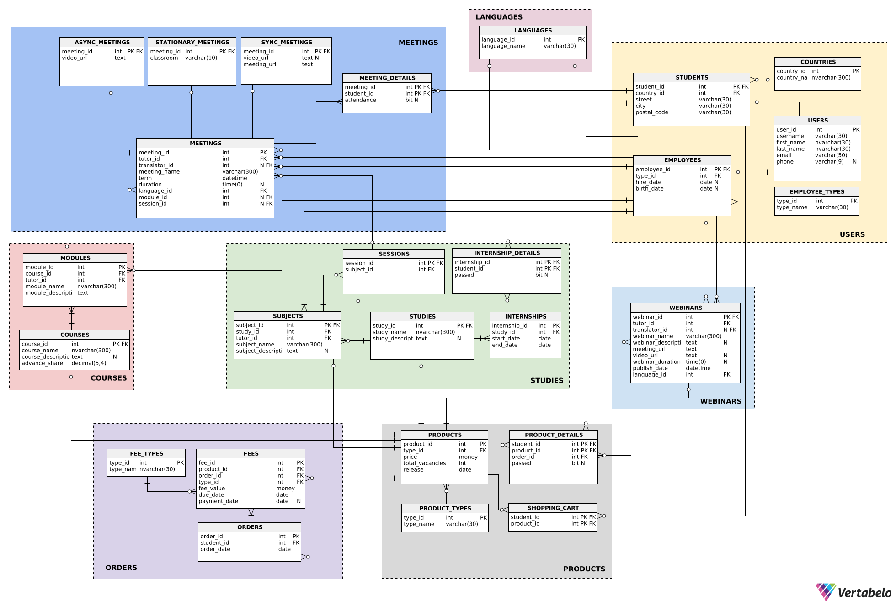

---
# Podstawy baz danych

**Dzień i godzina zajęć**: Środa 15:00

**Nr zespołu**: 2

**Autorzy:** Dariusz Marecik, Filip Węgrzyn, Paweł Fornagiel

**Link do repozytorium git**: https://github.com/pFornagiel/bazy-danych-2025

--- 

### Założenia dotyczące projektu:
 - W zakres studiów wchodzą pojedyńcze przedmioty (studium), które mają przypisane spotkania

---

# 1.	Wymagania i funkcje systemu

# Opis Funkcjonalności Systemu

## Funkcje Systemu
- Weryfikacja limitu zapisanych osób i blokowanie jego przekroczenia
- Blokowanie zapisu / dostępu do treści po upływie terminu ważności
- Blokowanie możliwości zapisania się na te same zajęcia wiele razy

## Użytkownicy
- Studenci (użytkownicy zalogowani)
- Goście (użytkownicy niezalogowani)
- Prowadzący zajęcia
- Dyrektor Szkoły
- Administrator zasobów
- Dziekanat
- Tłumacz

## Funkcje poszczególnych użytkowników 

### Studenci (użytkownicy zalogowani, rozszerzenie możliwości gości)
- możliwość zapisania się na kurs
- zapis na praktyki
- usunięcie konta
- dodanie i usunięcie adresu korespondencyjnego
- wyświetlenie wykazu zajęć w których brał udział / obecności
- wyświetlenie frekwencji / stopnia zaliczenia dla poszczególnych zajęć
- wyświetlenie dostępnych kursów / webinarów / studiów
- wyświetlanie linków dostępu do udostępnionych zasobów
- dodanie, usunięcie i przegląd elementów w koszyku
- stworzenie zamówienia
- opłacenie zamówienia

### Goście (użytkownicy niezalogowani)
- dostęp do wybranych webinarów
- przegląd dostępnych webinarów / studiów / kursów
- założenie konta

### Prowadzący zajęcia
- modyfikacja terminu zajęć
- modyfikacja udostępnionych zasobów 
- sprawdzanie obecności dla każdych zajęć
- wyświetlenie wykazu prowadzonych zajęć

### Administrator zasobów
- dodawanie / usuwanie webinarów, kursów i studiów
- dodawanie / usuwanie materiałów

### Dyrektor
- dodawanie / usuwanie pracowników
- modyfikacja dostępu do kursu
- modyfikacja opłat za kurs
- modyfikacja czasu na dokonanie płatności dla danej osoby
- przegląd wszelkich danych dotyczących realizowanych zajęć

### Dziekanat
- tworzenie dyplomów potwierdzających ukończenie kursu / studium
- dodawanie / modyfikacja praktyk
- modyfikacja webinarów / kursów / studiów / przedmiotów
- dodawanie webinarów / kursów / studiów / przedmiotów
- dodawanie / usuwanie tłumacza do wybranych przedmiotów
- tworzenie sylabusu
- generowanie harmonogramu
- generowanie danych dotyczących realizowanych zajęć
- wyświetlenie zatrudnionych pracowników
- wyświetlenie studentów przypisanych do danego zasobu wraz z limitami zasobu
- wyświetlenie danych dotyczących wybranych form zajęć
- wykrywanie i wyświetlanie kolizji czasowych studentów
- Raportowanie:
  - Tworzenie raportu liczby zapisanych osób na przyszłe wydarzenia wraz z informacjami o wydarzeniach
  - Tworzenie raportu dotyczącego frekwencji na zakończonych wydarzeniach
  - Tworzenie raportu dotyczącego osób, które skorzystały z usług, ale nie uiściły opłat
  - Tworzenie raportów finansowych
  - Tworzenie list obecności dla poszczególnych form zajęć
  - Tworzenie list kolizji czasowych wśród użytkowników

### Tłumacz
- Dostęp do zasobów poszczególnych kursów / studiów i webinarów
- Dodawanie przetłumaczonych zasobów do kursów /studiów / webinarów

# Schemat bazy danych


# Opis tabel
## Kategoria Users
### Tabela Users

Zawiera podstawowe informacje o każdym użytkowniku bazy.

- *user_id* int - klucz główny, identifikuje użytkownika

- username varchar(30)  - nazwa użytkownika w bazie danych

- first_name nvarchar(30) - imię użytkownika

- last_name nvarchar(30) - nazwisko użytkownika

- email varchar(50) - email użytkownika
  - warunek: (mail LIKE '%_@%.%')
- phone varchar(9) nullable - numer telefonu użytkownika
  - warunek: LEN(Phone) = 15 AND ISNUMERIC(Phone) = 1


``` sql
-- Table: USERS
CREATE TABLE USERS (
    user_id int  NOT NULL IDENTITY,
    username varchar(30)  NOT NULL,
    first_name nvarchar(30)  NOT NULL,
    last_name nvarchar(30)  NOT NULL,
    email varchar(50)  NOT NULL CHECK (mail LIKE '%_@%.%'),
    phone varchar(9)  NULL CHECK (LEN(Phone) = 9 AND ISNUMERIC(Phone) = 1),
    CONSTRAINT unique_email UNIQUE (email),
    CONSTRAINT unique_phone UNIQUE (phone),
    CONSTRAINT USERS_pk PRIMARY KEY  (user_id)
);
```

### Tabela Students

Zawiera infromacje specyficzne dla studenta

- *student_id* int - klucz główny, identyfikuje studenta

- street varchar(30) - ulica, na której mieszka studenta

- city varchar(30) - miasto, w którym mieszka studenta

- postal_code varchar(30) - kod pocztowy studenta

- country varchar(30)  - kraj pochodzenia studenta

``` sql
-- Table: STUDENTS
CREATE TABLE STUDENTS (
   student_id int  NOT NULL,
   street varchar(30)  NOT NULL,
   city varchar(30)  NOT NULL,
   postal_code varchar(30)  NOT NULL,
   country varchar(30)  NOT NULL,
   CONSTRAINT STUDENTS_pk PRIMARY KEY  (student_id)
);
```

### Tabela EMPLOYEES

Zawiera szczególne informacje dla pracowników (dyrektora, pracownika dziekanatu, nauczyciela, tłumacza)

- *emploee_id* int - klucz główny, identyfikator pracownika

- type_id int - typ pracownika (opisany poniżej)

- hire_date date nullable - data zatrudnienia
  - DEFAULT current_date

- birth_date date nullable - data urodzin pracownika
  - DEFAULT current_date

``` sql
-- Table: EMPLOYEES
CREATE TABLE EMPLOYEES (
    emploee_id int  NOT NULL,
    type_id int  NOT NULL,
    hire_date date  NULL DEFAULT current_date,
    birth_date date  NULL DEFAULT current_date,
    CONSTRAINT EMPLOYEES_pk PRIMARY KEY  (emploee_id)
);
```

### Tabela EMPLOYEES_TYPE
Zawiera opis typu pracowników

- *type_id* int - klucz główny, typ pracownika (dyrektor, pracownik dziekanatu, nauczyciel, tłumacz)
- type_name varchar(30) - nazwa pełnionej funkcji

``` sql
-- Table: EMPLOYEE_TYPES
CREATE TABLE EMPLOYEE_TYPES (
    type_id int  NOT NULL IDENTITY,
    type_name varchar(30)  NOT NULL,
    CONSTRAINT EMPLOYEE_TYPES_pk PRIMARY KEY  (type_id)
);
```

## Kategoria Products

### Tabela Products
Zawiera informacje o każdym produkcie w ofercie. Produkt jest rozumiany
jako każda form przeprowadzania zajęć.

- *product_id* int - klucz główny, identyfikuje produkt

- type_id int - numer kategorii produktu (1- study, 2 - subject, 3 - course
, 4 - webinar)

- price money - cena za produkt
  - warunek: prive >= 0
  - DEFAULT 1000

- vacancies int - ilość wolnoch miejsc możliwych do kupienia na dane zajęcia
  - warunek: vacancies>=0

- total_amount int - liczba wszystkich miejsc dla produktu

``` sql
-- Table: PRODUCTS
CREATE TABLE PRODUCTS (
    product_id int  NOT NULL IDENTITY,
    type_id int  NOT NULL,
    price money  NULL DEFAULT 1000 CHECK (prive>=0),
    vacancies int  NOT NULL CHECK (vacancies>=0),
    total_amount int  NOT NULL DEFAULT 30 CHECK (total_amount>0),
    CONSTRAINT product_id PRIMARY KEY  (product_id)
);
```

### Tabela Product_DETAILS

Zawiera informacje o studentach zapisanych na dane zajęcia 
o oraz numerze zamówienia z jakiego został kupiony dostęp do zajęć

- student_id int - wchodzi w skład klucza głównego, identyfikuje studenta
- product_id int - wchodzi w skład klucza głównego, identifukuje produkt
- order_id int - identifikuje zamówienie z jakiego został kupiony dostęp do zajęć


``` sql
-- Table: PRODUCTS_DETAILS
CREATE TABLE PRODUCTS_DETAILS (
    student_id int  NOT NULL,
    product_id int  NOT NULL,
    order_id int  NOT NULL,
    CONSTRAINT PRODUCTS_DETAILS_pk PRIMARY KEY  (student_id,product_id)
);
```

### Tabela PRODUCT_TYPES

Zawiera informacje o typach produktów

- type_id int - klucz główny, identyfikuje typ
- type_name varchar(30) - nazwa typu

``` sql
-- Table: PRODUCT_TYPES
CREATE TABLE PRODUCT_TYPES (
    type_id int  NOT NULL IDENTITY,
    type_name varchar(30)  NOT NULL,
    CONSTRAINT PRODUCT_TYPES_pk PRIMARY KEY  (type_id)
);
```